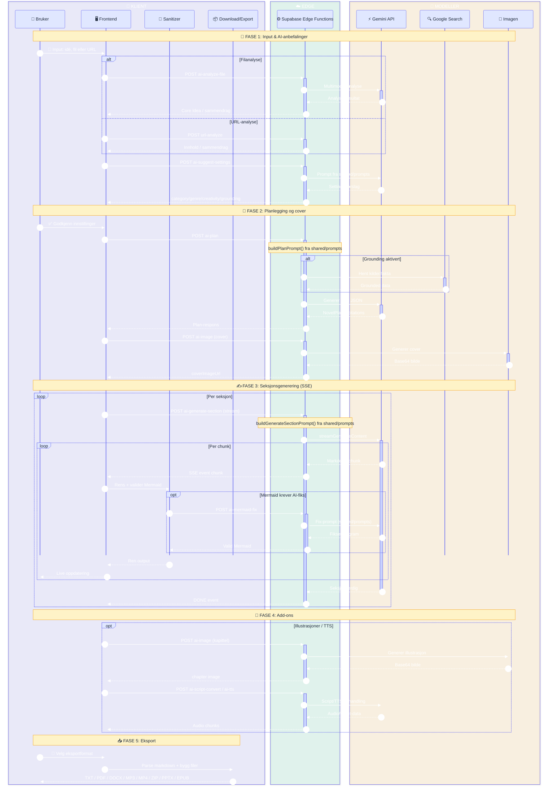

# Story Engine
### Den AI-drevne publiseringsplattformen.


> **Story Engine effektiviserer produksjonen av innhold og sikrer fakta ved hjelp av avanserte AI-agenter. Fra én idé til ferdig dokument, lydbok og video – kvalitetssikret.**

---

## 🚀 Nøkkelfunksjoner

*   ✍️ **Smart Prompt-utvidelse**: Usikker på hvordan du skal formulere deg? Ett klikk forvandler enkle stikkord til en rik, detaljert prosjektbeskrivelse optimalisert for at AI-en skal gi best mulig resultat.

*   ✨ **AI-anbefalte innstillinger**: Få forslag til kategori, sjanger/format (155 kombinasjoner), søk, kreativitet og diagram-frekvens - automatisk tilpasset din idé.

*   📄 **Native Dokumentgenerering**: Skaper ekte PDF, DOCX og MP3-filer direkte i nettleseren uten eksterne konverteringstjenester.

*   🌐 **Interaktiv Nettside**: Eksporter prosjektet ditt som en komplett, responsiv nettside (.zip) med mørkt tema, innholdsfortegnelse, og integrert lyd/bilde-avspilling. Åpnes enkelt direkte i nettleseren.

*   🎬 **Smart Video-produksjon**: Genererer videoer per kapittel med synkronisert lyd og tekst. Eksporterer som **MP4** (H.264/AAC) i **16:9** eller **9:16** (vertikal) format. Bruker "Smart Split"-teknologi for å sikre perfekt typografi.

*   📊 **PowerPoint-eksport (Non-Fiction)**: AI-genererte presentasjoner med oppsummerte bullet points, kapittelillustrasjoner og Mermaid-diagrammer på dedikerte slides.

*   📚 **EPUB E-bok**: Eksporter som universell e-bok med cover, kapittelnavigasjon og bilder – klar for Apple Books, Kobo, Kindle og andre e-lesere.

*   📂 **Analyser hva som helst**: Start prosjektet ditt med en lydfil, video, bilde, dokument, kodefil eller et helt .zip-arkiv. AI-en forstår innholdet og skriver "Core Idea" for deg.

*   🛠️ **AI-verktøykasse for spesialoppgaver**: Utfør avanserte oppgaver med ett klikk – konverter lydfiler til undertekster (.srt), generer en komplett README.md fra et .zip-arkiv, eller trekk ut et profesjonelt sammendrag fra et langt dokument.

*   🌍 **Full språk-kontroll**: Velg mellom auto-deteksjon eller spesifiser nøyaktig hvilket språk historien skal skrives på. Inkluderer nå oversettelse av eksisterende prosjekter.

*   📊 **Dynamisk Diagram-frekvens**: Kontroller den visuelle tettheten med presisjon - velg hvor ofte AI-en skal generere flytskjemaer, tidslinjer og grafer.

*   📝 **Regenerer fra fil**: Last opp en tidligere generert Story Engine-fil (.txt) for å lage nye formater som lyd, video eller nettside med den originale teksten eller oversett til et annet språk.

*   ⚙️ **Automatisk struktur**: La AI-en bestemme det optimale antallet seksjoner for historien din basert på kompleksitet og tema, eller velg antall seksjoner selv.

*   🎙️ **Velg din stemmekvalitet**: Bytt mellom to kraftige Text-to-Speech modeller for lydbøker – Gemini 2.5 Flash (rask og effektiv) eller Pro (maksimal kvalitet).

*   🤖 **Multi-Agent System**: Orkestrerer planlegging, skriving og faktasjekk gjennom spesialiserte AI-agenter som samarbeider.

*   🧼 **Vaskemaskinen (Sanitizer)**: Automatisk rensing og validering av kode, Markdown og Mermaid-diagrammer før visning. "Self-healing" Mermaid-diagrammer som fikser syntaksfeil automatisk.

---

## 🚀 Se Story Engine i aksjon

### 🧪 Prøv Appen (Beta)
Story Engine kan nå testes på midlertidig server her:
👉 **[https://story.neoweb.no](https://story.neoweb.no)** 

### 🌐 Live Interaktiv Rapport
Opplev en komplett generert leveranse direkte i nettleseren. Klikk på bildet under for å utforske den interaktive nettsiden som Story Engine produserer automatisk:

<p>
  <a href="https://neoweb.no/se-walkthrough/index.html">
    
  </a>
  <br/>
  <a href="https://neoweb.no/se-walkthrough/index.html"><strong>Åpne Interaktiv Demo ➔</strong></a>
</p>

---

### 🗺️ Videogjennomgang
> 💡 **Klikk på bildene for å se videoene direkte fra vår server**

<table>
  <tr>
    <td>
      <strong>Seksjon 1: Velkommen til Story Engine</strong><br/>
      <a href="https://neoweb.no/se-walkthrough/chapter-1.webm">
        
      </a><br/>
      Introduksjon til Story Engine og dets muligheter.
    </td>
    <td>
      <strong>Seksjon 2: Slik fungerer det</strong><br/>
      <a href="https://neoweb.no/se-walkthrough/chapter-2.webm">
        
      </a><br/>
      Steg-for-steg gjennomgang av arbeidsflyten.
    </td>
  </tr>
  <tr>
    <td>
      <strong>Seksjon 3: Nøkkelfunksjoner</strong><br/>
      <a href="https://neoweb.no/se-walkthrough/chapter-3.webm">
        
      </a><br/>
      Deep dive i avanserte funksjoner.
    </td>
    <td>
      <strong>Seksjon 4: Teknologi og Sikkerhet</strong><br/>
      <a href="https://neoweb.no/se-walkthrough/chapter-4.webm">
        
      </a><br/>
      Teknisk arkitektur og sikkerhetsprinsipper.
    </td>
  </tr>
</table>

### 🖥️ Visuell Omvisning App
Møtet med brukeren – rent, moderne og inviterende.


<details>
<summary><strong>Klikk for å se Story Engine app</strong></summary>

### Startside app
Etter landingssiden – moderne og stilrent panel.


### Alternativt smal skjermbredde
Skriv inn dine nye ideer umiddelbart på din telefon. 


</details>

<details>
<summary><strong>Klikk for å se genereringen i sanntid</strong></summary>

### Generation Progress
Noen trinn før genereringen, her foregår researchingen.


Hvor magien skjer. Her ser brukeren innholdet bli skapt i sanntid, med levende oppdateringer.

</details>

---

## 🏗️ Teknisk Arkitektur

### Dataflyt (Input → Eksport)

Dataflyten er delt i to separate diagrammer for bedre lesbarhet.

<details>
<summary><strong>Klikk for å se Dataflyt Del 1 (Input → Generering)</strong></summary>

### Dataflyt Del 1: Input → Generering

Dette diagrammet dekker input, analyse, planlegging og innholdsgenerering fram til ferdig generert payload.

```mermaid
graph TD
    Entry((("🚀 App Start")))
    Entry --> LandingPage["🏠 Landing Page<br/><i>LandingPage.tsx</i>"]
    LandingPage --> UserStart((("👤 Bruker")))

    subgraph InputSources ["📥 INPUT KILDER"]
        direction TB
        IdeaInput["📝 Core Idea"]
        FileInput["📁 Fil Upload"]
        URLInput["🌐 URL Analyse"]
        PlanFile["📄 .txt Plan"]
    end
    UserStart -->|"Velger kilde"| InputSources

    subgraph Analysis ["🔍 ANALYSE & ANBEFALINGER"]
        direction TB
        CoreIdea["💡 Core Idea"]
        UI["🎨 IntroView"]
        AIRecommend["🤖 getRecommendedSettingsHybrid()"]
        SuggestPrompt["✨ enhanceUserIdeaHybrid()"]
        FileAnalyzer["⚙️ fileExtract.ts"]
        URLAnalyzer["🔗 api.ts"]
        FileParser["📑 fileParser.ts"]
        SharedPromptSuggest["🧩 shared/prompts<br/><i>suggest builders</i>"]
        EdgeSuggestPrompt["⚙️ ai-suggest-prompt"]
        EdgeSuggestSettings["⚙️ ai-suggest-settings"]
        EdgeAnalyzeFile["⚙️ ai-analyze-file"]
        EdgeUrlAnalyze["⚙️ url-analyze"]
        GeminiAnalyze["🤖 Gemini API<br/><i>3-flash/pro</i>"]
    end

    IdeaInput --> AIRecommend
    IdeaInput --> SuggestPrompt
    SuggestPrompt --> EdgeSuggestPrompt
    EdgeSuggestPrompt --> SharedPromptSuggest
    EdgeSuggestPrompt --> GeminiAnalyze
    CoreIdea --> AIRecommend
    AIRecommend --> EdgeSuggestSettings
    EdgeSuggestSettings --> SharedPromptSuggest
    EdgeSuggestSettings --> GeminiAnalyze
    GeminiAnalyze --> CoreIdea
    EdgeSuggestSettings --> UI

    FileInput --> FileAnalyzer
    FileAnalyzer --> EdgeAnalyzeFile
    EdgeAnalyzeFile --> GeminiAnalyze
    URLInput --> URLAnalyzer
    URLAnalyzer --> EdgeUrlAnalyze
    EdgeUrlAnalyze --> GeminiAnalyze
    PlanFile --> FileParser --> PlanReady["📋 NovelPlan<br/><i>fra fil</i>"]

    subgraph Planning ["📐 PLANLEGGING"]
        direction TB
        PlanningLogic{"🤔 Har vi plan?"}
        PlanGenerator["📝 generateNovelPlanHybrid()"]
        SharedPromptPlan["🧩 shared/prompts<br/><i>planPrompt.ts</i>"]
        EdgePlan["⚙️ ai-plan"]
        GeminiPlan["🤖 Gemini API<br/><i>3-pro</i>"]
        SearchDecision{"🔎 Google Search?"}
        SearchAPI["🌍 Grounding + Citations"]
    end

    UI --> PlanningLogic
    PlanningLogic -->|"Ja"| PlanReady
    PlanningLogic -->|"Nei"| PlanGenerator
    PlanGenerator --> SharedPromptPlan
    SharedPromptPlan --> EdgePlan
    EdgePlan --> GeminiPlan
    EdgePlan --> SearchDecision
    SearchDecision -->|"Ja"| SearchAPI --> EdgePlan
    SearchDecision -->|"Nei"| EdgePlan
    EdgePlan --> PlanReady

    subgraph ContentFlow ["✍️ GENERERING + SANITIZE + ADD-ONS"]
        direction TB
        EdgeImageCover["⚙️ ai-image (cover)"]
        ImageGen["🎨 Imagen 4.0"]
        PlanWithCover["📖 Plan + coverImageUrl"]
        ChapterGen["📚 generateChapterBatch()"]
        PromptService3["📋 getBaseChapterPrompt()"]
        SharedPromptSection["🧩 shared/prompts<br/><i>sectionPrompt.ts</i>"]
        EdgeSection["⚙️ ai-generate-section<br/><i>SSE</i>"]
        GeminiSection["🤖 Gemini Streaming"]
        StreamHandler["📡 chapters.ts"]
        RawMD["📄 Rå MD"]
        Fix1["🔧 ContentSanitizer"]
        Fix2["✅ mermaidFixer"]
        MermaidDecision{"📊 Mermaid OK?"}
        EdgeMermaidFix["⚙️ ai-mermaid-fix"]
        SharedPromptFix["🧩 mermaidFixPrompt.ts"]
        GeminiFix["🤖 Mermaid fix"]
        CleanMD["✨ Ren MD"]
        AddOnProcessor["⚡ processChapterAddOns()"]
        EdgeImageChapter["⚙️ ai-image (chapter)"]
        EdgeScript["⚙️ ai-script-convert"]
        EdgeTTS["⚙️ ai-tts"]
        FinalChapter["📖 GeneratedChapter"]
        GenerationPayload["💾 Payload til Del 2"]
    end

    PlanReady --> EdgeImageCover
    EdgeImageCover --> ImageGen
    ImageGen --> EdgeImageCover
    EdgeImageCover --> PlanWithCover
    PlanWithCover --> ChapterGen
    ChapterGen --> PromptService3
    PromptService3 --> SharedPromptSection
    SharedPromptSection --> EdgeSection
    EdgeSection --> GeminiSection
    GeminiSection --> EdgeSection
    EdgeSection --> StreamHandler
    StreamHandler --> RawMD
    RawMD --> Fix1
    Fix1 --> Fix2
    Fix2 --> MermaidDecision
    MermaidDecision -->|"Ja"| CleanMD
    MermaidDecision -->|"Nei"| EdgeMermaidFix
    EdgeMermaidFix --> SharedPromptFix
    SharedPromptFix --> GeminiFix
    GeminiFix --> EdgeMermaidFix
    EdgeMermaidFix --> Fix2
    CleanMD --> AddOnProcessor
    AddOnProcessor --> EdgeImageChapter
    AddOnProcessor --> EdgeScript
    EdgeScript --> EdgeTTS
    AddOnProcessor --> FinalChapter
    EdgeImageChapter --> FinalChapter
    EdgeTTS --> FinalChapter
    FinalChapter --> GenerationPayload
    PlanWithCover --> GenerationPayload

    classDef userNode fill:#fef3c7,stroke:#d97706,stroke-width:3px,color:#92400e
    classDef landingNode fill:#fce7f3,stroke:#be185d,stroke-width:2px,color:#9d174d
    classDef apiNode fill:#dbeafe,stroke:#2563eb,stroke-width:2px,color:#1e40af
    classDef processNode fill:#f3e8ff,stroke:#7c3aed,stroke-width:2px,color:#5b21b6
    classDef serviceNode fill:#e0e7ff,stroke:#4f46e5,stroke-width:2px,color:#3730a3
    classDef stateNode fill:#dcfce7,stroke:#16a34a,stroke-width:3px,color:#166534
    classDef decisionNode fill:#fff7ed,stroke:#ea580c,stroke-width:2px,color:#c2410c
    classDef sanitizerNode fill:#e0f2fe,stroke:#0284c7,stroke-width:2px,color:#075985

    class Entry,UserStart userNode
    class LandingPage landingNode
    class GeminiAnalyze,GeminiPlan,SearchAPI,ImageGen,GeminiSection,GeminiFix apiNode
    class SuggestPrompt,AIRecommend,PlanGenerator,ChapterGen,StreamHandler,AddOnProcessor processNode
    class PromptService3,FileAnalyzer,URLAnalyzer,FileParser,EdgeSuggestPrompt,EdgeSuggestSettings,EdgeAnalyzeFile,EdgeUrlAnalyze,EdgePlan,SharedPromptSuggest,SharedPromptPlan,SharedPromptSection,EdgeSection,EdgeImageCover,EdgeImageChapter,EdgeMermaidFix,SharedPromptFix,EdgeScript,EdgeTTS serviceNode
    class CoreIdea,PlanReady,PlanWithCover,FinalChapter,GenerationPayload,UI stateNode
    class PlanningLogic,SearchDecision,MermaidDecision decisionNode
    class RawMD,Fix1,Fix2,CleanMD sanitizerNode
```

</details>

<details>
<summary><strong>Klikk for å se Dataflyt Del 2 (State → Eksport)</strong></summary>

### Dataflyt Del 2: State → Eksport

Dette diagrammet dekker state/sporing, visning og alle eksportformatene.

```mermaid
graph TD
    %% ═══════════════════════════════════════════
    %% 📱 STORY ENGINE - DEL 2 (STATE → EKSPORT)
    %% Oppdatert: Februar 2026
    %% ═══════════════════════════════════════════

    GenerationPayload["📥 Fra Del 1<br/><i>Plan + Chapters + Audio + Images</i>"]
    QuotaUsage["💳 Credits/Kvoter<br/><i>Edge _shared/utils.ts</i>"]

    subgraph StateTracking ["💾 STATE & SPORING"]
        direction LR
        AppState[("App State<br/><i>React</i>")]
        UsageMetrics["📊 UsageMetrics<br/><i>Tokens/Images/Audio</i>"]
    end

    GenerationPayload --> AppState
    GenerationPayload -.-> QuotaUsage
    QuotaUsage --> UsageMetrics
    AppState --> UsageMetrics

    Viewer["🖥️ ContentRenderer<br/><i>react-markdown + Mermaid</i>"]
    Screen["📺 GenerationView<br/><i>Live + Yellow text</i>"]
    UserEnd((("👤 Bruker")))
    DownloadBtn["⬇️ DownloadModal<br/><i>Format + Progress</i>"]
    FormatChoice{"📁 Format?"}

    AppState --> Viewer --> Screen
    UserEnd -.->|"Ser dokument"| Screen
    UserEnd -->|"Last Ned"| DownloadBtn --> FormatChoice

    subgraph ExportService ["📤 EKSPORT SERVICE"]
        direction TB
        DLService["🔧 downloadService"]
        ContentParse["📑 ContentParser<br/><i>MD → Blokker</i>"]
        ExportModules["📦 Export Modules<br/><i>docx/pdf/video/website</i>"]
        FullMD["📄 Full Markdown<br/><i>YAML + Innhold</i>"]
        DLService --> ContentParse
        DLService --> ExportModules
        DLService --> FullMD
    end

    AppState -->|"NovelPlan + Chapters"| DLService
    UsageMetrics -->|"Produksjonsrapport"| DLService

    subgraph ExportFormats ["💾 EKSPORT FORMATER"]
        direction TB
        ExportTXT["📄 .txt<br/><i>YAML + Markdown</i>"]
        GeneratePDF["📕 PDF Generator<br/><i>jsPDF + Bold/Italic</i>"]
        ExportPDF["📕 .pdf<br/><i>A4 + Mermaid PNG</i>"]
        GenerateDOCX["📘 DOCX Generator<br/><i>docx + Numbered lists</i>"]
        ExportDOCX["📘 .docx<br/><i>Native Word</i>"]
        GenerateMP3["🎵 Audio Processor<br/><i>MP3/WAV valg</i>"]
        ExportMP3["🎵 .zip<br/><i>MP3 (64kbps) eller WAV</i>"]
        GenerateWebM["🎬 Video Processor<br/><i>MP4 H.264/AAC</i>"]
        ExportWebM["🎬 .zip<br/><i>MP4 (16:9 / 9:16)</i>"]
        GenerateWebsite["🌐 Web Generator<br/><i>HTML/CSS/JS Bundle</i>"]
        ExportWebsite["🌐 .zip<br/><i>Interaktiv side</i>"]
        GeneratePPTX["📊 PPTX Generator<br/><i>AI Summarize + PptxGenJS</i>"]
        ExportPPTX["📊 .pptx<br/><i>Non-Fiction presentasjon</i>"]
        GenerateEPUB["📚 EPUB Generator<br/><i>XHTML + Cover</i>"]
        ExportEPUB["📚 .epub<br/><i>Universell e-bok</i>"]
    end

    FormatChoice -->|"TXT"| ExportTXT
    FullMD --> ExportTXT

    FormatChoice -->|"PDF"| GeneratePDF
    ContentParse --> GeneratePDF
    GeneratePDF --> ExportPDF

    FormatChoice -->|"DOCX"| GenerateDOCX
    ContentParse --> GenerateDOCX
    GenerateDOCX --> ExportDOCX

    FormatChoice -->|"MP3"| GenerateMP3
    AppState -->|"audioContent"| GenerateMP3
    GenerateMP3 --> ExportMP3

    FormatChoice -->|"MP4 Video"| GenerateWebM
    AppState -->|"audio + image"| GenerateWebM
    GenerateWebM --> ExportWebM

    FormatChoice -->|"Nettside"| GenerateWebsite
    AppState -->|"Plan + Chapters"| GenerateWebsite
    GenerateWebsite --> ExportWebsite

    FormatChoice -->|"PPTX"| GeneratePPTX
    AppState -->|"Plan + AI Summary"| GeneratePPTX
    GeneratePPTX --> ExportPPTX

    FormatChoice -->|"EPUB"| GenerateEPUB
    ContentParse --> GenerateEPUB
    GenerateEPUB --> ExportEPUB

    classDef userNode fill:#fef3c7,stroke:#d97706,stroke-width:3px,color:#92400e
    classDef apiNode fill:#dbeafe,stroke:#2563eb,stroke-width:2px,color:#1e40af
    classDef processNode fill:#f3e8ff,stroke:#7c3aed,stroke-width:2px,color:#5b21b6
    classDef serviceNode fill:#e0e7ff,stroke:#4f46e5,stroke-width:2px,color:#3730a3
    classDef stateNode fill:#dcfce7,stroke:#16a34a,stroke-width:3px,color:#166534
    classDef exportNode fill:#fce7f3,stroke:#db2777,stroke-width:2px,color:#9d174d
    classDef decisionNode fill:#fff7ed,stroke:#ea580c,stroke-width:2px,color:#c2410c
    classDef viewNode fill:#f5f3ff,stroke:#7c3aed,stroke-width:2px,color:#5b21b6
    classDef metricsNode fill:#fef9c3,stroke:#ca8a04,stroke-width:2px,color:#854d0e

    class UserEnd userNode
    class Viewer,Screen viewNode
    class DLService,ContentParse,ExportModules serviceNode
    class AppState,GenerationPayload stateNode
    class QuotaUsage,UsageMetrics metricsNode
    class FormatChoice decisionNode
    class ExportTXT,ExportPDF,ExportDOCX,ExportMP3,ExportWebM,ExportWebsite,ExportPPTX,ExportEPUB,GeneratePDF,GenerateDOCX,GenerateMP3,GenerateWebM,GenerateWebsite,GeneratePPTX,GenerateEPUB,FullMD,DownloadBtn exportNode
```

</details>

<details>
<summary><strong>Klikk for å se Sekvensdiagram (Interaksjon)</strong></summary>

### Sekvensdiagram (Interaksjon)

Hvordan frontend kommuniserer med AI-modellene og håndterer asynkrone strømmer.


</details>

---

## 📂 Filstruktur & Modul-analyse

<details>
<summary><strong>Klikk for filstruktur</strong></summary>

Prosjektet har gjennomgått en omfattende refaktorering for å øke vedlikeholdbarhet og skalerbarhet. Vi bruker nå en tydelig domenestruktur under `services`, samt et delt prompt-lag i `shared/prompts` for å hindre prompt-drift mellom frontend og Edge Functions.

```text
.
├── App.tsx                                   # Global state, view-ruting og kostnadssporing
├── README.md                                 # Dokumentasjon
├── CHANGELOG.md                              # Endringslogg
├── ROADMAP.md                                # Veikart og fremtidsplaner
├── constants.ts                              # Globale konstanter (stemmer, stiler)
├── types.ts                                  # TypeScript definisjoner for hele applikasjonen
├── genres.ts                                 # Definisjoner av hovedsjangre og kategorier
├── genreOptions.ts                           # Kontekstuelle sub-options (faktasjekk, lengde, etc.)
├── genreUtils.ts                             # Delte sjanger-hjelpere (fiction/non-fiction checks)
├── languages.ts                              # Støttede språk for I/O
├── components/
│   ├── Icons.tsx                             # Ikoner (SVG)
│   ├── MermaidDebugPage.tsx                  # Debug side for Mermaid
│   ├── OnboardingModal.tsx                   # Førstegangs onboarding
│   ├── ParserTest.tsx                        # Test-komponent for parser
│   ├── landing/                              # Landingsside komponenter
│   │   └── LandingPage.tsx                   # Hovedinngang / Hero-seksjon
│   ├── ui/                                   # Gjenbrukbare UI-komponenter
│   │   ├── ContentRenderer.tsx               # Markdown/Mermaid renderer (ReactMarkdown)
│   │   ├── DownloadModal.tsx                 # Modal for valg av eksportformat
│   │   ├── ErrorBoundary.tsx                 # Feilhåndtering
│   │   ├── LoadingView.tsx                   # Animerte laste-steg (Analyzing -> Finalizing)
│   │   ├── LogViewer.tsx                     # Debug-konsoll i UI
│   │   ├── Mermaid.tsx                       # Wrapper for Mermaid-diagrammer
│   │   ├── PlanningStepper.tsx               # Visuell fremdriftsindikator
│   │   ├── ResearchSourcesBox.tsx            # Visning av Google Search-kilder
│   │   └── SettingsModal.tsx                 # Avanserte innstillinger (Logger, Terskelverdier)
│   └── views/                                # Hovedvisninger (States)
│       ├── AdminUsersView.tsx                # Egen admin-visning for brukerstyring
│       ├── AltIntroDesignView.tsx            # Alternativ intro-layout / design
│       ├── DashboardView.tsx                 # Brukerdashboard og prosjektoversikt
│       ├── ProjectsView.tsx                  # Prosjektliste og prosjektstyring
│       ├── LoginView.tsx                     # Innlogging og autentisering
│       ├── WaitlistView.tsx                  # Venteliste og early access
│       ├── IntroView.tsx                     # Input, filanalyse, drag-n-drop
│       ├── CastingView.tsx                   # Karakteroversikt og stemmevalg
│       ├── GenerationView.tsx                # Live streaming av innhold
│       └── CompleteView.tsx                  # Ferdig resultat, avspilling og regenerering
├── scripts/                                  # Verktøy og test-skript
│   ├── check-prompt-drift.mjs                # CI-guard mot inline core-prompts i Edge Functions
│   ├── smoke-prompt-builders.ts              # Smoke-test av shared prompt-builders
│   ├── verify_quotas.ts                      # Kvote/credit test mot Edge Functions
│   └── ...                                   # Repro/parse/test hjelpeskript
├── services/                                 # FORRETNINGSLOGIKK (MODULÆR)
│   ├── ContentParser.ts                      # AST-parser som konverterer MD til blokker
│   ├── ContentSanitizer.ts                   # "Vaskemaskinen" (Regex-rensing, header-fiks)
│   ├── documentStyles.ts                     # Fasade for styles/index.ts
│   ├── downloadService.ts                    # Fasade for export/index.ts
│   ├── api.ts                                # URL-analyse og ekstern API-kommunikasjon
│   ├── auth.ts                               # Autentiseringslogikk
│   ├── formatConstants.ts                    # Konstanter for overskriftsformater
│   ├── geminiService.ts                      # Fasade for ai/index.ts
│   ├── modelPricing.ts                       # Prismodeller for Gemini/Imagen
│   ├── prompts.ts                            # Stabil offentlig entrypoint (barrel re-export)
│   ├── supabaseApi.ts                        # Klient for Supabase Edge Functions
│   ├── supabaseClient.ts                     # Supabase autentisering og oppsett
│   ├── ai/                                   # AI-integrasjon (Google GenAI)
│   │   ├── audioHelpers.ts                   # PCM/Base64 hjelpere
│   │   ├── chapters.ts                       # Generering av kapitler (tekst + add-ons)
│   │   ├── config.ts                         # Konfigurasjon (tokens, sikkerhet)
│   │   ├── fileExtract.ts                    # Filanalyse (DOCX, PDF, Code, Images)
│   │   ├── imageGenerator.ts                 # Bildegenerering via Supabase/API-lag
│   │   ├── imagen.ts                         # Bildegenerering (Imagen & Gemini)
│   │   ├── index.ts                          # Eksportør
│   │   ├── retry.ts                          # Feilhåndtering og retry-logikk
│   │   ├── schemas.ts                        # Zod/JSON schemas for AI output
│   │   ├── summarize.ts                      # AI-oppsummering for PPTX bullet points
│   │   ├── tts.ts                            # Tekst-til-tale logikk (Gemini)
│   │   └── utils.ts                          # Delte AI-hjelpere
│   ├── aiHybrid.ts                           # Edge-first orkestrering (lokal fallback fjernet)
│   ├── export/                               # Eksport-moduler
│   │   ├── docx.ts                           # DOCX-generering
│   │   ├── epub.ts                           # EPUB 3 e-bok generering (XHTML + Cover)
│   │   ├── index.ts                          # Eksportør
│   │   ├── markdown.ts                       # Markdown-generering
│   │   ├── mp3.ts                            # Lyd-sammenstilling (MP3 64kbps / WAV)
│   │   ├── pdf.ts                            # PDF-generering med avansert formatering
│   │   ├── pptx.ts                           # PowerPoint-generering (Non-Fiction)
│   │   ├── utils.ts                          # Delte eksport-hjelpere (Mermaid render)
│   │   ├── video.ts                          # Videorendring (MP4 H.264/AAC, 16:9 / 9:16) med "Smart Split"
│   │   └── website.ts                        # Interaktiv nettside-pakking (ZIP)
│   ├── format/                               # Tekstformatering
│   │   └── sectionHeaders.ts                 # Håndtering av kapitteloverskrifter og språk
│   ├── i18n/                                 # Internasjonalisering
│   │   └── translations.ts                   # Oversettelser (NO/EN) for UI og eksport
│   ├── prompts/                              # Lokale prompt-moduler (split refaktor)
│   │   ├── README.md                         # Modulgrense + safe refactor-regler
│   │   ├── core.ts                           # Delte lokale prompt-konstanter/hjelpere
│   │   ├── referencePrompts.ts               # Fil-/media-analyse prompts
│   │   ├── settingsPrompts.ts                # Settings + enhance-idea prompts
│   │   ├── novelPlanPrompts.ts               # Plan/story prompts
│   │   ├── chapterPrompts.ts                 # Chapter/section + export/QA/TTS prompts
│   │   └── fragments/                        # Re-export av shared fragments
│   │       ├── markdownRules.ts              # MD-regler (fra shared/prompts)
│   │       ├── mermaidRules.ts               # Mermaid-regler (fra shared/prompts)
│   │       ├── mermaidSyntaxV11.ts           # Mermaid v11 syntaks (shared)
│   │       └── professionalVisualization.ts  # Visualiseringsstrategi (shared)
│   ├── sanitize/                             # Rens og validering
│   │   └── mermaidFixer.ts                   # Self-healing Mermaid logikk
│   └── styles/                               # Stildefinisjoner
│       ├── config.ts                         # Globale stilvariabler
│       ├── docx.ts                           # DOCX-spesifikke stiler
│       ├── helpers.ts                        # Hjelpefunksjoner for farger/størrelser
│       ├── index.ts                          # Eksportør
│       ├── pdf.ts                            # PDF-spesifikke stiler
│       ├── types.ts                          # Type-definisjoner for stiler
│       └── units.ts                          # Enhetskonvertering (mm, px, pt)
├── shared/                                   # Delt kode mellom frontend og Edge Functions
│   └── prompts/                              # Prompt source-of-truth (core generation flows)
│       ├── builders/                         # Prompt-builders for Edge flows
│       │   ├── sectionPrompt.ts              # ai-generate-section
│       │   ├── planPrompt.ts                 # ai-plan
│       │   ├── suggestPrompt.ts              # ai-suggest-prompt
│       │   ├── suggestSettingsPrompt.ts      # ai-suggest-settings
│       │   └── mermaidFixPrompt.ts           # ai-mermaid-fix
│       ├── fragments/                        # Delte prompt-fragmenter
│       │   ├── markdownRules.ts              # Markdown-regler
│       │   ├── mermaidRules.ts               # Mermaid-regler
│       │   ├── mermaidSyntaxV11.ts           # Mermaid v11 syntaks
│       │   └── professionalVisualization.ts  # Visualisering
│       └── index.ts                          # Stabil eksportflate
├── supabase/                                 # SUPABASE BACKEND (Edge Functions + DB)
│   ├── config.toml                           # Supabase lokal konfigurasjon
│   ├── deno.json                             # Deno konfigurasjon for Edge Functions
│   ├── functions/
│   │   ├── _shared/                          # Delt logikk for alle Edge Functions
│   │   │   ├── utils.ts                      # Auth, allowlist, kvote/credit-håndtering
│   │   │   ├── pricing.ts                    # Pris- og kredittkonvertering (server-side)
│   │   │   ├── rateLimit.ts                  # Upstash Redis rate limiting
│   │   │   ├── genres.ts                     # Delt sjangerdata
│   │   │   └── genreOptions.ts               # Delt sub-option data
│   │   ├── ai-admin-adjust-credits/          # Admin: kredittjustering (+/-)
│   │   ├── ai-admin-list-users/              # Admin: brukerliste/status/tier/limits
│   │   ├── ai-admin-update-user/             # Admin: allowlist + tier-endring
│   │   ├── ai-analyze-file/                  # Analyse av opplastede filer (multimodal)
│   │   ├── ai-generate-section/              # Server-side generering (SSE Streaming)
│   │   ├── ai-image/                         # Bildegenerering (Imagen 4.0)
│   │   ├── ai-mermaid-fix/                   # Mermaid-fiksing med AI
│   │   ├── ai-plan/                          # Planleggings-agent (Google Search)
│   │   ├── ai-script-convert/                # Konvertering til filmmanus
│   │   ├── ai-stripe-checkout/               # Oppretter Stripe Checkout for kredittkjøp
│   │   ├── ai-stripe-webhook/                # Verifiserer betaling og fyller kreditter
│   │   ├── ai-suggest-prompt/                # Prompt-forbedring
│   │   ├── ai-suggest-settings/              # Innstillings-anbefalinger
│   │   ├── ai-summarize/                     # Oppsummerings-agent
│   │   ├── ai-tts/                           # Tekst-til-tale (Gemini TTS)
│   │   ├── ai-user-profile/                  # Brukerprofil og preferanser
│   │   ├── url-analyze/                      # Analyse av nettsider (Scraping)
│   │   └── deno.d.ts                         # Supplerende module declarations
│   └── migrations/                           # Database-migrasjoner
│       ├── 20260120000000_quota_system.sql   # Kvote-system tabeller og RPC
│       ├── 20260129000000_add_credits_columns.sql # Credits-kolonner og flyt
│       ├── 20260216160000_fix_credit_idempotency_by_type.sql # Idempotens-fiks for kreditt-trekk
│       ├── 20260216173000_create_admin_users_table.sql # Admin-brukere tabell
│       └── ...                               # Videre fixes/cleanup migrasjoner
└── utils/                                    # Generelle hjelpefunksjoner
    ├── audio.ts                              # PCM/WAV-hjelpere (lavnivå)
    ├── dom.ts                                # DOM-manipulasjon
    └── fileParser.ts                         # Parsing av opplastede filer (.txt gjenoppretting)
```
### Nøkkelkomponenter forklart

* `services/ai/chapters.ts`: Kjernen i innholdsgenereringen. Bruker nå "Smart Chunking" for å bevare linjeskift i TTS-tekst, noe som er kritisk for korrekt videorendring og synkronisering.
* `services/export/video.ts`: Videomotor som bruker Canvas API og WebCodecs. Har innebygd logikk for å splitte lange overskrifter fra brødtekst visuelt.
* `services/export/website.ts`: Genererer en komplett HTML/CSS/JS-pakke som lar brukeren navigere i historien interaktivt.
* `services/sanitize/mermaidFixer.ts`: Intelligent "selvhelbredende" modul som oppdager syntaksfeil i Mermaid-diagrammer og fikser dem automatisk.
* `components/views/AdminUsersView.tsx`: Separat admin-view for brukerliste, allowlist-status, tier-endringer og kredittjustering.
* `shared/prompts/*`: Felles prompt source-of-truth for kjerneflytene (`ai-generate-section`, `ai-plan`, `ai-suggest-*`, `ai-mermaid-fix`) slik at frontend og Edge Functions bruker samme instruksjonsgrunnlag.
* `scripts/check-prompt-drift.mjs`: Drift-guard som stopper innføring av nye inline core-prompts i Edge Functions.
* `supabase/functions/_shared/utils.ts`: Delt logikk for Edge Functions inkludert auth, allowlist, admin checks, kvote-reservering og brukslogging.
* `supabase/functions/_shared/pricing.ts`: Server-side prismapping (`USD -> credits`) for konsistent kredittbelastning.
* `supabase/migrations/20260120000000_quota_system.sql`: Database-migrasjon med tabeller for `entitlements`, `usage_counters`, `usage_events` og atomiske RPC-funksjoner.

</details>

---

## 🚀 Tilgang & Installasjon

Kildekoden til Story Engine er for tiden i et privat repository (novel-planner) for å beskytte immaterielle rettigheter (IP). Dette repoet fungerer som teknisk dokumentasjon.

For investorer, partnere eller utviklere som har fått tildelt tilgangsrettigheter, gjelder følgende oppsett:

### 🛠️ Forutsetninger
*   **Node.js**: v20+
*   **Deno**: v2.6.8+ (for Edge Functions)
*   **Supabase CLI**: v2.76.3+

### 🚀 Installasjon

1.  **Klon kildekode-repoet**
   (Krever autorisasjon)
    ```bash
    git clone https://github.com/engan/novel-planner.git
    cd novel-planner
    ```

2.  **Installer avhengigheter**
    ```bash
    npm install
    ```

3.  **Sett opp miljøvariabler**
    Lag en `.env.local` fil i rotmappen og legg inn Supabase-oppsett:
    ```env
    VITE_SUPABASE_URL=https://<project-ref>.supabase.co
    VITE_SUPABASE_ANON_KEY=<anon-key>
    ```
    For enkelte lokale testskript kan du i tillegg trenge:
    ```env
    VITE_GEMINI_API_KEY=din_nøkkel_her
    ```

4.  **Start utviklingsserveren**
    ```bash
    npm run dev
    ```
---

## 📝 Endringslogg

Kortversjon av siste endringer. Full historikk finnes i `CHANGELOG.md` (og i GitHub Releases).

### Siste endringer (arbeidsgren / story-engine-dev)
- 🎬 **Video**: Mermaid-diagrammer viser nå "Diagram er utelatt i video"-melding. Listelementer beholder **bold**/*italic* formatering. Unummererte lister bruker bullet-punkt (•). Inline math ($...$) konverteres til kursiv. Fleksibel tabelldeteksjon.
- 📄 **PDF/DOCX**: Inline math støttes som kursiv tekst. PDF-kodeblokker har emoji-til-tekst konvertering (jsPDF-begrensning). Forbedret word-wrap i kodeblokker.
- 🎙️ **TTS**: Stemmenavn (Charon:, etc.) fjernes kun når de står som speaker-label på linjestarten – bevarer legitim bruk i tekst.
- 🔗 **Lenker**: Konsistent lenkegjengivelse i video (cyan/understrek), PDF (blå/klikkbar), og DOCX (hyperlenker). Filtrerer ut "junk" grounding-lenker.
- 🖥️ **UI**: Fikset tekstoverflyt i Generation Progress-kort.
- 🛠️ **Refaktorering**: `externalApiService.ts` → `api.ts`.

> Tips: Bruk GitHub Releases for "release notes", og hold `CHANGELOG.md` som den tekniske kilden.

---

## 🗺️ Veikart

Vi bygger fremtidens publiseringsverktøy. Her er hva som kommer:

*   📰 **Integrasjon mot Retriever/Mediearkivet**: For dypere faktasjekk mot norske kilder.
*   🗣️ **Multi-LLM Konsensus-debatt**: La flere AI-modeller diskutere en sak før konklusjon trekkes.
*   📻 **Advanced Audio (Radio Play)**: Lydeffekter og bakgrunnsmusikk mikset med fortellerstemmen.
*   🗞️ **Pilotprosjekt med lokalavis**: Test av "Breaking News"-agent (f.eks journalist, etter avtale).
*   📱 **PWA-støtte**: Full offline-støtte for journalister i felt (etter avtale).

---

## 🎵 Bonus: The Story Engine Anthem

Fordi en multimodal AI-plattform fortjener sitt eget lydspor. Tekst og melodi er generert for å fange essensen av overgangen fra idé til ferdig produkt.

> *"Story Engine / Turning one small flame to a wildfire..."*

[▶️ **Hør sangen her (Suno)**](https://suno.com/s/bYmMmpVi77OgbCm2)

---

<details>
  <summary>📊</summary>
  
</details>

<div align="center">
  <p>Utviklet med ❤️ i Norge</p>
  <p>© 2025-2026 Story Engine</p>
</div>
