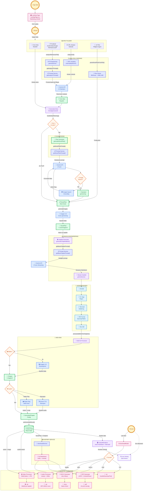

```mermaid
graph TD
    %% ═══════════════════════════════════════════
    %% 📱 NOVEL GENERATOR - KOMPLETT DATAFLYT
    %% ═══════════════════════════════════════════

    %% ─── FASE -1: LANDING PAGE ───
    Entry((("🚀 App Start")))
    Entry --> LandingPage["🏠 Landing Page<br/><i>LandingPage.tsx</i><br/>Marketing innhold"]
    LandingPage -->|"Kom i gang"| UserStart((("👤 Bruker")))

    %% ─── FASE 0: INPUT KILDER ───
    subgraph InputSources ["📥 INPUT KILDER"]
        direction TB
        IdeaInput["📝 Core Idea<br/><i>Tekstfelt</i>"]
        FileInput["📁 Fil Upload<br/><i>Audio/Video/Image/<br/>PDF/DOCX/ZIP</i>"]
        URLInput["🌐 URL Analyse<br/><i>Nettside</i>"]
        PlanFile["📄 .txt Plan<br/><i>Tidligere lagret</i>"]
    end

    UserStart -->|"Velger kilde"| InputSources

    %% ─── FASE 1: ANALYSE & PARSING ───
    subgraph Analysis ["🔍 ANALYSE & PARSING"]
        direction TB
        FileAnalyzer["⚙️ Fil Analysering<br/><i>geminiService</i>"]
        PromptService1["📋 Prompt Service<br/><i>getAnalyze*Prompt()</i>"]
        URLAnalyzer["🔗 URL Scraping<br/><i>externalApiService</i>"]
        FileParser["📑 Plan Parser<br/><i>fileParser - YAML+MD</i>"]
    end

    IdeaInput -->|"Direkte tekst"| UI["🎨 GenerationView<br/><i>Hovedgrensesnitt</i>"]
    
    FileInput -->|"analyzeReferenceFile()"| FileAnalyzer
    FileAnalyzer -->|"getAnalyze*Prompt()"| PromptService1
    PromptService1 -->|"Prompt basert på filtype"| GeminiAPI1["🤖 Gemini API<br/><i>2.5-flash/pro</i>"]
    
    URLInput -->|"analyzeUrl()"| URLAnalyzer
    URLAnalyzer -->|"Henter innhold"| GeminiAPI1
    
    GeminiAPI1 -->|"Returnerer analyse"| CoreIdea["💡 Core Idea<br/><i>Populert</i>"]
    CoreIdea --> UI
    
    PlanFile -->|"parseNovelPlanFromFile()"| FileParser
    FileParser -->|"Ferdig plan"| PlanReady["📋 NovelPlan<br/><i>Klar til bruk</i>"]

    %% ─── FASE 2: PLANLEGGING ───
    subgraph Planning ["📐 PLANLEGGING"]
        direction TB
        PlanGenerator["📝 Plan Generator<br/><i>generateNovelPlan()</i>"]
        PromptService2["📋 Prompt Service<br/><i>getNovelPlanPrompt()</i>"]
    end

    UI -->|"handleStartPlanning()"| PlanningLogic{"🤔 Har vi<br/>en plan?"}
    PlanningLogic -->|"Nei"| PlanGenerator
    PlanningLogic -->|"Ja: Fra fil"| PlanReady

    PlanGenerator -->|"getNovelPlanPrompt()"| PromptService2
    PromptService2 -->|"Strukturert prompt"| GeminiAPI2["🤖 Gemini API<br/><i>2.5-pro</i>"]

    GeminiAPI2 --> SearchDecision{"🔎 Google<br/>Search?"}
    SearchDecision -->|"Ja"| SearchAPI["🌍 Google Search<br/><i>Grounding</i>"]
    SearchAPI -->|"Grounded data"| GeminiAPI2
    SearchDecision -->|"Nei"| NoSearch["📄 Standard<br/>generering"]
    NoSearch --> PlanReady
    GeminiAPI2 -->|"JSON Plan"| PlanReady

    %% ─── FASE 3: COVER IMAGE ───
    PlanReady -->|"generateImage()"| ImageGen["🎨 Imagen 4.0<br/><i>Cover generering</i>"]
    ImageGen -->|"Base64 bilde"| PlanWithCover["📖 NovelPlan<br/><i>+ coverImageUrl</i>"]

    %% ─── FASE 4: INNHOLDSGENERERING ───
    subgraph ContentGen ["✍️ INNHOLDSGENERERING"]
        direction TB
        ChapterGen["📚 Kapittel Generator<br/><i>generateChapterBatch()</i>"]
        PromptService3["📋 Prompt Service<br/><i>getBaseChapterPrompt()</i>"]
        StreamHandler["📡 Stream Handler<br/><i>geminiService</i>"]
    end

    PlanWithCover -->|"Batch av kapitler"| ChapterGen
    ChapterGen -->|"getBaseChapterPrompt()"| PromptService3
    PromptService3 -->|"Detaljert prompt"| GeminiAPI3["🤖 Gemini API<br/><i>2.5-pro Streaming</i>"]
    GeminiAPI3 -->|"Streamer Markdown"| StreamHandler

    %% ─── FASE 5: VASKEMASKINEN ───
    subgraph Sanitizer ["🧼 VASKEMASKINEN"]
        direction LR
        RawMD["📄 Rå MD"]
        Fix1["🔧 Fix Tags<br/><i>Regex</i>"]
        Fix2["✅ Mermaid<br/><i>Validering</i>"]
        Fix3["📝 MD Format<br/><i>Spacing/Tables</i>"]
        CleanMD["✨ Ren MD"]
        RawMD --> Fix1 --> Fix2 --> Fix3 --> CleanMD
    end

    StreamHandler --> RawMD

    %% ─── FASE 6: ADD-ONS ───
    subgraph AddOns ["🎁 ADD-ONS"]
        direction TB
        AddOnProcessor["⚡ Add-On Processor"]
        ChapterImageGen["🖼️ Imagen 4.0<br/><i>Illustrasjoner</i>"]
        NarrationGen["🎙️ Gemini TTS<br/><i>Narrasjon</i>"]
        RadioPlayGen["📻 Radio Play<br/><i>Multi-voice</i>"]
    end

    CleanMD -->|"processAddOnsForChapters()"| AddOnProcessor

    AddOnProcessor --> IllustrationDecision{"🖼️ Bilder?"}
    IllustrationDecision -->|"Ja"| ChapterImageGen
    ChapterImageGen -->|"Base64 bilde"| ChapterWithImage["📖 Chapter<br/><i>+ imageUrl</i>"]
    IllustrationDecision -->|"Nei"| ChapterWithImage

    ChapterWithImage --> AudioDecision{"🔊 Audio?"}
    AudioDecision -->|"Narrasjon"| NarrationGen
    AudioDecision -->|"Radio Play"| RadioPlayGen
    AudioDecision -->|"Nei"| FinalChapter["📖 GeneratedChapter<br/><i>Ferdig</i>"]
    NarrationGen -->|"Base64 audio"| FinalChapter
    RadioPlayGen -->|"Audio + script"| FinalChapter

    %% ─── FASE 7: STATE ───
    FinalChapter -->|"setGeneratedNovel()"| AppState[("💾 Global State<br/><i>React State</i>")]

    %% ─── FASE 8: RENDERING ───
    AppState -->|"Sender data"| Viewer["🖥️ ContentRenderer<br/><i>react-markdown + Mermaid</i>"]
    Viewer -->|"Rendrer innhold"| Screen["📺 Live Visning<br/><i>Dark theme</i>"]

    %% ─── FASE 9: EKSPORT ───
    UserEnd((("👤 Bruker")))
    UserEnd -.->|"Ser dokument"| Screen
    UserEnd -->|"Last Ned"| DownloadBtn["⬇️ DownloadModal"]

    DownloadBtn --> FormatChoice{"📁 Format?"}

    subgraph ExportService ["📤 EKSPORT SERVICE"]
        direction TB
        DLService["🔧 downloadService"]
        FullMD["📄 Full Markdown<br/><i>YAML + Innhold</i>"]
        DLService --> FullMD
    end

    AppState -->|"NovelPlan + Chapters"| DLService

    subgraph ExportFormats ["💾 EKSPORT FORMATER"]
        direction TB
        ExportTXT["📄 .txt<br/><i>handleDownloadTxt()</i>"]
        GeneratePDF["📕 PDF Generator<br/><i>jsPDF + ContentParser</i>"]
        ExportPDF["📕 .pdf<br/><i>A4 print-vennlig</i>"]
        GenerateDOCX["📘 DOCX Generator<br/><i>docx library</i>"]
        ExportDOCX["📘 .docx<br/><i>Native Word</i>"]
        GenerateMP3["🎵 Audio Processor<br/><i>lamejs + JSZip</i>"]
        ExportMP3["🎵 .zip<br/><i>MP3 24kHz mono</i>"]
        GenerateWebM["🎬 Video Processor<br/><i>WebCodecs + VP9</i>"]
        ExportWebM["🎬 .zip<br/><i>WebM per kapittel</i>"]
    end

    FormatChoice -->|"TXT"| ExportTXT
    FullMD --> ExportTXT

    FormatChoice -->|"PDF"| GeneratePDF
    FullMD --> GeneratePDF
    GeneratePDF --> ExportPDF

    FormatChoice -->|"DOCX"| GenerateDOCX
    FullMD --> GenerateDOCX
    GenerateDOCX --> ExportDOCX

    FormatChoice -->|"MP3"| GenerateMP3
    AppState -->|"audioContent"| GenerateMP3
    GenerateMP3 --> ExportMP3

    FormatChoice -->|"WebM"| GenerateWebM
    AppState -->|"audio + image"| GenerateWebM
    GenerateWebM --> ExportWebM

    %% ═══════════════════════════════════════════
    %% 🎨 STYLING CLASSES (GitHub Compatible)
    %% ═══════════════════════════════════════════
    
    classDef userNode fill:#fef3c7,stroke:#d97706,stroke-width:3px,color:#92400e
    classDef landingNode fill:#fce7f3,stroke:#be185d,stroke-width:2px,color:#9d174d
    classDef apiNode fill:#dbeafe,stroke:#2563eb,stroke-width:2px,color:#1e40af
    classDef processNode fill:#f3e8ff,stroke:#7c3aed,stroke-width:2px,color:#5b21b6
    classDef serviceNode fill:#e0e7ff,stroke:#4f46e5,stroke-width:2px,color:#3730a3
    classDef stateNode fill:#dcfce7,stroke:#16a34a,stroke-width:3px,color:#166534
    classDef exportNode fill:#fce7f3,stroke:#db2777,stroke-width:2px,color:#9d174d
    classDef decisionNode fill:#fff7ed,stroke:#ea580c,stroke-width:2px,color:#c2410c
    classDef sanitizerNode fill:#e0f2fe,stroke:#0284c7,stroke-width:2px,color:#075985
    classDef viewNode fill:#f5f3ff,stroke:#7c3aed,stroke-width:2px,color:#5b21b6

    class Entry,UserStart,UserEnd userNode
    class LandingPage landingNode
    class GeminiAPI1,GeminiAPI2,GeminiAPI3,SearchAPI,ImageGen,ChapterImageGen,NarrationGen,RadioPlayGen apiNode
    class UI,ChapterGen,StreamHandler,Viewer,AddOnProcessor processNode
    class PromptService1,PromptService2,PromptService3,DLService,FileAnalyzer,URLAnalyzer,FileParser serviceNode
    class AppState,PlanReady,CoreIdea,FinalChapter,PlanWithCover,ChapterWithImage,PlanGenerator,NoSearch stateNode
    class ExportTXT,ExportPDF,ExportDOCX,ExportMP3,ExportWebM,GeneratePDF,GenerateDOCX,GenerateMP3,GenerateWebM,FullMD,DownloadBtn exportNode
    class PlanningLogic,SearchDecision,IllustrationDecision,AudioDecision,FormatChoice decisionNode
    class RawMD,Fix1,Fix2,Fix3,CleanMD sanitizerNode
    class Screen viewNode
```