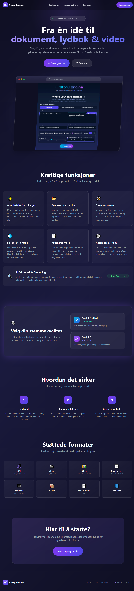
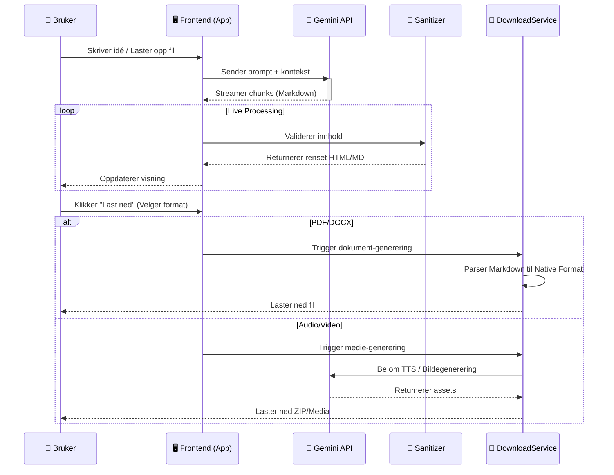

# Story Engine
### Den AI-drevne publiseringsplattformen.


> **Story Engine effektiviserer produksjonen av innhold og sikrer fakta ved hjelp av avanserte AI-agenter. Fra én idé til ferdig dokument, lydbok og video – kvalitetssikret.**

---

## 🚀 Nøkkelfunksjoner

*   ✨ **AI-anbefalte innstillinger**: Få forslag til kategori, sjanger/format (155 kombinasjoner), søk og kreativitet – automatisk tilpasset din idé.
*   📂 **Analyser hva som helst**: Start prosjektet ditt med en lydfil, video, bilde, dokument, kodefil eller et helt .zip-arkiv. AI-en forstår innholdet og skriver "Core Idea" for deg.
*   🛠️ **AI-verktøykasse for spesialoppgaver**: Utfør avanserte oppgaver med ett klikk – konverter lydfiler til undertekster (.srt), generer en komplett README.md fra et .zip-arkiv, eller trekk ut et profesjonelt sammendrag fra et langt dokument.
*   🌐 **Full språk-kontroll**: Velg mellom auto-deteksjon eller spesifiser nøyaktig hvilket språk historien skal skrives på – helt uavhengig av språket i kildematerialet.
*   📝 **Regenerer fra fil**: Last opp en tidligere generert Story Engine-fil (.txt) for å lage nye formater som lyd eller video med den originale teksten eller skrevet på et annet språk.
*   ⚙️ **Automatisk struktur**: La AI-en bestemme det optimale antallet seksjoner for historien din basert på kompleksitet og tema, eller velg antall seksjoner selv.
*   🎙️ **Velg din stemmekvalitet**: Bytt mellom to kraftige TTS-modeller for lydbøker – Gemini 2.5 Flash (rask og effektiv) eller Pro (maksimal kvalitet).
*   🤖 **Multi-Agent System**: Orkestrerer planlegging, skriving og faktasjekk gjennom spesialiserte AI-agenter som samarbeider.
*   🧼 **Vaskemaskinen (Sanitizer)**: Automatisk rensing og validering av kode, Markdown og Mermaid-diagrammer før visning.
*   🔒 **Personvern først**: Lokal prosessering og anonymisering av sensitive data før de sendes til AI-modellene.
*   📄 **Native Dokumentgenerering**: Skaper ekte PDF, DOCX og MP3-filer direkte i nettleseren uten eksterne konverteringstjenester.

---

## 🖥️ Visuell Omvisning

### Landingsside
Møtet med brukeren – rent, moderne og inviterende.


<details>
<summary><strong>Klikk for å se Story Engine app</strong></summary>

### Startside app
Etter landingssiden – moderne og stilrent panel.

</details>

<details>
<summary><strong>Klikk for å se genereringen i sanntid</strong></summary>

### Generation Progress
Hvor magien skjer. Her ser brukeren innholdet bli skapt i sanntid, med levende oppdateringer.

</details>

---

## 🏗️ Teknisk Arkitektur

<details>
<summary><strong>Klikk for å se Sekvensdiagram (Interaksjon)</strong></summary>

### Sekvensdiagram (Interaksjon)

Hvordan frontend kommuniserer med AI-modellene og håndterer asynkrone strømmer.


</details>

<details>
<summary><strong>Klikk for å se Dataflyt (Input → Eksport)</strong></summary>

### Dataflyt (Input → Eksport)

Dette diagrammet viser hvordan data beveger seg fra brukerens input, gjennom våre prosesseringssteg, og ut som ferdige formater.

```mermaid
graph TD
    %% ===========================================
    %% 📱 STORY ENGINE GENERATOR - SYSTEM ARKITEKTUR
    %% ===========================================

    %% --- FASE -1: LANDING PAGE ---
    Entry((("🚀 Start")))
    Entry --> LandingPage["🏠 <b>Landing Page</b><br/>LandingPage.tsx"]
    LandingPage -->|"Kom i gang"| UserStart((("👤 Bruker")))

    %% --- FASE 0: INPUT KILDER ---
    subgraph InputSources ["📥 INPUT KILDER"]
        direction TB
        IdeaInput["📝 Tekstidé"]
        FileInput["📁 Fil Upload<br/><i>Audio/Video/PDF/DOCX/Zip</i>"]
        URLInput["🌐 URL Analyse"]
        PlanFile["📄 Eksisterende Story<br/><i>.txt fil</i>"]
    end

    UserStart --> InputSources

    %% --- FASE 1: ANALYSE & PARSING ---
    subgraph Analysis ["🔍 ANALYSE"]
        direction TB
        FileAnalyzer["⚙️ Fil Analysering<br/><i>geminiService</i>"]
        URLAnalyzer["🔗 URL Scraping<br/><i>externalApiService</i>"]
        FileParser["📑 Plan Parser<br/><i>fileParser</i>"]
    end

    IdeaInput --> UI["🎨 <b>GenerationView</b>"]
    FileInput --> FileAnalyzer
    URLInput --> URLAnalyzer
    PlanFile --> FileParser

    FileAnalyzer --> GeminiAPI1["🤖 Gemini API<br/><i>2.5-flash/pro</i>"]
    URLAnalyzer --> GeminiAPI1
    GeminiAPI1 --> CoreIdea["💡 Core Idea"]
    CoreIdea --> UI
    FileParser --> PlanReady["📋 StoryEnginePlan<br/><i>Klar til bruk</i>"]

    %% --- FASE 2: PLANLEGGING ---
    UI --> PlanningLogic{"🤔 Har story plan?"}
    PlanningLogic -->|"Nei"| PlanGenerator["📝 Story Plan Generator<br/><i>generateNovelPlan()</i>"]
    PlanningLogic -->|"Ja"| PlanReady

    PlanGenerator --> GeminiAPI2["🤖 Gemini API<br/><i>2.5-pro</i>"]
    GeminiAPI2 --> SearchDecision{"🔎 Google<br/>Search?"}
    SearchDecision -->|"Ja"| SearchAPI["🌍 Google Search<br/>Grounding"]
    SearchAPI --> GeminiAPI2
    SearchDecision -->|"Nei"| PlanReady
    GeminiAPI2 --> PlanReady

    %% --- FASE 3: COVER IMAGE ---
    PlanReady --> ImageGen["🎨 Imagen 4.0<br/><i>Cover generering</i>"]
    ImageGen --> PlanWithCover["📖 Story Plan + Cover"]

    %% --- FASE 4: INNHOLDSGENERERING ---
    PlanWithCover --> ChapterGen["✍️ Kapittel Generator<br/><i>generateChapterBatch()</i>"]
    ChapterGen --> GeminiAPI3["🤖 Gemini API<br/><i>Streaming</i>"]
    GeminiAPI3 --> StreamHandler["📡 Stream Handler"]

    %% --- FASE 5: VASKEMASKINEN ---
    subgraph Sanitizer ["🧼 VASKEMASKINEN"]
        direction LR
        RawMD["📄 Rå MD"] --> Fix1["🔧 Fix Tags"]
        Fix1 --> Fix2["✅ Validering"]
        Fix2 --> CleanMD["✨ Ren MD"]
    end

    StreamHandler --> RawMD

    %% --- FASE 6: ADD-ONS ---
    subgraph AddOns ["🎁 ADD-ONS"]
        direction TB
        IllustrationDecision{"🖼️ Bilder?"}
        AudioDecision{"🔊 Audio?"}
        ChapterImageGen["🎨 Imagen 4.0"]
        NarrationGen["🎙️ Gemini TTS"]
        RadioPlayGen["📻 Radio Play"]
    end

    CleanMD --> IllustrationDecision
    IllustrationDecision -->|"Ja"| ChapterImageGen
    IllustrationDecision -->|"Nei"| AudioDecision
    ChapterImageGen --> AudioDecision
    AudioDecision -->|"Narrasjon"| NarrationGen
    AudioDecision -->|"Radio Play"| RadioPlayGen
    AudioDecision -->|"Nei"| FinalChapter["📖 Ferdig Kapittel"]
    NarrationGen --> FinalChapter
    RadioPlayGen --> FinalChapter

    %% --- FASE 7: STATE ---
    FinalChapter --> AppState[("💾 <b>Global State</b><br/>React State")]

    %% --- FASE 8: RENDERING ---
    AppState --> Viewer["🖥️ ContentRenderer<br/><i>react-markdown + Mermaid</i>"]
    Viewer --> Screen["📺 <b>Live Visning</b>"]

    %% --- FASE 9: EKSPORT ---
    UserEnd((("👤 Bruker")))
    UserEnd -.-> Screen
    UserEnd --> DownloadBtn["⬇️ Download Modal"]

    subgraph Export ["📤 EKSPORT FORMATER"]
        direction TB
        ExportTXT["📄 .txt<br/><i>YAML + Markdown</i>"]
        ExportPDF["📕 .pdf<br/><i>jsPDF</i>"]
        ExportDOCX["📘 .docx<br/><i>docx library</i>"]
        ExportMP3["🎵 .mp3<br/><i>lamejs + JSZip</i>"]
        ExportWebM["🎬 .webm<br/><i>WebCodecs + VP9</i>"]
    end

    DownloadBtn --> Export
    AppState --> Export

    %% --- STYLING (GitHub Compatible) ---
    classDef userNode fill:#fef3c7,stroke:#d97706,stroke-width:3px,color:#92400e
    classDef apiNode fill:#dbeafe,stroke:#2563eb,stroke-width:2px,color:#1e40af
    classDef processNode fill:#f3e8ff,stroke:#7c3aed,stroke-width:2px,color:#5b21b6
    classDef stateNode fill:#dcfce7,stroke:#16a34a,stroke-width:3px,color:#166534
    classDef exportNode fill:#fce7f3,stroke:#db2777,stroke-width:2px,color:#9d174d
    classDef decisionNode fill:#fff7ed,stroke:#ea580c,stroke-width:2px,color:#c2410c

    class Entry,UserStart,UserEnd userNode
    class GeminiAPI1,GeminiAPI2,GeminiAPI3,SearchAPI,ImageGen,ChapterImageGen,NarrationGen,RadioPlayGen apiNode
    class UI,PlanGenerator,ChapterGen,StreamHandler,Viewer processNode
    class AppState,PlanReady,CoreIdea,FinalChapter,PlanWithCover stateNode
    class ExportTXT,ExportPDF,ExportDOCX,ExportMP3,ExportWebM exportNode
    class PlanningLogic,SearchDecision,IllustrationDecision,AudioDecision decisionNode
```



</details>

---

## 📂 Filstruktur & Modul-analyse

<details>
<summary><strong>Klikk for filstruktur</strong></summary>

Her er en oversikt over de viktigste modulene i prosjektet. Vi følger en streng "Separation of Concerns"-filosofi.

Prosjektet følger en flat og modulær arkitektur optimalisert for rask utvikling med Vite. 
Her er en oversikt over kjernesystemene.

```text
.
├── components/                # VISNINGSLAGET (Frontend)
│   ├── landing/                 # Førsteinntrykk
│   │   └── LandingPage.tsx        # Salgsplakaten (Entry point)
│   ├── ui/                      # Gjenbrukbare komponenter
│   │   ├── ContentRenderer.tsx    # "TV-skjermen" - Live Markdown/Mermaid motor
│   │   ├── Mermaid.tsx            # Spesialisert diagram-visning
│   │   ├── LogViewer.tsx          # Terminal-visning av AI-prosessen
│   │   └── DownloadModal.tsx      # Eksport-grensesnitt
│   └── views/                   # Applikasjonens hovedtilstander
│       ├── IntroView.tsx          # Input og analyse av filer
│       ├── GenerationView.tsx     # Streaming og skriving (Hovedvisning)
│       └── CompleteView.tsx       # Ferdig resultat
│
├── services/                  # LOGIKKLAGET (Backend-logic)
│   ├── geminiService.ts         # API-orkestrering mot Google Gemini
│   ├── prompts.ts               # "Hjernen" - Systeminstrukser og personaer
│   ├── ContentSanitizer.ts      # "Vaskemaskinen" - Sanering av AI-output
│   ├── ContentParser.ts         # Strukturerer råtekst til objekter
│   ├── downloadService.ts       # Native generering av PDF, DOCX og MP3
│   ├── externalApiService.ts    # Koblinger mot tredjeparts kilder
│   ├── mermaidRules.ts          # Streng logikk for diagram-syntaks
│   └── markdownRules.ts         # Regler for dokumentformatering
│
├── utils/                     # HJELPEFUNKSJONER
│   ├── audio.ts                 # Lydbehandling
│   ├── fileParser.ts            # Analyse av opplastede filer (PDF/Zip/Code)
│   └── dom.ts                   # DOM-manipulasjon
│
├── public/                    # STATISKE RESSURSER
│   ├── infographic.png          # Systemoversikt
│   ├── app-hero.png             # Landingsside
│   ├── gen-progress.jpg         # Generation Progress
│   └── story-engine.png         # Startside app
│
├── App.tsx                      # Applikasjonens kjerne og ruting
├── index.html                   # Entry point
└── [Konfigurasjon]              # vite.config.ts, tailwind.config.js, tsconfig.json
```

### Nøkkelkomponenter forklart

* `services/prompts.ts`: Dette er systemets hjerne. Her defineres alle AI-personligheter, fra den kreative forfatteren til den kritiske faktasjekkeren.
* `services/ContentSanitizer.ts`: Vår proprietære "vaskemaskin". Denne sikrer at all kode og markdown som genereres av AI-en er syntaktisk korrekt før den treffer brukergrensesnittet.
* `components/ui/ContentRenderer.tsx`: En avansert visningsmotor som renderer tekst, kode og diagrammer i sanntid mens AI-en skriver.
* `services/downloadService.ts`: En "Native Document Generator" som bygger ekte Word- og PDF-filer binært, i stedet for å bare ta skjermbilde av nettsiden.

</details>

---

## 🚀 Tilgang & Installasjon

Kildekoden til Story Engine er for tiden i et privat repository (novel-planner) for å beskytte immaterielle rettigheter (IP). Dette repoet fungerer som teknisk dokumentasjon.

For investorer, partnere eller utviklere som har fått tildelt tilgangsrettigheter, gjelder følgende oppsett:

1.  **Klon kildekode-repoet**
   (Krever autorisasjon)
    ```bash
    git clone https://github.com/engan/novel-planner.git
    cd novel-planner
    ```

2.  **Installer avhengigheter**
    ```bash
    npm install
    ```

3.  **Sett opp miljøvariabler**
    Lag en `.env.local` fil i rotmappen og legg inn din API-nøkkel:
    ```env
    VITE_GEMINI_API_KEY=din_nøkkel_her
    ```

4.  **Start utviklingsserveren**
    ```bash
    npm run dev
    ```

---

## 🗺️ Veikart

Vi bygger fremtidens publiseringsverktøy. Her er hva som kommer:

*   📰 **Integrasjon mot Retriever/Mediearkivet**: For dypere faktasjekk mot norske kilder.
*   🗣️ **Multi-LLM Konsensus-debatt**: La flere AI-modeller diskutere en sak før konklusjon trekkes.
*   🗞️ **Pilotprosjekt med lokalavis**: Test av "Breaking News"-agent (f.eks journalist, etter avtale).
*   📱 **PWA-støtte**: Full offline-støtte for journalister i felt (etter avtale).

---

<div align="center">
  <p>Utviklet med ❤️ i Norge</p>
  <p>© 2025 Story Engine</p>
</div>
