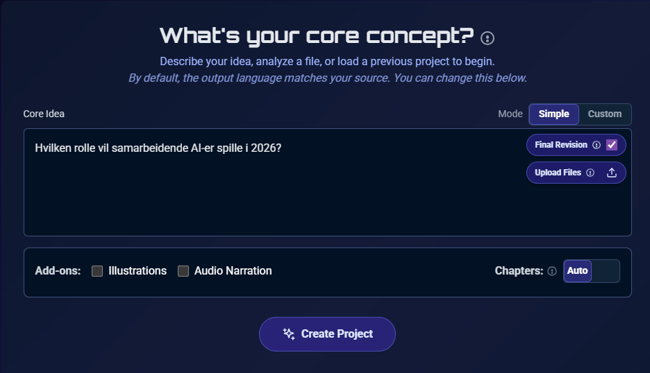
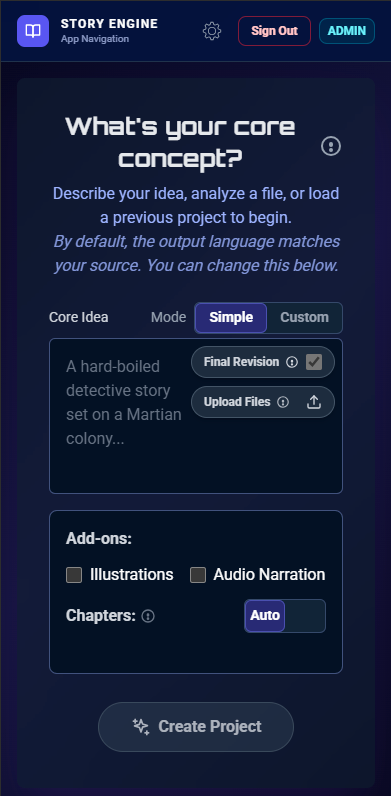
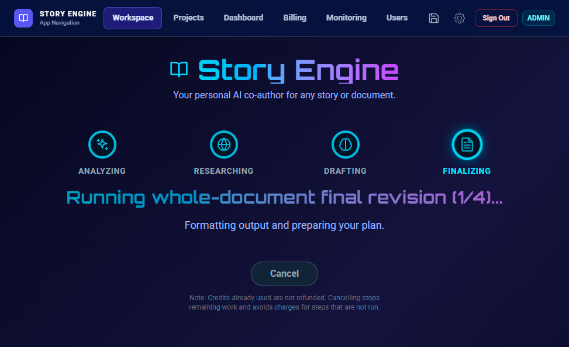
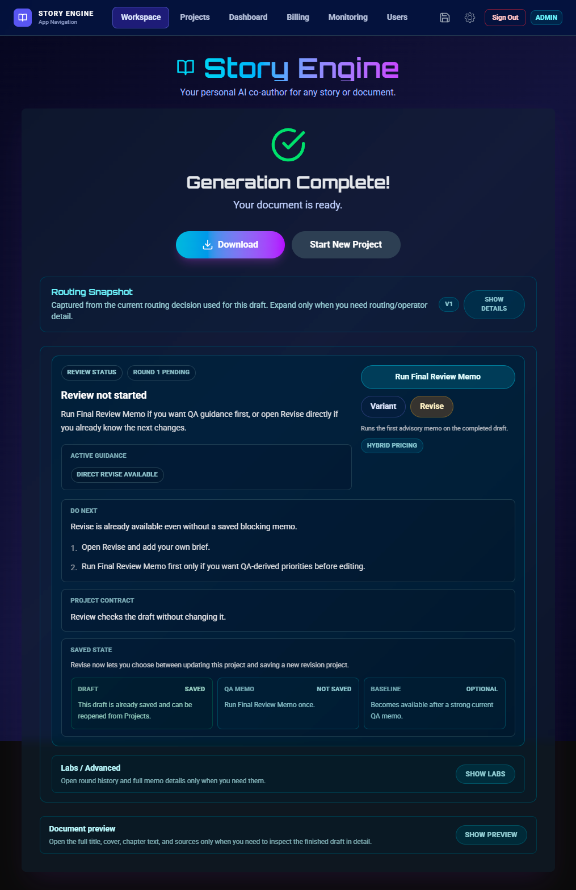
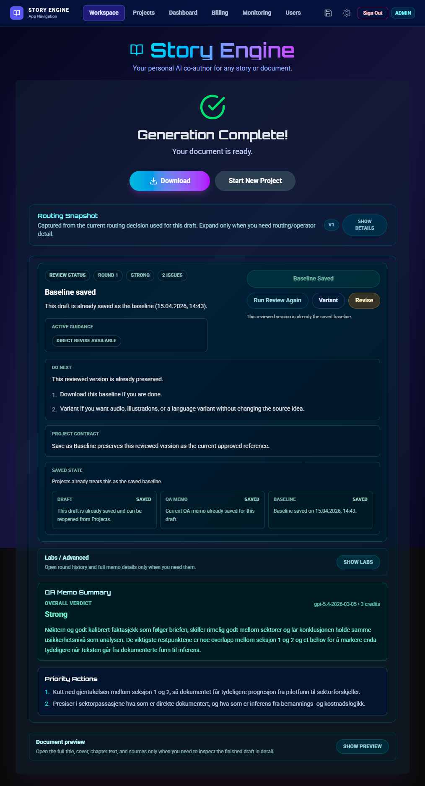
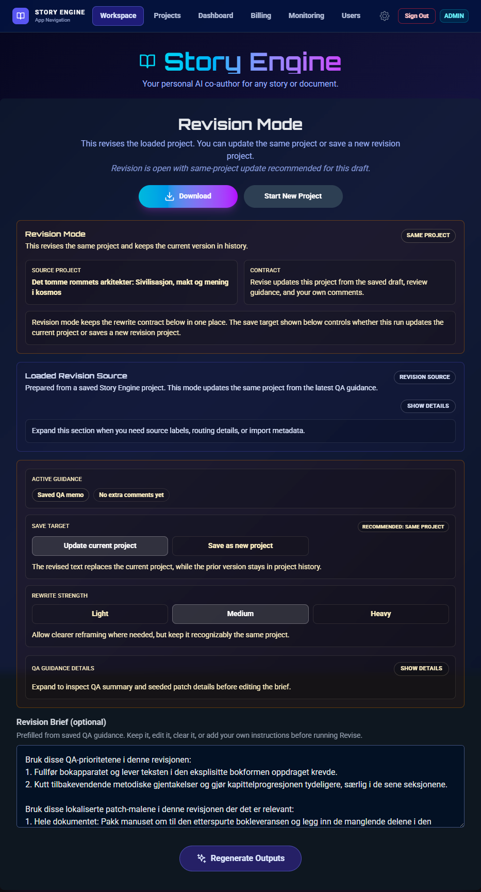
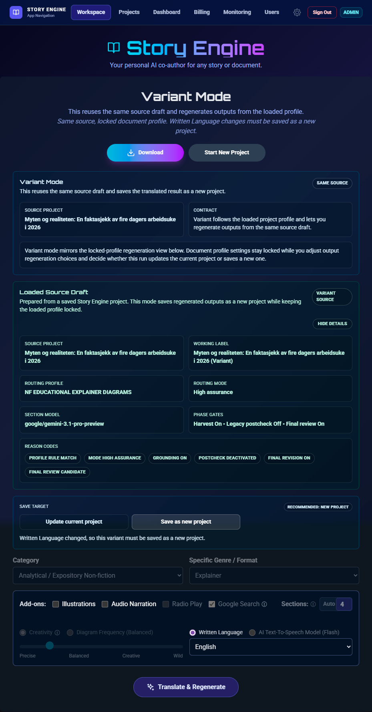
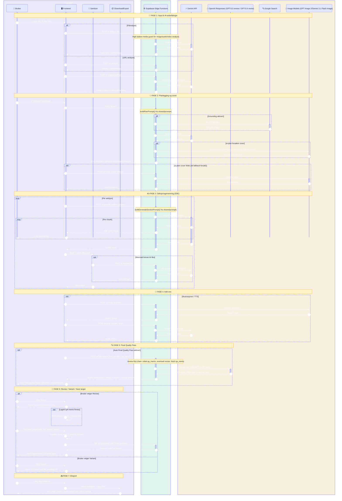

# Story Engine
### AI-drevet publiseringsplattform.


> **Story Engine effektiviserer produksjonen av innhold og sikrer fakta ved hjelp av avanserte AI-agenter. Fra én idé til ferdig dokument, lydbok og video – kvalitetssikret.**

---

## 🚀 Nøkkelfunksjoner

*   ✍️ **Smart Prompt-utvidelse**: Usikker på hvordan du skal formulere deg? Ett klikk forvandler enkle stikkord til en rik, detaljert prosjektbeskrivelse optimalisert for at AI-en skal gi best mulig resultat.

*   ✨ **AI-anbefalte innstillinger**: Få forslag til kategori, sjanger/format (158 kombinasjoner), søk, kreativitet og diagram-frekvens - automatisk tilpasset din idé.

*   🧭 **Simple / Custom startmodus**: Nye prosjekter starter i en ryddig `Simple`-modus der avanserte valg skjules, `Final Quality Pass` er aktivert, og `Suggest Settings` kjøres automatisk når prosjektet opprettes. `Custom` beholder hele kontrollflaten for brukere som vil styre kategori, format, kreativitet, diagrammer, språk, research og add-ons selv.

*   📄 **Native dokument- og medieeksport**: Skaper PDF, DOCX, PPTX, EPUB, MP3/WAV, MP4 og interaktive website-zipper direkte i nettleseren uten eksterne konverteringstjenester.

*   🌐 **Interaktiv nettside**: Eksporter prosjektet ditt som en komplett, responsiv nettside (.zip) med oppgradert design, mørkt tema som standard, lys/mørk toggle, innholdsfortegnelse, integrert lyd/bilde-avspilling og egne nedlastingskort. Website-eksporten pakker nå lokale Mermaid- og KaTeX-assets, inkludert KaTeX-fontene, slik at eksporten er mer deterministisk og offline-vennlig.

*   🎬 **Smart Video-produksjon**: Genererer videoer per kapittel med synkronisert lyd og tekst. Eksporterer som **MP4** (H.264/AAC) i **16:9** eller **9:16** (vertikal) format. Bruker "Smart Split"-teknologi for å sikre perfekt typografi.

*   📊 **PowerPoint-eksport (Non-Fiction)**: AI-genererte presentasjoner med oppsummerte bullet points, kapittelillustrasjoner og Mermaid-diagrammer på dedikerte slides.

*   📚 **EPUB E-bok**: Eksporter som universell e-bok med cover, kapittelnavigasjon og bilder – klar for Apple Books, Kobo, Kindle og andre e-lesere.

*   📂 **Analyser hva som helst**: Start prosjektet ditt med en lydfil, video, bilde, dokument, kodefil eller et helt .zip-arkiv. Core Idea kan i tillegg ha opptil 7 vedlegg, inkludert dokumenter og visuelle referanser, som analyseres før planlegging. Opplastet bilde/lyd/video kalibreres med en generell high-stakes media guard: systemet kan beskrive observerbare trekk, men skal ikke gi definitive medisinske, juridiske, sikkerhetskritiske eller lignende handlingsråd fra media alene.

*   🖼️ **Objektagnostiske visuelle referanser**: Opplastede Core Idea-bilder og kildehøstede produktbilder brukes som evidens og visuelle ankre, ikke som collage eller direkte kopi. Cover kan bruke hele referansepoolen, mens seksjonsbilder velger et begrenset, prioritert utvalg og markerer et primary identity anchor når et helmotiv finnes.

*   🔒 **Strukturert fact-lock**: Brukeroppgitte Core Idea-URL-er, opplastede filer, Google Search-kilder og produkt-/konfiguratorlenker normaliseres til én intern kildepool. Fact-lock bygger strukturerte faktakandidater med kildeprioritet, konfliktløsing og autoriserte primary facts før tekst og bildeprompt får bruke tekniske hovedverdier.

*   🔎 **Verifiserte forskningskilder v2**: Planleggingen skiller nå mellom kildestøttet fakta, verifisert relevante kilder, kun reachable kilder og avviste/ikke-verifiserte treff. Server-side kildeverifisering bruker safe-fetch, redirect-vask, bounded reads, soft404-/mismatch-sjekker og rik `verifiedCitations`-metadata, slik at topplisten under `Forskningskilder` ikke fylles med svake lenker bare for å nå et antall.

*   🧭 **Trusted source authority registry**: En liten, objektagnostisk bootstrap-registry hjelper source ranking og fact-lock med offisielle/statistiske/helse-/standard-/fact-check-kilder på tvers av land og språk. Registry-treff er bare authority metadata; de erstatter ikke direkte kildeverifisering, ferskhet eller gap-matching.

*   🛡️ **Evidence safety og kildestatus**: High-assurance og publiseringsfølsomme dokumenter får tydelig kildestatus når review/evidence ikke er lukket. Den samme lokaliserte draft-advarselen kan vises i workspace preview og følger eksportene der det er relevant, blant annet TXT, PDF, DOCX, EPUB og website.

*   🛠️ **AI-verktøykasse for spesialoppgaver**: Utfør avanserte oppgaver med ett klikk – konverter lydfiler til undertekster (.srt), generer en komplett README.md fra et .zip-arkiv, eller trekk ut et profesjonelt sammendrag fra et langt dokument.

*   🌍 **Full språk-kontroll**: Velg mellom auto-deteksjon eller spesifiser nøyaktig hvilket språk prosjektet skal skrives på. Eksisterende prosjekter kan nå oversettes via egne plan- og markdown-oversettere.

*   📊 **Dynamisk Diagram-frekvens**: Kontroller den visuelle tettheten med presisjon - velg hvor ofte AI-en skal generere flytskjemaer, tidslinjer og grafer.

*   📝 **Regenerer fra fil**: Last opp en tidligere generert Story Engine-fil (.txt) for å regenerere outputs fra låst dokumentprofil, lage nye medievarianter eller opprette et nytt språkprosjekt.

*   🔁 **Samlet Revise-flyt**: `Revise` bruker lagret QA-memo når det finnes, prefiller revisjonsmål inn i arbeidsflaten, og lar deg enten oppdatere samme prosjekt eller lagre en ny revisjonsgren fra samme arbeidsflate.

*   🔧 **Repair Sources / kildeforbedring**: Når QA finner kildegap kan Story Engine forsøke målrettet kildeforbedring før revisjon. Flyten mapper kilder til konkrete gap, bærer ulukkede gap inn i revision-briefen og stopper uten videre source-repair-belastning når sterke nok kilder ikke finnes.

*   🎛️ **Variant / Regenerate Outputs**: `Variant` gjenbruker samme prosjektprofil for illustrasjoner, audio og språkbytte. Medie-only-varianter kan oppdatere samme prosjekt og bevare eksisterende bilder når bare audio regenereres, mens språkbytte opprettes som nytt prosjekt.

*   ⚙️ **Automatisk struktur**: La AI-en bestemme det optimale antallet seksjoner for historien din basert på kompleksitet og tema, eller velg antall seksjoner selv.

*   🎙️ **Velg din stemmekvalitet**: Bytt mellom flere Text-to-Speech modeller for lydbøker – Gemini 2.5 Flash (rask og effektiv), Gemini 2.5 Pro (maksimal kvalitet) eller Gemini 3.1 Flash TTS Preview. I testfasen er Gemini 3.1 Flash TTS Preview satt som standardvalg for nye lydgenereringer. Initial audio/radio-generering kjører nå text-first `Final Quality Pass` før media bygges, og billing bruker server-observert varighet når format/metadata er trygt verifisert eller konservativ tegnproxy ellers.

*   🤖 **Multi-Agent System**: Orkestrerer planlegging, skriving og faktasjekk gjennom spesialiserte AI-agenter som samarbeider.

*   🧼 **Vaskemaskinen (Sanitizer)**: Automatisk rensing og validering av kode, Markdown og Mermaid-diagrammer før visning. "Self-healing" Mermaid-diagrammer som fikser syntaksfeil automatisk.

*   🔍 **Final Quality Pass + Final Review**: Etter førstegenerering kan Story Engine kjøre en review-first kvalitetskjede med OpenAI Responses: først et QA Review med `gpt-5.5`, deretter automatisk stopp hvis utkastet allerede er `strong`, eller målrettet `Revise` med `gpt-5.4` når memoet finner reelle problemer. For lange dokumenter kan Quality Autopilot kjøre et kontrollert staged pass med owner-godkjente caps, prioriterte issue clusters, målrettet source repair/revision og tydelige stop reasons uten å gjøre Repair/Prune/Broad til normalbrukerens primærvalg.

*   💬 **Kontekstuelle hjelpetekster**: Startskjermen viser korte hjelpetekster for `Upload Files`, `Final Quality Pass` og kredittestimat/balanse i både Simple og Custom, inkludert kostnads-/kvalitetsavveiing og sikkerhetsforbehold for opplastet media.

*   🧭 **Intelligent Model Routing**: Automatisk valg av optimal AI-modell basert på prosjektets `category`, `genre`, `creativity`-nivå, og om det er fiction eller non-fiction. Routing-logikken lever i `shared/routing/` og brukes av alle Edge Functions.

*   📊 **Monitoring**: Sanntids-dashboard for Google Cloud API-kvoter, Vertex/Gemini-helse, runtime-flagg, readiness, operative risikoer, Model & Pricing-status og en read-only Quality Queue V1 for admin-triage av prosjekter med høy kvalitetsrisiko.

*   🧾 **Model & Pricing**: Monitoring-fanen sammenholder server registry, provider-katalog, customer billing policy, credit value, runtime evidence og mismatch findings for tekst-, bilde- og TTS-flyt. Dette gjør modell- og prisdrift synlig uten å endre live routing eller billing.

*   💳 **Billing & Tier-system**: Komplett abonnement- og kredittløsning med Stripe-integrasjon. Aktive tier-nivåer er `pilot`, `pro` og `elite` med ulike månedlige inkluderte kreditter, generasjonsgrenser og feature-flagg. Eldre `enterprise`-verdier normaliseres til `elite`. Konfigurert i `shared/billing/`.

*   📈 **Production Report og runtime ledger**: Eksportert Story Engine-fil viser kundevendt faktisk server-side kredittbruk når ledger-data er fanget. Admin kan i tillegg eksportere intern rapport med klientbasert provider-estimat, modell-/tokenkostnader, bildeoperasjoner, TTS-varighetsmetadata, operation-gate status og quality-chain metadata når automatisk kvalitetskjede er brukt.

*   👥 **Admin Users med prosjektinnsikt**: Admin-flaten viser nå ikke bare tier, kreditter og aktivitet, men også en paginert `Projects`-fane per bruker med prosjektantall, review health, revision branches og siste prosjektaktivitet.

---

## 🚀 Se Story Engine i aksjon

### 🧪 Prøv Appen (Beta)
Story Engine kan nå testes på midlertidig server her:
👉 **[https://story.neoweb.no](https://story.neoweb.no)** 

### 🌐 Live demoer
- **Mesterhus Form 1.0 demo (landing/index.html):**
  [https://neoweb.no/mesterhus/index.html](https://neoweb.no/mesterhus/index.html)
  Viser den oppgraderte nedlastbare nettsidepakken med video, lyd, eksportkort og lenke til interaktiv mikroside.

- **Interaktiv Mesterhus-nettside (website/index.html):**
  [https://neoweb.no/mesterhus/website/index.html](https://neoweb.no/mesterhus/website/index.html)
  Ferdig eksportert mikroside generert fra et kildebasert Story Engine-prosjekt.

- **Arbeidsflyt formatdemo (landing/index.html):**
  [https://neoweb.no/arbeidsflyt/index.html](https://neoweb.no/arbeidsflyt/index.html)
  Viser en samlet oversikt over leveranseformatene og peker videre til den interaktive nettside-eksporten.

- **Interaktiv Arbeidsflyt-nettside (website/index.html):**
  [https://neoweb.no/arbeidsflyt/website/index.html](https://neoweb.no/arbeidsflyt/website/index.html)
  Ferdig eksportert mikroside koblet til Arbeidsflyt-demoen.

- **Story Engine walkthrough (produktdemo):**
  [https://neoweb.no/se-walkthrough/index.html](https://neoweb.no/se-walkthrough/index.html)
  Eldre showcase som fortsatt viser leveranseuniverset og fireseksjons walkthrough.

<p>
  <a href="https://neoweb.no/mesterhus/website/index.html">
    
  </a>
  <br/>
  <a href="https://neoweb.no/mesterhus/index.html"><strong>Åpne Mesterhus-demo ➔</strong></a>
  &nbsp;|&nbsp;
  <a href="https://neoweb.no/mesterhus/website/index.html"><strong>Åpne Nettside-eksport ➔</strong></a>
</p>

---

### 🗺️ Videogjennomgang
> 💡 **Klikk på bildene for å se videoene direkte fra vår server**

<table>
  <tr>
    <td>
      <strong>Seksjon 1: Hva Story Engine er i dagens versjon</strong><br/><br/>
      <a href="https://neoweb.no/se-walkthrough/section-1.mp4">
        
      </a><br/>
      Plattformens kjerne, mål og hvorfor pipeline-basert produksjon gir bedre leveringssikkerhet.
    </td>
    <td>
      <strong>Seksjon 2: Arbeidsflyt i praksis (input, styring og regenerering)</strong><br/>
      <a href="https://neoweb.no/se-walkthrough/section-2.mp4">
        
      </a><br/>
      Startmodi, Suggest-flyter, Story Engine-fil import og hvilke innstillinger som bevisst forblir justerbare.
    </td>
  </tr>
  <tr>
    <td>
      <strong>Seksjon 3: Leveranser, add-ons og formatstrategi</strong><br/><br/>
      <a href="https://neoweb.no/se-walkthrough/section-3.mp4">
        
      </a><br/>
      Hvordan ett prosjektgrunnlag gjenbrukes til dokument, presentasjon, web, video, lyd og e-bok.
    </td>
    <td>
      <strong>Seksjon 4: Teknologi, sikkerhet, kostkontroll og administrasjon</strong><br/>
      <a href="https://neoweb.no/se-walkthrough/section-4.mp4">
        
      </a><br/>
      Edge-first arkitektur, server-side kredittlogikk, prompt-SSOT og adminverktøy for brukerstyring.
    </td>
  </tr>
</table>

### 🖥️ Visuell Omvisning App
Møtet med brukeren – rent, moderne og inviterende.


<details>
<summary><strong>Klikk for å se Workspace: app og startside</strong></summary>

### Startside app
Etter landingssiden møter brukeren hovedarbeidsflaten i Story Engine. Den åpner nå i Simple-modus, der nye prosjekter kan startes med færre valg: brukeren skriver inn idé, tema eller bestilling, velger eventuelt bilder og lydopplesning, og kan deretter starte genereringen direkte.

For brukere som ønsker mer kontroll, finnes alle avanserte produksjonsvalg fortsatt i Custom-modus. Der kan man justere språk, kategori, sjanger, kreativitet, researchnivå, add-ons og andre innstillinger før prosjektet kjøres.

Målet med startsiden er å gjøre veien fra første tanke til ferdig prosjekt så kort som mulig, samtidig som mer erfarne brukere fortsatt kan styre hvordan innholdet skal produseres.

### Simple-modus



### Custom-modus


### Simple-modus, mobilskjerm

Den samme startsiden er også tilpasset mobil, slik at brukeren kan starte et prosjekt raskt fra en mindre skjerm uten å miste de viktigste valgene.


</details>

<details>
<summary><strong>Klikk for å se Workspace: genereringen i sanntid</strong></summary>

### Generation Progress
Noen trinn før genereringen, her foregår researchingen.


Hvor magien skjer. Her ser brukeren innholdet bli skapt i sanntid, med levende oppdateringer.


Her kan man følge skrivingen seksjon for seksjon etter hvert som den skrives.


Når førsteutkastet er skrevet ferdig, går flyten videre til `Final Quality Pass`. Her kan Story Engine først kjøre et QA Review, stoppe direkte hvis utkastet allerede er sterkt nok, eller gjøre en målrettet revisjon før en ny sluttkontroll. Brukeren ser dermed at systemet ikke bare produserer tekst, men også jobber videre med kvalitetssikring før prosjektet avsluttes.



Til slutt havner prosjektet i ferdigvisningen. Her er genereringen fullført, og brukeren kan gå videre til eksport, åpning av prosjektet, nye varianter eller senere revisjon.


</details>

<details>
<summary><strong>Klikk for å se Workspace: eksport og leveranseformater</strong></summary>

### Eksport og leveranseformater
Story Engine gjør ett prosjektgrunnlag om til flere ferdige leveranser, blant annet dokumentformater, nettside, presentasjon, lyd og video. I denne visningen ser brukeren også at samme tekst kan eksporteres både som klassisk fortelleropplesning eller radio play, og som vanlig bredformatvideo eller vertikal mobilvideo. Poenget er at ett prosjekt ikke bare skrives ferdig, men kan pakkes ut i flere praktiske sluttformater.


</details>

<details>
<summary><strong>Klikk for å se Projects: oversikt</strong></summary>

### Projects Overview
Prosjektoversikten samler alle lagrede prosjekter på ett sted. Her ser brukeren hvilke utkast som er importert, hvilke som mangler første review, hvilke som allerede har baseline eller QA-status, og hva som er neste naturlige handling for hvert prosjekt.


</details>

<details>
<summary><strong>Klikk for å se Projects: åpne et prosjekt</strong></summary>

### Projects / Open
Når et prosjekt åpnes, får brukeren tilgang til cover, struktur, review-status, sist lagrede revisjon og kildeprompt uten å måtte inn i selve arbeidsflaten først. Dette gjør `Projects` til et reelt operasjonspanel, ikke bare en lagringsliste.


</details>

<details>
<summary><strong>Klikk for å se Projects: Revise og revisjonsgren</strong></summary>

### Projects / Revise
`Revise` bygger videre på lagret QA-memo og gjør det tydelig om brukeren bør oppdatere samme prosjekt eller lagre en ny revisjonsgren. `Save Target` styrer nettopp dette valget: enten en direkte oppdatering av eksisterende prosjekt, eller lagring som en separat revision branch for trygg sammenligning og historikk. `Rewrite strength` gir samtidig kontroll over hvor forsiktig eller aggressivt teksten skal omskrives, slik at brukeren kan velge mellom små presiseringer og en mer omfattende redaksjonell omarbeiding. Dette gjør revisjonsarbeidet mer kontrollert, særlig når flere versjoner av samme prosjekt skal sammenlignes senere.


</details>

<details>
<summary><strong>Klikk for å se Projects: Variant og regenererte outputs</strong></summary>

### Projects / Variant
`Variant` lar brukeren gjenbruke samme prosjektprofil for nye illustrasjoner, audio-output eller språkvarianter. Medievarianter kan oppdatere samme prosjekt videre, mens språkvarianter opprettes som et nytt prosjekt med samme grunnprofil, slik skjermbildet viser. Det gjør det mulig å videreføre samme grunnprosjekt til nye leveranser uten å miste historikk eller prosjektkontekst, samtidig som språkversjoner holdes adskilt som egne prosjekter.


</details>

<details>
<summary><strong>Klikk for å se Dashboard</strong></summary>

### Dashboard
Dashboardet gir et raskt overblikk over konto, aktivitet og status. Det er her brukeren ser hva som nylig er generert, hvilke funksjoner som er brukt, og hvordan prosjektarbeidet utvikler seg over tid.


</details>

<details>
<summary><strong>Klikk for å se Billing</strong></summary>

### Billing
Billing-siden samler abonnement, kredittsaldo, top-ups og betalingsstatus i ett tydelig grensesnitt. Målet er at brukeren alltid skal forstå hva som er inkludert, hva som er kjøpt, og hva som er neste steg.


</details>

<details>
<summary><strong>Klikk for å se Monitoring</strong></summary>

### Quota Health
Monitoring viser levende status for AI-kvoter, forbruk og operasjonell helse. Dette er admin-flaten som gjør det mulig å oppdage kapasitetsproblemer, lese runtime-flagg og vurdere neste rollout-steg før noe faktisk går galt.


### Runtime & Config
Her vises hvilke runtime-flagg og fallback-mekanismer som faktisk er aktive. Det gjør overvåkningen konkret, og kobler konfigurasjon direkte til hvordan systemet oppfører seg i produksjon.


### Model & Pricing
Model & Pricing-fanen viser provider-katalog, server registry, credit value, runtime match, registry publish control, pricing simulator, model catalog, mismatch findings og flow-matrise. Dette er nå hovedflaten for å oppdage modell-/prisdrift, pensjonerte modeller og manglende runtime evidence uten å endre billing eller routing direkte.

> Skjermbildet av denne fanen mangler foreløpig i README og bør legges til når den nye Monitoring-runden med oppdaterte bilder tas.

### Quality Queue
Quality Queue V1 er en admin-only, read-only triageflate for prosjekter som kan trenge kvalitetssjekk. Den bruker et deterministisk `risk_score`, bounded vindu, sidebasert lasting og lette `projects.stats`-signaler slik at admin kan finne aktuelle kandidater uten å skanne tunge prosjektdata i tabellvisningen.

> Skjermbildet av denne fanen mangler foreløpig i README og bør legges til når den nye Monitoring-runden med oppdaterte bilder tas.

### Phase 2 Readiness
Readiness-visningen samler signalene som trengs før neste Vertex-bølge kan vurderes. Den gjør canary-beslutninger mer synlige og mindre avhengige av manuell tolkning på tvers av flere paneler.


### Operational Risks
Dette panelet løfter frem de viktigste operative risikopunktene i et format som er lett å bruke i hverdagen. Målet er å gjøre oppfølging konkret, ikke bare informativ.


</details>

<details>
<summary><strong>Klikk for å se Users</strong></summary>

### Users
Admin-brukerlisten gir full oversikt over brukere, tier, kreditter og abonnementsstatus. I tillegg har hver bruker nå egne faner for `Overview`, `Projects`, `Credits` og `Activity`, slik at support og drift også kan se faktisk prosjektbruk, review health, revision branches og siste prosjektaktivitet uten å forlate adminflaten.


</details>

---

## 🏗️ Teknisk Arkitektur

### Dataflyt (Input → Eksport)

Dataflyten er delt i to separate diagrammer for bedre lesbarhet.

<details>
<summary><strong>Klikk for å se Dataflyt Del 1 (Input → Generering)</strong></summary>

### Dataflyt Del 1: Input → Generering

Dette diagrammet dekker input, analyse, planlegging og innholdsgenerering fram til ferdig generert payload.

```mermaid
graph TD
    Entry((("🚀 App Start")))
    Entry --> PublicRoute{"🌐 Public route?"}
    PublicRoute -->|"/"| LandingPage["🏠 Landing Page<br/><i>LandingPage.tsx</i>"]
    PublicRoute -->|"/faq"| FaqPage["❓ FAQ Page<br/><i>FaqPage.tsx + faqContent.ts</i>"]
    PublicRoute -->|"/privacy, /terms"| LegalPage["⚖️ Legal Pages<br/><i>LegalPage.tsx + legalContent.ts</i>"]
    LandingPage --> UserStart((("👤 Bruker")))
    FaqPage -.-> LandingPage
    FaqPage --> UserStart
    LegalPage -.-> LandingPage
    LegalPage --> UserStart

    subgraph InputSources ["📥 INPUT KILDER"]
        direction TB
        IdeaInput["📝 Core Idea"]
        FileInput["📁 Fil Upload"]
        URLInput["🌐 URL Analyse"]
        PlanFile["📄 .txt Plan"]
    end
    UserStart -->|"Velger kilde"| InputSources

    subgraph Analysis ["🔍 ANALYSE & ANBEFALINGER"]
        direction TB
        CoreIdea["💡 Core Idea"]
        UI["🎨 IntroView"]
        AIRecommend["🤖 getRecommendedSettingsHybrid()"]
        SuggestPrompt["✨ enhanceUserIdeaHybrid()"]
        FileAnalyzer["⚙️ fileExtract.ts"]
        URLAnalyzer["🔗 api.ts"]
        FileParser["📑 fileParser.ts"]
        SharedPromptSuggest["🧩 shared/prompts<br/><i>suggest builders</i>"]
        EdgeSuggestPrompt["⚙️ ai-suggest-prompt"]
        EdgeSuggestSettings["⚙️ ai-suggest-settings"]
        EdgeAnalyzeFile["⚙️ ai-analyze-file"]
        EdgeUrlAnalyze["⚙️ url-analyze"]
        ReferenceEvidence["🖼️ Reference evidence<br/><i>opptil 7 Core Idea refs</i>"]
        GeminiAnalyze["🤖 Gemini API<br/><i>3 Flash / 3.1 Pro</i>"]
    end

    IdeaInput --> AIRecommend
    IdeaInput --> SuggestPrompt
    SuggestPrompt --> EdgeSuggestPrompt
    EdgeSuggestPrompt --> SharedPromptSuggest
    EdgeSuggestPrompt --> GeminiAnalyze
    CoreIdea --> AIRecommend
    AIRecommend --> EdgeSuggestSettings
    EdgeSuggestSettings --> SharedPromptSuggest
    EdgeSuggestSettings --> GeminiAnalyze
    GeminiAnalyze --> CoreIdea
    EdgeSuggestSettings --> UI

    FileInput --> FileAnalyzer
    FileAnalyzer --> EdgeAnalyzeFile
    EdgeAnalyzeFile --> GeminiAnalyze
    EdgeAnalyzeFile --> ReferenceEvidence
    ReferenceEvidence --> CoreIdea
    URLInput --> URLAnalyzer
    URLAnalyzer --> EdgeUrlAnalyze
    EdgeUrlAnalyze --> GeminiAnalyze
    PlanFile --> FileParser --> PlanReady["📋 NovelPlan<br/><i>fra fil</i>"]

    subgraph Planning ["📐 PLANLEGGING"]
        direction TB
        PlanningLogic{"🤔 Har vi plan?"}
        PlanGenerator["📝 generateNovelPlanHybrid()"]
        SharedPromptPlan["🧩 shared/prompts<br/><i>planPrompt.ts</i>"]
        EdgePlan["⚙️ ai-plan"]
        ModelRouter["🧭 shared/routing<br/><i>decision.ts</i>"]
        GeminiPlan["🤖 Gemini API<br/><i>3 Flash / 3.1 Pro (via Vertex/Dev)</i>"]
        SearchDecision{"🔎 Google Search?"}
        SearchAPI["🌍 Grounding + Citations"]
        PlanCoverAttempt["🖼️ ai-plan cover attempt<br/><i>GPT Image 2 / Gemini 3.1 Flash Image</i>"]
    end

    UI --> PlanningLogic
    PlanningLogic -->|"Ja"| PlanReady
    PlanningLogic -->|"Nei"| PlanGenerator
    PlanGenerator --> SharedPromptPlan
    SharedPromptPlan --> EdgePlan
    ReferenceEvidence -.-> EdgePlan
    EdgePlan --> ModelRouter
    ModelRouter --> GeminiPlan
    EdgePlan --> SearchDecision
    SearchDecision -->|"Ja"| SearchAPI --> EdgePlan
    SearchDecision -->|"Nei"| EdgePlan
    EdgePlan --> PlanCoverAttempt --> EdgePlan
    EdgePlan --> PlanReady

    subgraph ContentFlow ["✍️ GENERERING + SANITIZE + ADD-ONS"]
        direction TB
        CoverDecision{"🖼️ Cover fra ai-plan?"}
        EdgeImageCover["⚙️ ai-image (cover fallback)"]
        ImageGen["🎨 Image models<br/><i>GPT Image 2 / Gemini 3.1 Flash Image</i>"]
        PlanWithCover["📖 Plan + coverImageUrl"]
        ChapterGen["📚 generateChapterBatch()"]
        PromptService3["📋 Request assembly<br/><i>chapters.ts</i>"]
        SharedPromptSection["🧩 shared/prompts<br/><i>sectionPrompt.ts</i>"]
        EdgeSection["⚙️ ai-generate-section<br/><i>SSE</i>"]
        RoutingSection["🧭 shared/routing"]
        GeminiSection["🤖 Gemini Streaming<br/><i>Vertex AI / Dev API</i>"]
        StreamHandler["📡 chapters.ts"]
        RawMD["📄 Rå MD"]
        Fix1["🔧 ContentSanitizer"]
        Fix2["✅ mermaidFixer"]
        MermaidDecision{"📊 Mermaid OK?"}
        EdgeMermaidFix["⚙️ ai-mermaid-fix"]
        SharedPromptFix["🧩 mermaidFixPrompt.ts"]
        GeminiFix["🤖 Mermaid fix"]
        CleanMD["✨ Ren MD"]
        AddOnProcessor["⚡ processChapterAddOns()"]
        EdgeImageChapter["⚙️ ai-image (chapter)"]
        EdgeScript["⚙️ ai-script-convert"]
        EdgeTTS["⚙️ ai-tts"]
        FinalChapter["📖 GeneratedChapter"]
        GenerationPayload["💾 Payload til Del 2"]
    end

    PlanReady --> CoverDecision
    ReferenceEvidence -.-> PlanCoverAttempt
    ReferenceEvidence -.-> EdgeImageChapter
    CoverDecision -->|"Ja"| PlanWithCover
    CoverDecision -->|"Nei"| EdgeImageCover
    EdgeImageCover --> ImageGen
    ImageGen --> EdgeImageCover
    EdgeImageCover --> PlanWithCover
    PlanWithCover --> ChapterGen
    ChapterGen --> PromptService3
    PromptService3 --> SharedPromptSection
    SharedPromptSection --> EdgeSection
    EdgeSection --> RoutingSection
    RoutingSection --> GeminiSection
    GeminiSection --> EdgeSection
    EdgeSection --> StreamHandler
    StreamHandler --> RawMD
    RawMD --> Fix1
    Fix1 --> Fix2
    Fix2 --> MermaidDecision
    MermaidDecision -->|"Ja"| CleanMD
    MermaidDecision -->|"Nei"| EdgeMermaidFix
    EdgeMermaidFix --> SharedPromptFix
    SharedPromptFix --> GeminiFix
    GeminiFix --> EdgeMermaidFix
    EdgeMermaidFix --> Fix2
    CleanMD --> AddOnProcessor
    AddOnProcessor --> EdgeImageChapter
    AddOnProcessor --> EdgeScript
    EdgeScript --> EdgeTTS
    AddOnProcessor --> FinalChapter
    EdgeImageChapter --> FinalChapter
    EdgeTTS --> FinalChapter
    FinalChapter --> GenerationPayload
    PlanWithCover --> GenerationPayload

    classDef userNode fill:#fef3c7,stroke:#d97706,stroke-width:3px,color:#92400e
    classDef landingNode fill:#fce7f3,stroke:#be185d,stroke-width:2px,color:#9d174d
    classDef apiNode fill:#dbeafe,stroke:#2563eb,stroke-width:2px,color:#1e40af
    classDef processNode fill:#f3e8ff,stroke:#7c3aed,stroke-width:2px,color:#5b21b6
    classDef serviceNode fill:#e0e7ff,stroke:#4f46e5,stroke-width:2px,color:#3730a3
    classDef stateNode fill:#dcfce7,stroke:#16a34a,stroke-width:3px,color:#166534
    classDef decisionNode fill:#fff7ed,stroke:#ea580c,stroke-width:2px,color:#c2410c
    classDef sanitizerNode fill:#e0f2fe,stroke:#0284c7,stroke-width:2px,color:#075985

    class Entry,UserStart userNode
    class LandingPage,FaqPage,LegalPage landingNode
    class GeminiAnalyze,GeminiPlan,SearchAPI,ImageGen,GeminiSection,GeminiFix apiNode
    class SuggestPrompt,AIRecommend,PlanGenerator,ChapterGen,StreamHandler,AddOnProcessor processNode
    class PromptService3,FileAnalyzer,URLAnalyzer,FileParser,EdgeSuggestPrompt,EdgeSuggestSettings,EdgeAnalyzeFile,EdgeUrlAnalyze,EdgePlan,SharedPromptSuggest,SharedPromptPlan,SharedPromptSection,EdgeSection,EdgeImageCover,EdgeImageChapter,EdgeMermaidFix,SharedPromptFix,EdgeScript,EdgeTTS,ModelRouter,RoutingSection serviceNode
    class CoreIdea,ReferenceEvidence,PlanReady,PlanWithCover,FinalChapter,GenerationPayload,UI stateNode
    class PublicRoute,PlanningLogic,SearchDecision,CoverDecision,MermaidDecision decisionNode
    class RawMD,Fix1,Fix2,CleanMD sanitizerNode
```
</details>

<details>
<summary><strong>Klikk for å se Dataflyt Del 2 (State → Eksport)</strong></summary>

### Dataflyt Del 2: State → Review / Revise / Eksport

Dette diagrammet dekker state/sporing, prosjektvisning, QA/revise-flyt og alle eksportformatene.

```mermaid
graph TD
    %% ═══════════════════════════════════════════
    %% 📱 STORY ENGINE - DEL 2 (STATE → REVIEW / REVISE / EKSPORT)
    %% Oppdatert: April 2026
    %% ═══════════════════════════════════════════

    GenerationPayload["📥 Fra Del 1<br/><i>Plan + Chapters + Audio + Images</i>"]
    QuotaUsage["💳 Credits/Kvoter<br/><i>Edge _shared/utils.ts</i>"]

    subgraph StateTracking ["💾 STATE & SPORING"]
        direction LR
        AppState[("App State<br/><i>React</i>")]
        UsageMetrics["📊 UsageMetrics<br/><i>Tokens/Images/Audio</i>"]
    end

    GenerationPayload --> AppState
    GenerationPayload -.-> QuotaUsage
    QuotaUsage --> UsageMetrics
    AppState --> UsageMetrics

    Viewer["🖥️ ContentRenderer<br/><i>react-markdown + Mermaid</i>"]
    Screen["📺 GenerationView / CompleteView"]
    ProjectsUI["📚 ProjectsViewSimple / ProjectsView"]
    IntroUI["📝 IntroView<br/><i>Revise / Variant workspace</i>"]
    UserEnd((("👤 Bruker")))
    DownloadBtn["⬇️ DownloadModal<br/><i>Format + Progress</i>"]
    FormatChoice{"📁 Format?"}
    SaveState["☁️ cloudSave.ts<br/><i>projects + stats + lineage</i>"]

    AppState --> Viewer --> Screen
    AppState --> SaveState
    SaveState --> ProjectsUI
    UserEnd -.->|"Ser dokument"| Screen
    UserEnd -.->|"Ser lagrede prosjekter"| ProjectsUI
    UserEnd -->|"Last Ned"| DownloadBtn --> FormatChoice

    subgraph FinalReviewFlow ["🔍 FINAL QUALITY PASS / REVIEW"]
        direction TB
        ReviewDecision{"🔍 Kjør Final Quality Pass?"}
        EdgeFinalReview["⚙️ ai-final-review"]
        ReviewModel["🧠 OpenAI Responses<br/><i>GPT-5.5 review / GPT-5.4 revise</i>"]
        QAMemo["📋 Quality chain result / QA Memo<br/><i>strong stop, revise eller verdict + issues</i>"]
    end

    AppState -->|"Ferdig dokument"| ReviewDecision
    ReviewDecision -->|"Ja"| EdgeFinalReview
    EdgeFinalReview --> ReviewModel
    ReviewModel --> EdgeFinalReview
    EdgeFinalReview --> QAMemo
    QAMemo --> Screen
    ReviewDecision -->|"Nei / Ikke tilgjengelig"| DownloadBtn

    subgraph RevisionFlow ["🔁 REVISE / VARIANT / SAVE TARGET"]
        direction TB
        ReviseDecision{"🔁 Revise fra Complete/Projects?"}
        VariantDecision{"🎛️ Variant?"}
        SaveTarget{"💾 Same project<br/>eller new revision branch?"}
        RevisionMemo["📋 Saved QA memo<br/><i>priority actions / guidance</i>"]
    end

    Screen --> ReviseDecision
    ProjectsUI --> ReviseDecision
    ProjectsUI --> VariantDecision
    QAMemo --> RevisionMemo
    ReviseDecision -->|"Ja"| IntroUI
    VariantDecision -->|"Ja"| IntroUI
    RevisionMemo --> IntroUI
    IntroUI --> SaveTarget
    SaveTarget --> SaveState
    IntroUI -->|"Ny generering / språkvariant"| AppState

    subgraph ExportService ["📤 EKSPORT SERVICE"]
        direction TB
        DLService["🔧 downloadService"]
        ContentParse["📑 ContentParser<br/><i>MD → Blokker</i>"]
        ExportModules["📦 Export Modules<br/><i>docx/pdf/video/website</i>"]
        FullMD["📄 Full Markdown<br/><i>YAML + Innhold</i>"]
        DLService --> ContentParse
        DLService --> ExportModules
        DLService --> FullMD
    end

    AppState -->|"NovelPlan + Chapters"| DLService
    UsageMetrics -->|"Produksjonsrapport"| DLService

    subgraph ExportFormats ["💾 EKSPORT FORMATER"]
        direction TB
        ExportTXT["📄 .txt<br/><i>YAML + Markdown</i>"]
        GeneratePDF["📕 PDF Generator<br/><i>jsPDF + Bold/Italic</i>"]
        ExportPDF["📕 .pdf<br/><i>A4 + Mermaid PNG</i>"]
        GenerateDOCX["📘 DOCX Generator<br/><i>docx + Numbered lists</i>"]
        ExportDOCX["📘 .docx<br/><i>Native Word</i>"]
        GenerateMP3["🎵 Audio Processor<br/><i>MP3/WAV valg</i>"]
        ExportMP3["🎵 .zip<br/><i>MP3 (64kbps) eller WAV</i>"]
        GenerateWebM["🎬 Video Processor<br/><i>MP4 H.264/AAC</i>"]
        ExportWebM["🎬 .zip<br/><i>MP4 (16:9 / 9:16)</i>"]
        GenerateWebsite["🌐 Web Generator<br/><i>HTML/CSS/JS + local Mermaid/KaTeX</i>"]
        ExportWebsite["🌐 .zip<br/><i>Interaktiv side</i>"]
        GeneratePPTX["📊 PPTX Generator<br/><i>AI Summarize + PptxGenJS</i>"]
        ExportPPTX["📊 .pptx<br/><i>Non-Fiction presentasjon</i>"]
        GenerateEPUB["📚 EPUB Generator<br/><i>XHTML + Cover</i>"]
        ExportEPUB["📚 .epub<br/><i>Universell e-bok</i>"]
    end

    FormatChoice -->|"TXT"| ExportTXT
    FullMD --> ExportTXT

    FormatChoice -->|"PDF"| GeneratePDF
    ContentParse --> GeneratePDF
    GeneratePDF --> ExportPDF

    FormatChoice -->|"DOCX"| GenerateDOCX
    ContentParse --> GenerateDOCX
    GenerateDOCX --> ExportDOCX

    FormatChoice -->|"MP3"| GenerateMP3
    AppState -->|"audioContent"| GenerateMP3
    GenerateMP3 --> ExportMP3

    FormatChoice -->|"MP4 Video"| GenerateWebM
    AppState -->|"audio + image"| GenerateWebM
    GenerateWebM --> ExportWebM

    FormatChoice -->|"Nettside"| GenerateWebsite
    AppState -->|"Plan + Chapters"| GenerateWebsite
    GenerateWebsite --> ExportWebsite

    FormatChoice -->|"PPTX"| GeneratePPTX
    AppState -->|"Plan + AI Summary"| GeneratePPTX
    GeneratePPTX --> ExportPPTX

    FormatChoice -->|"EPUB"| GenerateEPUB
    ContentParse --> GenerateEPUB
    GenerateEPUB --> ExportEPUB

    classDef userNode fill:#fef3c7,stroke:#d97706,stroke-width:3px,color:#92400e
    classDef apiNode fill:#dbeafe,stroke:#2563eb,stroke-width:2px,color:#1e40af
    classDef processNode fill:#f3e8ff,stroke:#7c3aed,stroke-width:2px,color:#5b21b6
    classDef serviceNode fill:#e0e7ff,stroke:#4f46e5,stroke-width:2px,color:#3730a3
    classDef stateNode fill:#dcfce7,stroke:#16a34a,stroke-width:3px,color:#166534
    classDef exportNode fill:#fce7f3,stroke:#db2777,stroke-width:2px,color:#9d174d
    classDef decisionNode fill:#fff7ed,stroke:#ea580c,stroke-width:2px,color:#c2410c
    classDef viewNode fill:#f5f3ff,stroke:#7c3aed,stroke-width:2px,color:#5b21b6
    classDef metricsNode fill:#fef9c3,stroke:#ca8a04,stroke-width:2px,color:#854d0e

    class UserEnd userNode
    class Viewer,Screen,ProjectsUI,IntroUI viewNode
    class DLService,ContentParse,ExportModules,SaveState serviceNode
    class AppState,GenerationPayload,RevisionMemo stateNode
    class QuotaUsage,UsageMetrics metricsNode
    class FormatChoice,ReviseDecision,VariantDecision,SaveTarget decisionNode
    class ExportTXT,ExportPDF,ExportDOCX,ExportMP3,ExportWebM,ExportWebsite,ExportPPTX,ExportEPUB,GeneratePDF,GenerateDOCX,GenerateMP3,GenerateWebM,GenerateWebsite,GeneratePPTX,GenerateEPUB,FullMD,DownloadBtn exportNode
    classDef reviewNode fill:#ecfdf5,stroke:#059669,stroke-width:2px,color:#065f46
    class EdgeFinalReview,ReviewModel,QAMemo reviewNode
    class ReviewDecision decisionNode
```
</details>

<details>
<summary><strong>Klikk for å se Sekvensdiagram (Interaksjon)</strong></summary>

### Sekvensdiagram (Interaksjon)

Hvordan frontend kommuniserer med AI-modellene og håndterer asynkrone strømmer.


```mermaid
%%{init: {
  'theme': 'base',
  'themeVariables': {
    'primaryColor': '#6366f1',
    'primaryTextColor': '#ffffff',
    'primaryBorderColor': '#4f46e5',
    'secondaryColor': '#10b981',
    'tertiaryColor': '#f0f9ff',
    'lineColor': '#6366f1',
    'noteTextColor': '#1e293b',
    'noteBkgColor': '#fef3c7',
    'noteBorderColor': '#f59e0b',
    'actorTextColor': '#1e293b',
    'actorBkg': '#e0e7ff',
    'actorBorder': '#6366f1',
    'activationBkgColor': '#c7d2fe',
    'activationBorderColor': '#4f46e5',
    'sequenceNumberColor': '#ffffff'
  },
  'sequence': {
    'mirrorActors': false,
    'messageAlign': 'center',
    'width': 180,
    'useMaxWidth': true
  }
}}%%

sequenceDiagram
    autonumber
    
    box rgba(99, 102, 241, 0.1) 🎯 KLIENT
        participant User as 👤 Bruker
        participant FE as 🖥️ Frontend
        participant San as 🧼 Sanitizer
        participant DL as 📦 Download/Export
    end
    
    box rgba(16, 185, 129, 0.1) ☁️ EDGE
        participant Edge as ⚙️ Supabase Edge Functions
    end
    
    box rgba(245, 158, 11, 0.1) 🧠 MODELLER
        participant Gemini as ⚡ Gemini API
        participant OpenAI as 🧠 OpenAI Responses (GPT-5.5 review / GPT-5.4 revise)
        participant Search as 🔍 Google Search
        participant Imagen as 🎨 Image Models (GPT Image 2/Gemini 3.1 Flash Image)
    end

    Note over User,Imagen: 🎯 FASE 1: Input & AI-anbefalinger
    
    User->>+FE: 📝 Input: idé, fil eller URL
    alt Filanalyse
        FE->>+Edge: POST ai-analyze-file
        Note over Edge: High-stakes media guard for image/audio/video analysis
        Edge->>+Gemini: Multimodal analyse
        Gemini-->>-Edge: Analyse-resultat
        Edge-->>-FE: Core Idea / sammendrag
    else URL-analyse
        FE->>+Edge: POST url-analyze
        Edge-->>-FE: Innhold / sammendrag
    end
    FE->>+Edge: POST ai-suggest-settings
    Edge->>Gemini: Prompt fra shared/prompts
    Gemini-->>Edge: Settings-forslag
    Edge-->>-FE: category/genre/creativity/grounding

    Note over User,Imagen: 📐 FASE 2: Planlegging og cover
    
    User->>FE: ✅ Godkjenn innstillinger
    FE->>+Edge: POST ai-plan
    Note over Edge: buildPlanPrompt() fra shared/prompts
    
    alt Grounding aktivert
        Edge->>+Search: Hent kilder/fakta
        Search-->>-Edge: Grounded data
    end
    
    Edge->>+Gemini: Generer plan JSON
    Gemini-->>-Edge: NovelPlan + citations
    opt ai-plan forsøker cover
        Edge->>Imagen: Generer cover (GPT Image 2/Gemini 3.1 Flash Image)
        Imagen-->>Edge: Base64 bilde eller feil
    end
    Edge-->>-FE: Plan-respons (+ optional coverImageUrl/status)
    opt ai-plan cover feilet (ett fallback-forsøk)
        FE->>+Edge: POST ai-image (cover fallback)
        Edge->>+Imagen: Generer cover
        Imagen-->>-Edge: Base64 bilde
        Edge-->>-FE: coverImageUrl
    end

    Note over User,Imagen: ✍️ FASE 3: Seksjonsgenerering (SSE)
    
    loop Per seksjon
        FE->>+Edge: POST ai-generate-section (stream)
        Note over Edge: buildGenerateSectionPrompt() fra shared/prompts
        Edge->>+Gemini: streamGenerateContent
        loop Per chunk
            Gemini-->>Edge: Markdown chunk
            Edge-->>FE: SSE event chunk
            FE-->>User: Live oppdatering
        end
        Gemini-->>-Edge: Seksjon ferdig
        Edge-->>-FE: DONE event
        FE->>San: Rens + valider Mermaid
        opt Mermaid krever AI-fiks
            San->>+Edge: POST ai-mermaid-fix
            Edge->>Gemini: Fix-prompt (shared/prompts)
            Gemini-->>Edge: Fikset diagram
            Edge-->>-San: Valid Mermaid
        end
        San-->>FE: Ren output
    end
    
    Note over User,Imagen: 🎁 FASE 4: Add-ons
    opt Illustrasjoner / TTS
        FE->>+Edge: POST ai-image (kapittel)
        Edge->>Imagen: Generer illustrasjon
        Imagen-->>Edge: Base64 bilde
        Edge-->>-FE: chapter image
        FE->>+Edge: POST ai-script-convert / ai-tts
        Edge->>Gemini: Script/TTS behandling
        Gemini-->>Edge: Audio/script-data
        Edge-->>-FE: Audio chunks
    end

    Note over User,OpenAI: 🔍 FASE 5: Final Quality Pass
    opt Auto Final Quality Pass aktivert
        FE->>+Edge: POST ai-final-review (final_revision / qa_memo)
        Note over Edge: review-first chain: initial qa_memo, eventuell revise, fresh qa_memo
        Edge->>+OpenAI: QA Review eller målrettet Final Revision
        OpenAI-->>-Edge: QA Memo JSON eller revised sections
        Edge-->>-FE: quality chain status + verdict + issues + revised sections
        FE-->>User: Viser Final Quality Pass / QA Memo i CompleteView
    end

    Note over User,DL: 🔁 FASE 6: Revise / Variant / Save target

    alt Bruker velger Revise
        User->>FE: Klikk Revise
        FE-->>User: Åpner IntroView i revision mode
        opt Lagret QA-memo finnes
            FE->>FE: Prefill priority actions / revision brief
        end
        User->>FE: Velg same project eller new revision branch
        FE->>FE: Oppdater save target + revision contract
        FE->>+Edge: Kjør ny generering med revise-guidance
        Edge-->>-FE: Revidert draft / ny branch
        FE-->>User: Ny CompleteView + Projects state
    else Bruker velger Variant
        User->>FE: Klikk Variant
        FE-->>User: Åpner IntroView med låst prosjektprofil
    end

    Note over User,DL: 📥 FASE 7: Eksport

    User->>FE: 📁 Velg eksportformat
    FE->>DL: Parse markdown + bygg filer
    
    DL-->>User: TXT / PDF / DOCX / MP3 / MP4 / ZIP / PPTX / EPUB
```
</details>

---

## 📂 Filstruktur & Modul-analyse

<details>
<summary><strong>Klikk for filstruktur</strong></summary>

Prosjektet har gjennomgått en omfattende refaktorering for å øke vedlikeholdbarhet og skalerbarhet. Vi bruker nå en tydelig domenestruktur under `services`, samt et delt prompt-lag i `shared/prompts` for å hindre prompt-drift mellom frontend og Edge Functions.

```text
.
├── .gitignore                                # Git ignore-regler for lokale artefakter og build-output
├── .nvmrc                                    # Node-versjon for lokal utvikling/CI
├── App.tsx                                   # Global state, public-route-switch, view-ruting og kostnadssporing
├── README.md                                 # Dokumentasjon
├── AGENTS.md                                 # Agent-/Codex-regler for sikkerhet, deploy, billing og repo-hygiene
├── CHANGELOG.md                              # Endringslogg
├── LICENSE                                   # Lisens
├── constants.ts                              # Globale konstanter (stemmer, stiler)
├── genres.ts                                 # Definisjoner av hovedsjangre og kategorier
├── genreOptions.ts                           # Kontekstuelle sub-options (faktasjekk, lengde, etc.)
├── genreUtils.ts                             # Delte sjanger-hjelpere (fiction/non-fiction checks)
├── languages.ts                              # Støttede språk for I/O
├── metadata.json                             # Statisk app-/modellmetadata
├── ROADMAP.md                                # Veikart og fremtidsplaner
├── deno.lock                                 # Låste Deno-avhengigheter
├── index.html                                # Vite HTML-entrypoint
├── index.tsx                                 # React/Vite bootstrap
├── package.json                              # Scripts, avhengigheter og app-metadata
├── package-lock.json                         # Låste npm-avhengigheter
├── vite.config.ts                            # Vite bygg/dev-konfigurasjon
├── vercel.json                               # SPA-rewrite slik at direkte public routes som /faq, /privacy og /terms fungerer på Vercel
├── tailwind.config.js                        # Tailwind tema og scanning
├── postcss.config.js                         # PostCSS pipeline
├── tsconfig.json                             # TypeScript-konfigurasjon
├── types.ts                                  # TypeScript definisjoner for hele applikasjonen
├── verify_credits.sql                        # Manuell SQL-verifisering av credits/RPC
├── docs/                                     # Planer, eval-notater og operasjonell dokumentasjon
│   ├── plans/                                # Planbibliotek
│   │   ├── active/                           # Aktive eller startklare planer
│   │   └── archived/                         # Fullførte og arkiverte planer
│   ├── eval/                                 # Evalnotater og testgrunnlag
│   ├── images/                               # Dokumentasjonsbilder
│   └── mockups/                              # Design- og eksportmockups
├── .github/workflows/                        # CI guards for build, audit, Deno, prompts, billing og sanitizer
├── public/                                   # Bilder, screenshots og statiske assets
├── landing/                                  # Egen statisk showcase/landing
├── src/                                      # Global CSS + Vite typer
├── components/
│   ├── AppHeader.tsx                         # Toppnavigasjon for workspace, prosjekter, dashboard, billing og admin
│   ├── AppWorkspaceBranding.tsx              # Branding-/hero-blokk for workspace-layouten
│   ├── Icons.tsx                             # Ikoner (SVG)
│   ├── MermaidDebugPage.tsx                  # Debug side for Mermaid
│   ├── OnboardingModal.tsx                   # Førstegangs onboarding
│   ├── ParserTest.tsx                        # Test-komponent for parser
│   ├── auth/                                 # Login/QR-auth UI
│   │   └── QrLogin.tsx                       # QR-login flyt for mobil autorisering
│   ├── landing/                              # Public landing/FAQ-komponenter
│   │   ├── FaqPage.tsx                       # Offentlig /faq-side med landing-visuelt design
│   │   ├── LegalPage.tsx                     # Offentlige /privacy- og /terms-sider med landing-visuelt design
│   │   ├── LandingPage.tsx                   # Hovedinngang / Hero-seksjon med FAQ-preview
│   │   ├── faqContent.ts                     # Strukturert FAQ-innhold delt mellom landing og /faq
│   │   └── legalContent.ts                   # Engelske privacy/terms-utkast med regulatoriske referanser
│   ├── ui/                                   # Gjenbrukbare UI-komponenter
│   │   ├── AppMessage.tsx                    # Inline meldingsbanner med tone-/alert-varianter
│   │   ├── AppUiNoticeToast.tsx              # Flytende UI-toast for korte notices og feil
│   │   ├── ContentRenderer.tsx               # Markdown/Mermaid renderer (ReactMarkdown)
│   │   ├── DownloadModal.tsx                 # Modal for valg av eksportformat
│   │   ├── ErrorBoundary.tsx                 # Feilhåndtering
│   │   ├── LazyRouteFallback.tsx             # Suspense-fallback ved lazy lasting av views
│   │   ├── LoadingView.tsx                   # Animerte laste-steg (Analyzing -> Finalizing)
│   │   ├── LogViewer.tsx                     # Debug-konsoll i UI
│   │   ├── ManualScopePromptModal.tsx        # Bekreftelsesdialog når revise ikke kan scopes trygt automatisk
│   │   ├── Mermaid.tsx                       # Wrapper for Mermaid-diagrammer
│   │   ├── PlanningStepper.tsx               # Visuell fremdriftsindikator
│   │   ├── ResearchSourcesBox.tsx            # Tier-aware visning av forskningskilder + debuglogg
│   │   ├── SettingsModal.tsx                 # Avanserte innstillinger (Logger, Terskelverdier)
│   │   └── SourceReadinessPromptModal.tsx    # Modal for kilde-readiness før kvalitet/revisjon
│   └── views/                                # Hovedvisninger (States)
│       ├── AdminUsersView.tsx                # Egen admin-visning for brukerstyring + projects/credits/activity tabs
│       ├── BillingView.tsx                   # Abonnement, kreditter og Stripe-portal
│       ├── CastingView.tsx                   # Karakter- og stemmeoppsett for prosjektets roller
│       ├── CompleteView.tsx                  # Ferdig resultat, Final Review Memo, Revise/Variant-entrypoints
│       ├── complete/                         # Paneler, helpers og hooks for ferdigvisningen
│       │   ├── AdvancedReviewToggle.tsx      # Toggle for å vise/skjule quality details
│       │   ├── CompletionHero.tsx            # Hero-område med Download / Start New Project
│       │   ├── ConfirmResetModal.tsx         # Modal som bekrefter reset/start-new fra CompleteView
│       │   ├── DocumentPreviewPanel.tsx      # Full dokumentpreview med kapitler, cover, audio og kilder
│       │   ├── DocumentPreviewToggle.tsx     # Toggle for å åpne/lukke dokumentpreview
│       │   ├── FinalReviewAdvancedOverview.tsx # Operatørflate for memo-type, same-draft variance og saved-state-kontekst
│       │   ├── finalReviewComparison.ts      # Sammenligner review-runder og beregner issue-delta
│       │   ├── finalReviewDecision.ts        # Avleder enkel review-status og neste anbefalte handling
│       │   ├── FinalReviewMemoSummaryPanel.tsx # Kort oppsummering av verdict, summary, delta og priority actions
│       │   ├── FinalReviewMessages.tsx       # Inline success/error-meldinger for review-flyten
│       │   ├── finalReviewPersistence.ts     # Hydrering og persistering av lagrede review-snapshots
│       │   ├── finalReviewPresentation.ts    # Labels, tone-klasser og freshness/trend-formattering
│       │   ├── FinalReviewRoundTrackerPanel.tsx # Historikk for review-runder, trend og issue-progresjon
│       │   ├── FinalReviewStatusPanel.tsx    # Primær statusflate med review-/revise-/baseline-handlinger
│       │   ├── GuidedPatchCandidatesPanel.tsx # Lokale, memo-avledede patch-kandidater med risikomerking
│       │   ├── mermaidRepair.ts              # Ekstraherer, validerer og patcher Mermaid-blokker i draftet
│       │   ├── MermaidRepairPanel.tsx        # UI for preview/apply av Mermaid-reparasjoner
│       │   ├── ProjectStateDetailsPanel.tsx  # Routing-, review- og saved-state-kontekst for prosjektet
│       │   ├── QualityDetailsSection.tsx     # Gjenbrukbar kollapsbar seksjon for quality details
│       │   ├── QualityGateSummaryPanel.tsx   # Oppsummerer quality-chain, revision scope og integrity check
│       │   ├── RawMemoIssuesPanel.tsx        # Full strukturert liste over QA-issues og anbefalte fixes
│       │   ├── resetConfirmation.ts          # Bygger forklarende reset-tekst ut fra lagret prosjekt/media-state
│       │   ├── RevisionRunSummaryPanel.tsx   # Oppsummerer siste revise-run, save target og rewrite strength
│       │   ├── RoutingSnapshotPanel.tsx      # Viser lagret routing snapshot for ferdig draft
│       │   ├── useChapterAudioUrls.ts        # Konverterer kapittel-audio til midlertidige WAV-URL-er
│       │   ├── useFinalReviewDocumentHashes.ts # Beregner document hashes for review freshness og sammenligning
│       │   └── useMermaidRepairWorkflow.ts   # Koordinerer Mermaid preflight, preview og apply-workflow
│       ├── DashboardView.tsx                 # Brukerdashboard og prosjektoversikt
│       ├── GenerationView.tsx                # Live streaming av tekst, add-ons og genereringsstatus
│       ├── IntroView.tsx                     # Input, filanalyse, Revise/Variant/import-workflows
│       ├── intro/                            # Paneler, helpers og delvis workflow-UI for startskjermen
│       │   ├── AddOnsPanel.tsx               # Add-ons, Google Search, audio/bildevalg og seksjonskontroll
│       │   ├── CoreIdeaAttachmentTray.tsx    # Kompakt tray for vedlagte dokument- og bilde-referanser
│       │   ├── CoreIdeaInputPanel.tsx        # Hovedfelt for idé, enhance, suggest settings og vedleggsopplasting
│       │   ├── CreationModeControl.tsx       # Simple / Custom-modusbryter
│       │   ├── GenreSelectionPanel.tsx       # Category, genre og sub-option-velgere
│       │   ├── ImageGenerationModelsPanel.tsx # Valg av modeller for cover- og seksjonsillustrasjoner
│       │   ├── InputSourceSelector.tsx       # Velger start fra idé, referanse eller Story Engine-fil
│       │   ├── IntroSettingsPanel.tsx        # Kreativitet, diagrammer, språk og TTS-relaterte innstillinger
│       │   ├── LoadedWorkflowModeBanner.tsx  # Banner som forklarer variant-/revise-modus og save-kontrakt
│       │   ├── LoadedWorkflowSourcePanel.tsx # Snapshot av importert kildeprosjekt, routing og workflow-opphav
│       │   ├── NarratorVoicePanel.tsx        # Valg av fortellerstemme, stil og betalt voice preview
│       │   ├── PromptQualityTestOverridePanel.tsx # Lokale/admin-overrides for prompt quality A/B-tester
│       │   ├── ReferenceFileInput.tsx        # Drag-and-drop for referansefiler med analysehandlinger
│       │   ├── ReferenceInputModeTabs.tsx    # Tabs mellom filopplasting og Analyze Link
│       │   ├── ReferenceUrlInput.tsx         # URL-felt og hintbadge for Analyze Link
│       │   ├── referenceInputs.ts            # Filtypekart, analysemodi og labels for referanseanalyse
│       │   ├── RevisionBriefPanel.tsx        # Fri eller QA-seedet revisjonsbrief før Revise
│       │   ├── RevisionOptionsPanel.tsx      # Save target, rewrite strength, QA guidance og scope-preview
│       │   ├── RoutingPreviewPanel.tsx       # Lokal/admin routing preview av gjeldende beslutning
│       │   ├── routingLabels.ts              # Formattering av routing-mode, profile og flag labels
│       │   ├── StoryEngineFileInput.tsx      # Opplasting av lagret Story Engine-prosjektfil (.txt)
│       │   ├── SupportedReferenceFilesTooltip.tsx # Tooltip for støttede referansefiltyper
│       │   └── VariantSaveTargetPanel.tsx    # Valg av same project vs new project for variant-kjøringer
│       ├── LoginView.tsx                     # Innlogging og autentisering
│       ├── pageShell.ts                      # Delt shell-layout for admin-sider
│       ├── ProjectsView.tsx                  # Avansert prosjektfamilievisning / lineage / QA-detaljer
│       ├── ProjectsViewSimple.tsx            # Standard prosjektliste med Open / Variant / Revise
│       ├── QrAuthorizeView.tsx               # Mobil autorisering for QR-login
│       ├── QuotaHealthView.tsx               # Monitoring: quota health, Quality Queue, runtime/config, Model & Pricing og risks
│       ├── quotaHealthPlanData.ts            # Plan-data for fase 2 quota readiness
│       └── WaitlistView.tsx                  # Venteliste og early access
├── hooks/                                    # React hooks for auth, autosave, usage, navigation og workflows
│   ├── useAdminRole.ts                       # Henter adminrolle og tier fra profil/local mode
│   ├── useAppLogs.ts                         # Lokal debug-logg med filtrering, clearing og nedlasting
│   ├── useAppNavigation.ts                   # Toppnavigasjon mellom workspace, projects, dashboard, billing og adminflater
│   ├── useAuthSession.ts                     # Supabase auth-session lifecycle og allowlist-status
│   ├── useAutoQualityGate.ts                 # Review-first auto quality gate etter førstegenerering
│   ├── useAutosave.ts                        # IndexedDB restore/autosave med debounce, media-bevaring og kvotevarsling
│   ├── useGenerationWorkflow.ts              # Genereringsflyt, streaming/add-ons og finalisering
│   ├── useManualStoryUnitClamp.ts            # Tvinger manuelt seksjonsantall innen tier-/formatgrenser
│   ├── useRevisionWorkflow.ts                # Revise/Variant workflow-koordinering
│   ├── useUrlViewNavigation.ts               # Åpner views fra `?view=`-queryparam etter innlogging
│   ├── useUsageMetrics.ts                    # Klientside samling, dedupe og merging av usage metrics
│   └── useVoicePreview.ts                    # TTS voice preview med sample-tekst og lokal avspilling
├── scripts/                                  # Verktøy og test-skript
│   ├── audit-routing-coverage.ts             # Dekningssjekk for routing-regler mot katalogen
│   ├── check-admin-quality-queue-readonly.mjs # Guard for read-only admin quality queue
│   ├── check-app-shell-preloads.mjs          # Guard mot tunge modulepreloads i app-shell
│   ├── check-build-observability.mjs         # Guard for CI timeout og bundle-analyse
│   ├── check-ci-completeness.mjs             # Guard for at sentrale checks er koblet i CI
│   ├── check-final-quality-plan-open-items.ts # Plan-integritet for final-quality open items
│   ├── check-local-persistence-hardening.ts  # Guard for lokal persistence-størrelse og kvote-feil
│   ├── check-model-registry.ts               # Guard for modellregister, pricing og runtime-katalog
│   ├── check-paid-ai-billing.mjs             # Guard mot credit charge før request-validering
│   ├── check-production-report-audience.ts   # Guard for Production Report-audience og cost labels
│   ├── check-prompt-drift.mjs                # CI-guard mot inline core-prompts i Edge Functions
│   ├── check-quality-autopilot-ui.ts         # Guard for quality autopilot UI-kontrakt
│   ├── check-security-definer-grants.mjs     # Guard for SECURITY DEFINER EXECUTE-herding
│   ├── check-source-authority-query-planning.ts # Guard for trusted-source query planning
│   ├── check-staged-auto-quality-readiness.ts # Guard for staged quality readiness
│   ├── check-suggest-settings-plan.ts        # Parser-/integritetssjekk for suggest-settings testplan
│   ├── check-supabase-function-auth.mjs      # Guard for protected/public Edge Function auth-konfig
│   ├── check-supabase-functions.mjs          # Deno check for Supabase Edge Functions
│   ├── check-svg-sanitizer.ts                # XSS-regresjonstester for SVG/Mermaid sanitizer
│   ├── compare-suggest-settings-eval.ts      # Sammenligner to suggest-settings eval-rapporter
│   ├── eval-human-nuance-ab.ts               # A/B-evaluering av prompt-kvalitet
│   ├── eval-suggest-settings.ts              # Live/dry-run eval mot suggest-settings-matrisen
│   ├── probe-vertex-text-models.ts           # Probe for Vertex text model readiness
│   ├── report-staged-auto-quality-shadow.ts  # Rapport for staged quality shadow-runs
│   ├── smoke-auto-quality-gate-policy.ts     # Smoke-test av auto quality gate-policy
│   ├── smoke-evidence-export-warning.ts      # Smoke-test av evidence warning i eksport
│   ├── smoke-evidence-policy-metadata.ts     # Smoke-test av evidence policy metadata
│   ├── smoke-evidence-review-guard.ts        # Smoke-test av evidence review guard
│   ├── smoke-export-evidence-safety.ts       # Smoke-test av export-safety kontrakt
│   ├── smoke-final-quality-flat-regression.ts # Regresjonstest for flat final-quality flyt
│   ├── smoke-final-review-decision.ts        # Smoke-test av final-review decision helpers
│   ├── smoke-final-review-prompt-contract.ts # Smoke-test av final-review prompt-kontrakt
│   ├── smoke-focused-quality-scenarios.ts    # Focused quality scenario-røykprøver
│   ├── smoke-human-nuance-default-matrix.ts  # Default-matrise for human-nuance
│   ├── smoke-human-nuance-modes.ts           # Test av human-nuance prompt-modi
│   ├── smoke-language-detection.ts           # Smoke-test av språkdeteksjon
│   ├── smoke-media-lineage.ts                # Smoke-test av media lineage
│   ├── smoke-media-quality-pass-policy.ts    # Smoke-test av media quality pass-policy
│   ├── smoke-media-reference-sanitizer.ts    # Smoke-test av media reference-sanitizer
│   ├── smoke-mermaid-fixes.ts                # Smoke-test av mermaid sanitizer/fixer
│   ├── smoke-prompt-builders.ts              # Smoke-test av shared prompt-builders
│   ├── smoke-review-progress.ts              # Smoke-test av review-progress heuristikk
│   ├── smoke-revision-progress-commit.ts     # Smoke-test av revision progress commit
│   ├── smoke-revision-workflow-defaults.ts   # Smoke-test av revision workflow defaults
│   ├── smoke-routing-decision.ts             # Smoke-test av model routing-logikk
│   ├── smoke-source-authority-registry-phase-d.ts # Smoke-test av source authority registry
│   ├── smoke-source-display.ts               # Smoke-test av source/citation display
│   ├── smoke-source-readiness.ts             # Smoke-test av source readiness-policy
│   ├── smoke-source-repair-flow.ts           # Smoke-test av source repair-flyt
│   ├── smoke-source-verification-policy.ts   # Smoke-test av source verification-policy
│   ├── smoke-staged-auto-quality-shadow.ts   # Smoke-test av staged auto quality shadow
│   ├── smoke-stale-asset-reload.ts           # Smoke-test av stale asset reload
│   ├── smoke-suggest-settings-heuristics.ts  # Test av suggest-settings heuristikker
│   ├── smoke-tts-cache-key.ts                # Smoke-test av TTS cache keys
│   ├── smoke-usage-metrics.ts                # Smoke-test av usage metrics/Production Report-data
│   ├── smoke-website-export-katex.mjs        # Smoke-test for lokale KaTeX-assets i website-eksport
│   ├── summarize-suggest-settings-eval.ts    # Oppsummerer suggest-settings eval-rapporter
│   ├── lib/                                  # Hjelpere for eval/testskript
│   │   ├── staged-auto-quality-shadow-fixtures.ts # Fixtures for quality shadow-runs
│   │   └── suggest-settings-plan.ts          # Parser for suggest-settings rebalanseringsplanen
│   └── archive/                              # Arkiverte/utdaterte skript
│       ├── test-gemini-3-tts.ts              # Arkivert TTS-probe
│       ├── test-tts-models.js                # Arkivert TTS-modelltest
│       ├── verify_quotas.js                  # Arkivert quota-verifisering
│       └── verify_quotas.ts                  # Arkivert quota-verifisering
├── services/                                 # FORRETNINGSLOGIKK (MODULÆR)
│   ├── ContentParser.ts                      # AST-parser som konverterer Markdown til blokker
│   ├── ContentSanitizer.ts                   # Regex-rensing, spacing, header-fiks og duplikatrydding
│   ├── aiHybrid.ts                           # Edge-first orkestrering for plan/settings-generering
│   ├── aiPlanTuning.ts                       # Klientnære tuning-defaults for planbudsjetter og runtime
│   ├── api.ts                                # URL-analyse og ekstern API-kommunikasjon
│   ├── auth.ts                               # Autentiseringslogikk og session-hjelpere
│   ├── cloudSave.read.ts                     # Lesing/hydrering av cloud projects med evidence-policy normalisering
│   ├── cloudSave.ts                          # Prosjektpersistens, save/delete, metadata og lineage
│   ├── coreIdeaAttachmentContext.ts          # Bygger samlet kontekst fra Core Idea-vedlegg
│   ├── coreIdeaAttachmentLimits.ts           # Grenser og policy for Core Idea-filer/bilder
│   ├── coreIdeaAttachmentRecords.ts          # Normaliserer Core Idea-vedlegg for prosjektlagring/eksport
│   ├── coreIdeaAttachments.ts                # Klientflyt for Core Idea fil- og bildereferanser
│   ├── coverImageRecovery.ts                 # Recovery/fallback for cover-bildegenerering
│   ├── documentStyles.ts                     # Fasade for styles/index.ts
│   ├── downloadService.ts                    # Fasade for export/index.ts
│   ├── evidenceExportWarning.ts              # UI-logikk for evidence/export-advarsler
│   ├── evidenceGuardConfig.ts                # Feature flags og konfig for evidence guards
│   ├── evidencePolicy.ts                     # Evidence-state, source-set versioning og export-safety metadata
│   ├── formatConstants.ts                    # Konstanter for overskriftsformater
│   ├── geminiService.ts                      # Fasade for ai/index.ts
│   ├── generationCredits.ts                  # Estimat av kredittbehov før generering
│   ├── genreSubOptions.ts                    # Sjangeravhengige sub-option defaults og helpers
│   ├── localChapterMedia.ts                  # Lokal chapter media-lagring og restore-hjelpere
│   ├── localStorageService.ts                # IndexedDB full-session lagring med media, størrelsesestimat og kvotevarsling
│   ├── modelPricing.ts                       # Lokale provider-estimater for Production Report
│   ├── planCitations.ts                      # Normalisering og visning av plan-/source-citations
│   ├── prompts.ts                            # Stabil offentlig entrypoint for lokale prompt-moduler
│   ├── qualityStrategySelector.ts            # Velger quality/revision-strategi fra evidence og review-state
│   ├── referenceAnalysisUi.ts                # UI-presentasjon av referanseanalyse og readiness
│   ├── referenceEvidence.ts                  # Bygger evidenspakke for visuelle Core Idea-referanser
│   ├── sourceDisplay.ts                      # Formatering av source/citation-visning
│   ├── sourceEvidenceMetadata.ts             # Source-backed metadata, gaps og unsupported-claim signaler
│   ├── sourcePromptPersistence.ts            # Lagrer og gjenbruker source prompt-kontekst
│   ├── sourceReadiness.ts                    # Readiness-policy og autopilot-beslutninger for kilder
│   ├── suggestSettingsCoachMark.ts           # Lokal state for suggest-settings coach mark
│   ├── supabaseApi.ts                        # Legacy/aggregert klient for Supabase Edge Functions
│   ├── supabaseClient.ts                     # Supabase autentisering og oppsett
│   ├── usageMetrics.ts                       # Runtime usage ledger og Production Report-grunnlag
│   ├── voiceSampleText.ts                    # Eksempeltekster for TTS-stemmer
│   ├── workflowDrafts.ts                     # Midlertidige workflow drafts og restore-state
│   ├── ai/                                   # AI-orkestrering via Supabase, Google, OpenAI og image providers
│   │   ├── audioHelpers.ts                   # PCM/Base64 hjelpere
│   │   ├── chapters.ts                       # Hovedorkestrering for seksjonsgenerering og add-ons
│   │   ├── config.ts                         # Konfigurasjon, tokens og sikkerhetsgrenser
│   │   ├── fileExtract.ts                    # Filanalyse (DOCX, PDF, code og bilder)
│   │   ├── imageGenerator.ts                 # Bildegenerering via Supabase/API-lag
│   │   ├── imagen.ts                         # Legacy client-fasade for image generation
│   │   ├── index.ts                          # Eksportør
│   │   ├── mediaLineage.ts                   # Media lineage og variant-/remake-sporing
│   │   ├── retry.ts                          # Feilhåndtering og retry-logikk
│   │   ├── schemas.ts                        # JSON schemas for AI output
│   │   ├── summarize.ts                      # AI-oppsummering for PPTX bullet points
│   │   ├── tts.ts                            # Tekst-til-tale logikk
│   │   ├── utils.ts                          # Delte AI-hjelpere
│   │   └── chapters/                         # Delmoduler for seksjonsgenerering og media add-ons
│   │       ├── addOns.ts                     # Orkestrerer bilde-/lyd-add-ons per seksjon
│   │       ├── audioAddOns.ts                # TTS/audio add-on-flyt for kapitler
│   │       ├── callbacks.ts                  # Progress-, logging- og usage-callback typer
│   │       ├── imageAddOns.ts                # Kapittelbildegenerering, retries og referansebilder
│   │       ├── sectionGeneration.ts          # Selve seksjons-/chapter-genereringen
│   │       ├── sourceBackedFacts.ts          # Source-backed fact lock-kontekst inn i kapittelprompt
│   │       ├── ttsCacheKey.ts                # Cache keys for TTS-generering
│   │       ├── ttsRecovery.ts                # Chunking/recovery for TTS og video frames
│   │       └── visualReferences.ts           # Utvalg og formattering av visuelle referanser
│   ├── api/                                  # Tynne Edge Function-klienter
│   │   ├── edgeFetch.ts                      # Felles fetch-wrapper med auth headers og retry
│   │   ├── mermaidFix.ts                     # Klient for ai-mermaid-fix
│   │   ├── scriptConvert.ts                  # Klient for ai-script-convert
│   │   ├── summarize.ts                      # Klient for ai-summarize
│   │   └── tts.ts                            # Klient for ai-tts
│   ├── export/                               # Eksport-moduler
│   │   ├── docx.ts                           # DOCX-generering
│   │   ├── docxHelpers.ts                    # Delte DOCX-hjelpere
│   │   ├── epub.ts                           # EPUB 3 e-bok generering (XHTML + cover)
│   │   ├── evidenceNotice.ts                 # Evidence/advarselstekster i eksport
│   │   ├── imageUtils.ts                     # Image sizing, MIME og data URL-hjelpere
│   │   ├── index.ts                          # Eksportør
│   │   ├── katexAssets.ts                    # Pakker lokale KaTeX-assets inn i website-export
│   │   ├── latexRenderToPng.ts               # Renderer LaTeX/KaTeX til PNG for eksport
│   │   ├── markdown.ts                       # Markdown-generering
│   │   ├── markdownDownload.ts               # Markdown-nedlasting og filnavn
│   │   ├── mermaidRenderToPng.ts             # Renderer Mermaid SVG/PNG for eksport
│   │   ├── mp3.ts                            # Lyd-sammenstilling (MP3/WAV)
│   │   ├── pdf.ts                            # PDF-generering med avansert formatering
│   │   ├── pptx.ts                           # PowerPoint-generering
│   │   ├── qualityStamp.ts                   # Export quality/evidence-stempel
│   │   ├── reportCostUtils.ts                # Production Report-kostnad, usage og modellmetadata
│   │   ├── textUtils.ts                      # Tekstformattering for eksport
│   │   ├── utils.ts                          # Delte eksport-hjelpere
│   │   ├── video.ts                          # Videorendring (MP4 H.264/AAC, 16:9 / 9:16)
│   │   ├── website.ts                        # Interaktiv nettside-pakking (ZIP)
│   │   ├── videoParts/                       # Delmoduler for videoexport
│   │   │   ├── download.ts                   # Video download/build wrappers
│   │   │   ├── frameNormalization.ts         # Markdown/tabell-normalisering til frames
│   │   │   ├── frameRenderer.ts              # Canvas-rendering av videoframes
│   │   │   └── preview.ts                    # Preview-rendering for video
│   │   └── websiteTemplate/                  # Runtime assets for website-export
│   │       ├── reader.css                    # Reader CSS for eksportert nettside
│   │       └── reader.js                     # Reader JS for navigasjon, tema og interaksjon
│   ├── finalReview/                          # Whole-document review, revision guidance og rewrite-styrke
│   │   ├── autoQualityGatePolicy.ts          # Policy for staged/auto quality gate
│   │   ├── bookPackageRevision.ts            # Book/package-level revision helpers
│   │   ├── documentHash.ts                   # Fingerprinting av dokumentutkast for review-sammenligning
│   │   ├── evidenceGaps.ts                   # Evidence gap extraction, clustering og repair targets
│   │   ├── finalRevision.ts                  # Whole-document final revision
│   │   ├── guidedPatch.ts                    # QA-ledet brief-seeding og patch-kandidater
│   │   ├── initialRevisionGuidance.ts        # Førstepass-guidance for finale revisjoner
│   │   ├── logicalRunId.ts                   # Stabile logical run IDs for review/revision
│   │   ├── manualScopeAutopilot.ts           # Autopilot-anbefalinger for manuell scope
│   │   ├── mediaQualityPassPolicy.ts         # Media quality-pass og deferred media-regler
│   │   ├── repairHistory.ts                  # Historikk og dedupe for repair attempts
│   │   ├── reviewCache.ts                    # Review cache keys og matching mot dokument/config
│   │   ├── reviewCanon.ts                    # Normalisering av lagret review-state
│   │   ├── reviewProgress.ts                 # Review-delta, stagnasjon og progress verdict
│   │   ├── revisionBatchPlanning.ts          # Batch-planlegging for store final revisions
│   │   ├── revisionProgressCommit.ts         # Persist av post-revision review-progress metadata
│   │   ├── revisionQaMemo.ts                 # QA memo-kontekst og revision guidance
│   │   ├── revisionRunPlanning.ts            # Planlegger revision runs, save mode og lineage
│   │   ├── revisionTitle.ts                  # Titler/labels for revision artifacts
│   │   ├── revisionWorkflowDefaults.ts       # Defaults for revision workflow og save mode
│   │   ├── rewriteStrength.ts                # Light / Medium / Heavy defaults per workflow
│   │   ├── runtime.ts                        # Runtime helpers for final review/revision
│   │   ├── snapshots.ts                      # Persist av final review snapshots og history
│   │   ├── sourceRepairCoverage.ts           # Coverage-metrikker for source repair targets
│   │   ├── sourceRepairOutcome.ts            # Normaliserer source repair-resultater
│   │   ├── sourceRepairRevision.ts           # Revision-briefs etter source repair
│   │   └── sourceVerificationPolicy.ts       # Policy for source verification og closing evidence
│   ├── format/                               # Tekstformatering
│   │   └── sectionHeaders.ts                 # Håndtering av kapitteloverskrifter og språk
│   ├── i18n/                                 # Internasjonalisering
│   │   └── translations.ts                   # Oversettelser for UI og eksport
│   ├── mermaid/                              # Mermaid runtime, styling og layout
│   │   ├── loadMermaid.ts                    # Lazy-loader Mermaid runtime
│   │   ├── styleConfig.ts                    # Mermaid theme/style defaults
│   │   └── svgLayout.ts                      # SVG layout, wrapping og kontrastnormalisering
│   ├── pricing/                              # Provider-katalog, customer billing policy og modellnormalisering
│   │   ├── customerBillingPolicy.ts          # Kundepris/kredittpolicy per betalt flyt og modell
│   │   ├── modelDisplayCatalog.ts            # Visningsnavn og badges for modellvalg
│   │   ├── modelNormalization.ts             # Normaliserer runtime model IDs til kjente katalogmodeller
│   │   └── providerPricingCatalog.ts         # Provider-kostnadskatalog for audit/Production Report
│   ├── prompts/                              # Lokale prompt-moduler (split refaktor)
│   │   ├── README.md                         # Modulgrense + safe refactor-regler
│   │   ├── chapterPrompts.ts                 # Chapter/section + export/QA/TTS prompts
│   │   ├── core.ts                           # Delte lokale prompt-konstanter/hjelpere
│   │   ├── referencePrompts.ts               # Fil-/media-analyse prompts
│   │   ├── settingsPrompts.ts                # Settings + enhance-idea prompts
│   │   └── fragments/                        # Re-export av shared fragments
│   │       ├── markdownRules.ts              # MD-regler (fra shared/prompts)
│   │       ├── mermaidRules.ts               # Mermaid-regler (fra shared/prompts)
│   │       ├── mermaidSyntaxV11.ts           # Mermaid v11 syntaks (shared)
│   │       └── professionalVisualization.ts  # Visualiseringsstrategi (shared)
│   ├── runtime/                              # Browser/runtime hardening
│   │   └── staleAssetReload.ts               # Håndterer stale frontend-assets etter deploy
│   ├── sanitize/                             # Rens og validering
│   │   ├── mermaidFixer.ts                   # Self-healing Mermaid logikk
│   │   └── svgSanitizer.ts                   # SVG-sanitizer og XSS-sperrer
│   ├── styles/                               # Stildefinisjoner
│   │   ├── config.ts                         # Globale stilvariabler
│   │   ├── docx.ts                           # DOCX-spesifikke stiler
│   │   ├── helpers.ts                        # Hjelpefunksjoner for farger/størrelser
│   │   ├── index.ts                          # Eksportør
│   │   ├── pdf.ts                            # PDF-spesifikke stiler
│   │   ├── types.ts                          # Type-definisjoner for stiler
│   │   └── units.ts                          # Enhetskonvertering (mm, px, pt)
│   ├── supabase/                             # Typed klienter for Supabase Edge Functions
│   │   ├── adminQualityQueueApi.ts           # Admin Quality Queue API-klient
│   │   ├── adminUsersApi.ts                  # Admin users/projects/activity API-klient
│   │   ├── edgeClient.ts                     # Felles Edge Function fetch/auth/retry wrapper
│   │   ├── exportSafetyApi.ts                # Export-safety preflight API-klient
│   │   ├── finalReviewApi.ts                 # Final review/revision API-klient
│   │   ├── imageApi.ts                       # ai-image API-klient
│   │   ├── modelRegistryConfigApi.ts         # Admin modellregister config API-klient
│   │   ├── planApi.ts                        # ai-plan API-klient
│   │   ├── qrLoginClient.ts                  # QR login create/authorize/exchange klient
│   │   ├── quotaHealthApi.ts                 # Quota Health API-klient
│   │   ├── retryHelpers.ts                   # Retry/backoff-hjelpere for Supabase-kall
│   │   ├── sectionApi.ts                     # ai-generate-section streaming API-klient
│   │   ├── sourceRepairApi.ts                # ai-source-repair API-klient
│   │   ├── suggestApi.ts                     # ai-suggest-settings / prompt API-klient
│   │   ├── translationApi.ts                 # Oversettelses-API-klient
│   │   └── userProfileApi.ts                 # Brukerprofil, entitlements og usage API-klient
│   └── translation/                          # Oversettelsesflyter
│       └── markdownTranslation.ts            # Markdown-oversettelse og chunking
├── shared/                                   # Delt kode mellom frontend og Edge Functions
│   ├── billing/                              # Abonnement- og tier-konfigurasjon
│   │   ├── presentation.ts                   # UI-presentasjonstekster, feature-kort og notices
│   │   ├── productPolicy.ts                  # Produktpolicy (kreditt-utløp, top-up regler)
│   │   └── tierPresets.ts                    # Tier-definisjoner (pilot/pro/elite)
│   ├── diagramIntent.ts                      # Delt diagram-intent og Mermaid-policy
│   ├── export/                               # Delte eksportkontrakter
│   │   └── evidenceSafety.ts                 # Evidence-safety kontrakt for eksport/preview
│   ├── fiction/                              # Fiction-spesifikk logikk
│   │   └── premiseAnchor.ts                  # Premissforankring / continuity-hjelper for fiction
│   ├── finalReview/                          # Delte final-review guards
│   │   └── evidenceReviewGuard.ts            # Evidence guard for review/revision
│   ├── modelRegistry.ts                      # Server-/client-synlig modellregister og runtime metadata
│   ├── paidFlowModelDefaults.ts              # Standardmodeller for betalte bilde-, tekst- og TTS-flyter
│   ├── prompts/                              # Prompt source-of-truth (core generation flows)
│   │   ├── builders/                         # Prompt-builders for Edge flows
│   │   │   ├── coverImagePrompt.ts           # ai-image / cover-art prompt-bygging
│   │   │   ├── imageFactLock.ts              # Fact-lock kontrakt for bildeprompts
│   │   │   ├── imagePromptGuidance.ts        # Bildeprompt-policy og visuell guidance
│   │   │   ├── mermaidFixPrompt.ts           # ai-mermaid-fix
│   │   │   ├── planPrompt.ts                 # ai-plan
│   │   │   ├── sectionPrompt.ts              # ai-generate-section
│   │   │   ├── suggestPrompt.ts              # ai-suggest-prompt
│   │   │   ├── suggestSettingsPrompt.ts      # ai-suggest-settings
│   │   │   ├── translateMarkdownPrompt.ts    # ai-translate-markdown
│   │   │   └── translatePlanPrompt.ts        # ai-translate-plan
│   │   ├── fragments/                        # Delte prompt-fragmenter
│   │   │   ├── humanNuance.ts                # Human-nuance stilmodi og skrivestyring
│   │   │   ├── markdownRules.ts              # Markdown-regler
│   │   │   ├── mermaidRules.ts               # Mermaid-regler
│   │   │   ├── mermaidSyntaxV11.ts           # Mermaid v11 syntaks
│   │   │   └── professionalVisualization.ts  # Visualisering
│   │   └── index.ts                          # Stabil eksportflate
│   ├── routing/                              # Intelligent model routing
│   │   ├── decision.ts                       # Routing-beslutningsmotor
│   │   ├── index.ts                          # Eksportør
│   │   ├── mapping.ts                        # Modell-til-oppgave mapping
│   │   └── types.ts                          # Routing-types
│   ├── sourceAuthorityRegistry.ts            # Trusted-source registry for authority metadata
│   ├── sourceAuthoritySignals.ts             # Delte authority-signaler og klassifisering
│   ├── sourceHtmlAccessGuards.ts             # HTML/source access-guards
│   ├── storyUnitLimits.ts                    # Delte grenser for story units/sections
│   ├── suggestSettings/                      # Delt suggest-settings logikk
│   │   ├── heuristics.ts                     # Regex/guard heuristikker og fast-path regler
│   │   └── normalization.ts                  # Normalisering av suggest-resultater og defaults
│   └── ttsModelCatalog.ts                    # Delt TTS-modellkatalog
├── state/                                    # Frontend state reducers
│   └── generationReducer.ts                  # Reducer for genereringsstatus og workflow-state
├── supabase/                                 # SUPABASE BACKEND (Edge Functions + DB)
│   ├── config.toml                           # Supabase lokal konfigurasjon og function auth
│   ├── deno.json                             # Deno konfigurasjon for Edge Functions
│   ├── functions/
│   │   ├── _shared/                          # Delt logikk for alle Edge Functions
│   │   │   ├── genreOptions.ts               # Delt sub-option data
│   │   │   ├── genres.ts                     # Delt sjangerdata
│   │   │   ├── imageReferences.ts            # Validering og klargjøring av opplastede referansebilder
│   │   │   ├── openai.ts                     # OpenAI Responses API helper (server-side)
│   │   │   ├── paidOperationGate.ts          # Operation-gate/idempotency før betalte provider-kall
│   │   │   ├── pricing.ts                    # Pris- og kredittkonvertering (server-side)
│   │   │   ├── rateLimit.ts                  # Upstash Redis rate limiting
│   │   │   ├── ttsDuration.ts                # Server-side TTS-varighetsberegning
│   │   │   ├── types.ts                      # Delte Edge Function-typer
│   │   │   ├── utils.ts                      # Auth, allowlist, kvote/credit-håndtering
│   │   │   ├── vertexAuth.ts                 # Vertex AI autentisering (service account JWT)
│   │   │   └── vertexGemini.ts               # Vertex AI Gemini API-klient
│   │   ├── ai-admin-adjust-credits/          # Admin: kredittjustering (+/-)
│   │   ├── ai-admin-delete-user/             # Admin: slett bruker, entitlements og historikk
│   │   ├── ai-admin-list-users/              # Admin: brukerliste/status/tier/limits
│   │   ├── ai-admin-manage-flags/            # Admin: legg til/løs opp brukerflagg
│   │   ├── ai-admin-quality-control/         # Admin: Quality Queue V1 og kvalitetstrisiko-triage
│   │   ├── ai-admin-update-user/             # Admin: allowlist + tier-endring
│   │   ├── ai-admin-user-activity/           # Admin: aktivitet/ledger for valgt bruker
│   │   ├── ai-admin-user-projects/           # Admin: paginert prosjektoversikt, review health og project rows per bruker
│   │   ├── ai-analyze-file/                  # Analyse av opplastede filer (multimodal + high-stakes media guard)
│   │   ├── ai-export-safety/                 # Server-side export-safety preflight
│   │   ├── ai-final-review/                  # Final Revision + QA Memo (whole-document)
│   │   ├── ai-final-revision-billing/        # Reservasjon/commit/refund for Final Revision-kreditter
│   │   ├── ai-generate-section/              # Server-side generering (SSE Streaming)
│   │   ├── ai-image/                         # Bildegenerering (GPT Image 2 / Gemini Image / Imagen)
│   │   ├── ai-mermaid-fix/                   # Mermaid-fiksing med AI
│   │   ├── ai-model-registry-config/         # Admin: draft/publish/rollback for modellregister
│   │   ├── ai-plan/                          # Planleggings-agent med Google Search, fact-lock og verified sources
│   │   │   ├── access.ts                     # Auth, allowlist, rate-limit og kredittflyt for ai-plan
│   │   │   ├── coverImageRuntime.ts          # Edge-budsjett, deferral og recovery-logikk for cover-bilder
│   │   │   ├── index.ts                      # Hovedfunksjon for grounding, source harvest, fact-lock, source visuals og planrespons
│   │   │   ├── jsonParsing.test.ts           # Tester for JSON parsing
│   │   │   ├── jsonParsing.ts                # Stripper fences, finner JSON-objekt og normaliserer kandidattekst
│   │   │   ├── modelRouting.ts               # Velger Vertex vs Generative Language for plan-tekst og fallback-meta
│   │   │   ├── promptAssembly.ts             # Bygger planprompt og avleder premise anchor for fiction
│   │   │   ├── request.test.ts               # Tester for request-normalisering
│   │   │   ├── request.ts                    # Normaliserer request-shape, tuning-budsjetter og vedlagte dokumenter
│   │   │   ├── responseNormalization.test.ts # Tester for plan response-normalisering
│   │   │   ├── responseNormalization.ts      # Normaliserer plan JSON til stabil chapters/citations/story-bible-shape
│   │   │   ├── responses.ts                  # HTTP-responshelpers for success, timeout og parse-/AI-feil
│   │   │   ├── runtimeTypes.ts               # Runtime-typer for plan, citations, verifiedCitations og imageFactLock-status
│   │   │   ├── sourceAuthoritySignals.test.ts # Tester for source authority-signaler
│   │   │   ├── sourceFactLockConflicts.test.ts # Tester for fact-lock konflikter
│   │   │   ├── sourceFactLockConflicts.ts    # Oppdager kollisjon mellom exactFacts og avoidFacts
│   │   │   ├── sourceFactLockMatching.test.ts # Tester for fact matching
│   │   │   ├── sourceFactLockMatching.ts     # Tekst-/URL-matching, aliaser og variant-sensitive token-hjelpere
│   │   │   ├── sourceFactLockParsing.test.ts # Tester for fact-lock parsing
│   │   │   ├── sourceFactLockParsing.ts      # Parser og renser fact-lock JSON, citations og HTML-fragmenter
│   │   │   ├── sourceFactLockPdf.test.ts     # Tester for PDF fact-lock
│   │   │   ├── sourceFactLockPdf.ts          # Lettvekts PDF-tekstuttrekk for source-backed fact-lock
│   │   │   ├── sourceFactLockPlan.test.ts    # Tester for plan fact-lock
│   │   │   ├── sourceFactLockPlan.ts         # Påfører source-backed exactFacts/avoidFacts på summary og chapters
│   │   │   ├── sourceFactLockSnippets.test.ts # Tester for snippet extraction
│   │   │   ├── sourceFactLockSnippets.ts     # Ekstraherer relevante snippets til fact-lock-prompts
│   │   │   ├── sourceFactLockSourcePool.test.ts # Tester for source pool
│   │   │   ├── sourceFactLockSourcePool.ts   # Slår sammen citations, user URLs og dokumenter til ranked source pool
│   │   │   ├── sourceFactLockSources.test.ts # Tester for source scoring/classification
│   │   │   ├── sourceFactLockSources.ts      # Klassifiserer og scorer kilder, kuraterer citations og finner direkte spec-kilder
│   │   │   ├── sourceFactLockStructuredFacts.test.ts # Tester for structured facts
│   │   │   ├── sourceFactLockStructuredFacts.ts # Utleder navngitte, atomiske facts fra HTML og snippets
│   │   │   ├── sourceFactLockValues.test.ts  # Tester for value canonicalization
│   │   │   ├── sourceFactLockValues.ts       # Kanoniserer fact values, kategorier og evidence windows
│   │   │   ├── sourceHarvestHints.test.ts    # Tester for harvest hints
│   │   │   ├── sourceHarvestHints.ts         # Bygger grounding-/harvest-hints og formatterer grounded sources for prompt
│   │   │   ├── sourceUrlUtils.test.ts        # Tester for URL hygiene
│   │   │   ├── sourceUrlUtils.ts             # URL-normalisering, redirect-cleaning og bruker-URL-ekstraksjon
│   │   │   ├── sourceVerification.test.ts    # Tester for source verification
│   │   │   ├── sourceVerification.ts         # Safe-fetch, bounded reads, redirect-resolve og kildeverifisering
│   │   │   ├── sourceVisualCandidates.test.ts # Tester for visual candidates
│   │   │   ├── sourceVisualCandidates.ts     # Ekstraherer og rangerer visuelle kandidater fra HTML-kilder
│   │   │   ├── sourceVisualPersistence.ts    # Validerer, laster ned og persisterer source visuals til storage
│   │   │   ├── sourceVisualPlanPersistence.test.ts # Tester for visual plan persistence
│   │   │   ├── sourceVisualPlanPersistence.ts # Fester innsamlede source visuals til plan innen edge-budsjett
│   │   │   ├── sourceVisualReferences.test.ts # Tester for source visual orchestration
│   │   │   ├── sourceVisualReferences.ts     # Orkestrerer sidefetch, kandidatranking og persistence av source visuals
│   │   │   ├── sourceVisualSourcePages.test.ts # Tester for valg av source visual pages
│   │   │   ├── sourceVisualSourcePages.ts    # Velger hvilke kilde-sider som skal inspiseres for visuelle referanser
│   │   │   ├── sourceVisualTypes.ts          # URL-sikkerhet, candidate kinds og low-value filtre for source visuals
│   │   │   ├── usageLogging.test.ts          # Tester for usage/fact-lock logging
│   │   │   ├── usageLogging.ts               # finalizeUsage-logging for suksess, feil og fact-lock-runtime metadata
│   │   │   ├── usageOperations.ts            # Bygger usage ledger-operasjoner for plan-generering og cover image
│   │   │   ├── variantPrecisionGate.test.ts  # Tester for variant precision guard
│   │   │   └── variantPrecisionGate.ts       # Guard for variant-sensitive requests og stripping av ubekreftede presise specs
│   │   ├── ai-quota-sync/                    # Google Cloud kvote-synkronisering
│   │   │   ├── alerts.ts                     # Bygger quota health-alerts og sender webhook-varsler
│   │   │   ├── config.ts                     # Målmodeller, env-nøkler, vinduer og canary-thresholds
│   │   │   ├── helpers.ts                    # Felles quota/text-canary-hjelpere for metrics, timing og parsing
│   │   │   ├── index.ts                      # Admin-endepunkt for read/sync, snapshots, alerts, canaries og Model & Pricing
│   │   │   ├── modelPricingControl.ts        # Bygger Model & Pricing-snapshot, mismatch-funn og runtime evidence
│   │   │   ├── quotaMetrics.ts               # Regner ut limits, usage, remaining og health cards fra quota-data
│   │   │   ├── quotaStorage.ts               # Leser usage events/text canary rows og persisterer quota snapshots
│   │   │   ├── textCanarySummary.ts          # Oppsummerer ai-plan/ai-generate-section canary health, fallback og latency
│   │   │   └── types.ts                      # Typer for quota cards, alerts, canaries og Model & Pricing-respons
│   │   ├── ai-script-convert/                # Konvertering til filmmanus
│   │   ├── ai-source-repair/                 # Målrettet kilde-repair før revisjon
│   │   │   ├── index.ts
│   │   │   ├── sourceRepairCoveragePolicy.test.ts
│   │   │   └── sourceRepairCoveragePolicy.ts
│   │   ├── ai-stripe-checkout/               # Oppretter Stripe Checkout for kredittkjøp
│   │   ├── ai-stripe-portal/                 # Stripe Customer Portal (abonnement)
│   │   ├── ai-stripe-subscription-checkout/  # Oppretter Stripe Checkout for abonnement
│   │   ├── ai-stripe-webhook/                # Verifiserer betaling og fyller kreditter
│   │   ├── ai-suggest-prompt/                # Prompt-forbedring
│   │   ├── ai-suggest-settings/              # Innstillings-anbefalinger
│   │   ├── ai-summarize/                     # Oppsummerings-agent
│   │   ├── ai-translate-markdown/            # Oversettelse av ferdig markdown-dokument
│   │   ├── ai-translate-plan/                # Oversettelse av plan / scaffold før regenerering
│   │   ├── ai-tts/                           # Tekst-til-tale (Gemini TTS)
│   │   ├── ai-user-profile/                  # Brukerprofil, entitlements og feature-flagg
│   │   ├── cleanup-project-visual-references/ # Rydder midlertidige visuelle referanser for prosjekt
│   │   ├── qr-login/                         # QR login (create/authorize/exchange)
│   │   ├── url-analyze/                      # Analyse av nettsider (Scraping)
│   │   ├── deno.d.ts                         # Supplerende module declarations
│   │   ├── deno.json                         # Deno config for functions workspace
│   │   └── deno.lock                         # Låste Deno-avhengigheter
│   └── migrations/                           # Database-migrasjoner
│       ├── 20260120000000_quota_system.sql                    # Kvote-system, entitlements, usage events og grunn-RPC-er
│       ├── 20260129000000_add_credits_columns.sql             # Legger til manglende credits-kolonner på entitlements/usage events
│       ├── 20260129120000_fix_rpc.sql                         # Re-definerer get_user_entitlements RPC for credits-feltene
│       ├── 20260129180000_create_projects_table.sql           # Cloud Save-prosjekter med RLS og dashboard-indekser
│       ├── 20260201120000_ensure_charge_credits_rpc.sql       # Sikrer at charge_credits RPC finnes
│       ├── 20260201130000_fix_credits_insert.sql              # Hardener charge_credits og oppgraderer credits_cost til BIGINT
│       ├── 20260201133000_add_request_id.sql                  # Legger til request_id og idempotensindeks på usage_events
│       ├── 20260201140000_cleanup_events.sql                  # Rydder targeted null/0-cost usage events
│       ├── 20260201143000_cleanup_all_failed.sql              # Rydder mislykkede og gratis test-events fra usage_events
│       ├── 20260201150000_wipe_history.sql                    # Tømmer gammel usage-history fra tidlig testperiode
│       ├── 20260216160000_fix_credit_idempotency_by_type.sql  # Gjør kreditt-idempotens type-aware per request
│       ├── 20260216173000_create_admin_users_table.sql        # Admin-brukere for server-side admin-tilgang
│       ├── 20260217120000_create_billing_tables.sql           # Billing packages og subscription-tabeller
│       ├── 20260218183000_create_user_flags_table.sql         # Admin-opererbare brukerflagg med severity/status
│       ├── 20260220145500_qr_auth_sessions.sql                # QR login-sesjoner mellom desktop og mobil
│       ├── 20260220193000_add_new_credit_package_tiers.sql    # Legger inn nye credit-pakker 120/500/1300
│       ├── 20260220201000_split_credit_buckets.sql            # Deler inkluderte og kjøpte credits i separate buckets
│       ├── 20260303203000_create_google_quota_snapshots.sql   # Quota snapshots for Google/Vertex-modeller
│       ├── 20260309173500_lock_billing_v1_package_lineup.sql  # Låser godkjent v1-lineup for top-up packages
│       ├── 20260325140000_create_quota_health_alert_logs.sql  # Alert-logg for Quota Health throttling/dedupe
│       ├── 20260424190000_create_credit_reservations.sql      # Kredittreservasjoner før kostbare provider-kall
│       ├── 20260426190000_create_project_visual_references_bucket.sql # Privat storage-bucket for visuelle prosjektreferanser
│       ├── 20260520120000_harden_qr_auth_sessions.sql         # Herder QR auth-sesjoner og fjerner rå verifier-data
│       ├── 20260523020000_harden_security_definer_rpc_execute.sql # Revoke EXECUTE på sensitive SECURITY DEFINER RPC-er
│       ├── 20260528120000_create_model_registry_config_tables.sql # Modellregister releases og audit-logg
│       ├── 20260528153000_create_paid_operation_runs.sql      # Operation-gate-tabell for replay/idempotency før provider-kall
│       ├── 20260529103000_add_adjusted_credit_reservation_commit.sql # Tillater justert commit av reserverte credits
│       ├── 20260603120000_add_projects_user_activity_index.sql # Indeks for admin user activity/projects
│       ├── 20260604120000_create_admin_quality_cases.sql      # Admin Quality Queue cases
│       └── 20260604173000_add_admin_quality_fixture_export_audit.sql # Fixture export audit for admin quality
├── types/                                    # Lokale type declarations
│   └── lamejs.d.ts                           # Declaration for lamejs
└── utils/                                    # Generelle hjelpefunksjoner
    ├── audio.ts                              # PCM/WAV-hjelpere (lavnivå)
    ├── dom.ts                                # DOM-manipulasjon
    ├── dynamicImport.ts                      # Lazy/dynamisk import helper
    └── fileParser.ts                         # Parsing av opplastede filer (.txt gjenoppretting)
```
### Nøkkelkomponenter forklart

* `services/ai/chapters.ts`: Kjernen i innholdsgenereringen. Bruker "Smart Chunking" for TTS/video, bygger autoriserte bildepremisser fra fact-lock, velger relevante seksjonsbildereferanser og bevarer eksisterende bilder når medie-only-varianter bare regenererer lyd.
* `services/coreIdeaAttachments.ts` og `services/referenceEvidence.ts`: Klientlaget for Core Idea-vedlegg, visuell evidens og objektagnostiske referansepakker. Faktakilder og visuelle referanser holdes adskilt, men sendes videre som en felles prosjektkontekst til planlegging, tekst og bildegenerering.
* `supabase/functions/ai-analyze-file/`: Multimodal analyse av opplastede filer. For opplastet bilde/lyd/video prependes en generell high-stakes media guard som hindrer definitive identifikasjoner, sikkerhetsvurderinger, diagnoser, juridiske/finansielle konklusjoner eller handlingsråd fra media alene. Rene transcript/SRT-filer holdes utenfor denne media-guard-teksten.
* `services/export/video.ts`: Videomotor som bruker Canvas API og WebCodecs. Har innebygd logikk for å splitte lange overskrifter fra brødtekst visuelt.
* `AGENTS.md`: Root-regler for Codex/agentarbeid, inkludert SECURITY DEFINER/RPC, Edge Function-auth, billing/credits, lokal persistence, build-hygiene og valideringskommandoer.
* `services/export/website.ts`: Genererer en komplett HTML/CSS/JS-pakke som lar brukeren navigere i historien interaktivt, med oppgradert template, tema-toggle, media, kilder, nedlastingsflater og lokale, pinnede Mermaid- og KaTeX-assets i eksportpakken.
* `services/export/katexAssets.ts`: Henter appens bundlete KaTeX CSS/JS/font-manifest fra `vendor/katex/` og skriver stabile assetnavn, fontfiler og lisensnotis inn i website-zipen.
* `services/sanitize/mermaidFixer.ts`: Intelligent "selvhelbredende" modul som oppdager syntaksfeil i Mermaid-diagrammer og fikser dem automatisk.
* `components/views/AdminUsersView.tsx`: Separat admin-view for brukerliste, allowlist-status, tier-endringer, kredittjustering, brukerflagg og en paginert `Projects`-fane med per-bruker prosjektinnsikt.
* `components/views/QuotaHealthView.tsx`: Dedikert Monitoring-dashboard for quota health, Quality Queue V1, runtime/config, Model & Pricing, Phase 2 Readiness og Operational Risks.
* `components/ui/AppMessage.tsx` og `components/ui/AppUiNoticeToast.tsx`: Delte meldingsflater for inline alerts, statusbannere og flytende notices slik at review-, billing- og workflow-feil presenteres konsekvent.
* `components/ui/ResearchSourcesBox.tsx`: Viser forskningskilder i tiers (`FACT_EVIDENCE`, `VERIFIED_RELEVANT`, `REACHABLE_ONLY` og debug/avvist), med trygg fallback til gammel citation-liste når rik metadata mangler.
* `shared/export/evidenceSafety.ts` og `services/i18n/translations.ts`: Delt evidence-safety-kontrakt og lokaliserte tekster for kildestatus/advarsler i workspace preview, export warning og eksporterte formater.
* `components/views/ProjectsViewSimple.tsx`: Standard prosjektoversikt med fargekodet status, komprimerte neste-steg-kort og handlingene `Open`, `Variant` og `Revise`.
* `components/views/IntroView.tsx`: Samlet workspace for idéstart, importert Story Engine-fil, `Variant` og `Revise` med dynamiske save-targets.
* `components/views/intro/*`: Deler opp startskjermen i fokuserte paneler for inputkilde, Core Idea, referanseanalyse, add-ons, routing preview, variant-/revise-kontrakt og revisionsbrief. Dette er grunnen til at `IntroView` kan bære både Simple, Custom, Variant og Revise uten å bli én stor fil.
* `components/views/CompleteView.tsx`: Ferdig-visning med nedlasting, `Final Quality Pass`, Final Review Memo, quality-chain-oppsummering og inngang til `Variant` / `Revise`.
* `components/views/complete/*`: Modulært lag rundt `CompleteView` som skiller statuspaneler, quality-chain-oppsummering, rå QA-issues, routing snapshot, Mermaid-reparasjon, preview og saved-state/logikk i egne paneler og helpers.
* `shared/prompts/*`: Felles prompt source-of-truth for kjerneflytene (`ai-generate-section`, `ai-plan`, `ai-suggest-*`, `ai-mermaid-fix`) slik at frontend og Edge Functions bruker samme instruksjonsgrunnlag. Inneholder også fact-lock- og image-fact-lock-byggere som styrer hvilke fakta tekst og bilder får bruke.
* `hooks/useAutoQualityGate.ts`: Review-first orkestrering etter førstegenerering med `strong_stop`, scoped revise, staged long-document execution, broad fallback, post-review og quality-chain metadata.
* `services/finalReview/*`: Logikken for `Final Quality Pass`, targeted/broad Final Revision, staged quality policy, review-progresjon, rewrite-styrke og QA-/source-repair-seedede revision briefs.
* `supabase/functions/ai-source-repair/`: Målrettet kilde-repair før revisjon. Funksjonen søker etter sterkere kilder for QA-gap, registrerer per-gap coverage og kan returnere `no_sufficient_sources` slik at draftet heller bevares uendret eller revideres med tydelig kvalifisering/pruning av ulukkede gap.
* `shared/suggestSettings/*`: Felles heuristikker og normalisering for `Suggest Settings`, slik at frontend og edge holder samme tolkningsregler.
* `shared/routing/*`: Intelligent model routing-motor som velger optimal AI-modell basert på oppgavetype, kategori, kreativitet og genre.
* `shared/modelRegistry.ts` og `supabase/functions/ai-model-registry-config/`: Modellregister og admin-kontroll for draft/publish/rollback av server-side modellkonfigurasjon.
* `shared/billing/*`: Produktpolicy og tier-presets (`productPolicy.ts`, `tierPresets.ts`) som definerer kredittregler, utløpspolicyer og tier-grenser.
* `services/pricing/*`: Skiller provider-kostnad, customer billing policy, modellnormalisering og modellvisning slik at Production Report/audit ikke blander intern provider-estimat med kundevendt kredittbruk.
* `services/localStorageService.ts` og `hooks/useAutosave.ts`: Bevarer full lokal session i IndexedDB, inkludert chapter images, cover images og audio, med 5 sekunders debounce, størrelsesestimat og tydelig varsel ved lagringskvote-feil.
* `services/modelPricing.ts`: Lokal prisestimatkonfigurasjon for Production Report, inkludert `gpt-5.5` review, `gpt-5.4` revision og long-context terskler der provider-prisingen skiller mellom normal og lang kontekst.
* `scripts/check-prompt-drift.mjs`: Drift-guard som stopper innføring av nye inline core-prompts i Edge Functions.
* `scripts/check-supabase-function-auth.mjs`, `check-security-definer-grants.mjs`, `check-paid-ai-billing.mjs`, `check-model-registry.ts`, `check-app-shell-preloads.mjs`, `check-svg-sanitizer.ts`, `check-build-observability.mjs`, `check-local-persistence-hardening.ts`, `check-staged-auto-quality-readiness.ts`, `check-quality-autopilot-ui.ts`, `smoke-export-evidence-safety.ts`, `smoke-source-repair-flow.ts`, `smoke-source-verification-policy.ts`, `smoke-source-authority-registry-phase-d.ts`, `smoke-media-quality-pass-policy.ts`, `smoke-media-lineage.ts` og `smoke-website-export-katex.mjs`: Guard-skript for Edge Function auth, RPC EXECUTE-herding, billing-integritet, modell/pricing-katalog, app-shell preloads, SVG/Mermaid XSS-regresjoner, evidence-safety/export-varsel, source-repair, source authority, staged quality, media lineage, build-observability, lokal persistence og offline website-export assets.
* `supabase/functions/_shared/utils.ts`: Delt logikk for Edge Functions inkludert auth, allowlist, admin checks, kvote-reservering og brukslogging.
* `supabase/functions/_shared/imageReferences.ts`: Delt validering og normalisering av referansebilder. Core Idea kan analysere opptil 7 visuelle referanser, mens seksjonsbilder fortsatt får et begrenset utvalg.
* `supabase/functions/_shared/vertexAuth.ts`: Vertex AI autentisering via service account JWT for direkte Google Cloud API-tilgang.
* `supabase/functions/_shared/pricing.ts`: Server-side prismapping (`USD -> credits`) for konsistent kredittbelastning.
* `supabase/functions/_shared/paidOperationGate.ts`: Operation-gate helper som stopper replay før nye provider-kall der en betalt operasjon allerede kjører, er fullført eller har ukjent providerutfall.
* `supabase/functions/_shared/ttsDuration.ts`: Server-side TTS-varighetsberegning med provider metadata, WAV/PCM-observasjon og eksplisitt fallback til `character_proxy`.
* `supabase/functions/ai-plan/`: Planleggingsagenten som normaliserer brukeroppgitte kilder, opplastede dokumenter, Google Search-kilder og kildehøstede visuelle referanser til plan-, fact-lock- og bildegrunnlag. Inneholder Verified Research Sources v2 med safe-fetch/SSRF-beskyttelse, bounded reads, source tiers og `verifiedCitations`.
* `supabase/functions/ai-plan/request.ts`, `promptAssembly.ts`, `modelRouting.ts`, `responses.ts` og `responseNormalization.ts`: Fronten av planmotoren. Her normaliseres innkommende payload, prompten bygges, riktig Google-rute velges, rå AI-respons tolkes og sluttformatet presses tilbake til en stabil plan-shape.
* `supabase/functions/ai-plan/sourceFactLock*.ts`: Fact-lock-laget. Disse filene bygger source pool, parser PDF/HTML/snippets, trekker ut strukturerte fakta, matcher varianter og påfører `exactFacts`/`avoidFacts` på summary og kapitler uten å slippe inn ubekreftede presise spesifikasjoner.
* `shared/sourceAuthorityRegistry.ts` og `supabase/functions/ai-plan/sourceAuthoritySignals.ts`: Trusted-source registry og authority metadata. Dette laget hjelper ranking og diagnostics, men kan ikke lukke et gap uten relevant, fersk og verifisert kildestøtte.
* `supabase/functions/ai-plan/sourceVerification.ts`, `sourceUrlUtils.ts` og `sourceHarvestHints.ts`: Research-verifisering og URL-hygiene. Dette er laget som vasker redirect-lenker, bounded-fetcher sider trygt, vurderer om kilder er brukbare og styrer hvordan grounding/source-harvest skal beskrives til modellen.
* `supabase/functions/ai-plan/sourceVisual*.ts` og `coverImageRuntime.ts`: Visuell kildeinnhenting for planfasen. De prioriterer hvilke sider som skal sjekkes, henter ut og rangerer bilde-kandidater, persisterer valgte visuals og håndterer edge-budsjett/deferral for cover-bilder.
* `supabase/functions/ai-plan/usageOperations.ts`, `usageLogging.ts` og `variantPrecisionGate.ts`: Observability- og guard-laget for planmotoren. Her bygges ledger-operasjoner, runtime/fact-lock-metadata logges og variant-sensitive forespørsler mister presise påstander som ikke er kildestøttet.
* `supabase/functions/ai-final-review/`: OpenAI Responses-basert kvalitetstrinn for review-first `Final Quality Pass` og manuelt Final Review QA Memo. Standard runtime er `gpt-5.5` for review og `gpt-5.4` for revision.
* `supabase/functions/ai-admin-quality-control/`: Admin-endepunkt for read-only Quality Queue V1. `fetch_queue` returnerer bounded, paginerte prosjektkandidater med deterministisk `risk_score`, forklaringsfelt og observability uten brede `projects.data`-reads i tabellradene.
* `supabase/functions/ai-admin-user-projects/`: Admin-endepunkt som leser lagrede prosjekter via service-role, normaliserer baseline/review health og returnerer en paginert lettvekts prosjektoversikt for valgt bruker.
* `supabase/functions/ai-translate-plan/` og `ai-translate-markdown/`: Egne edge functions for språkvarianter, slik at plan og ferdig innhold kan oversettes server-side før regenerering.
* `supabase/functions/ai-quota-sync/`: Synkroniserer og returnerer normaliserte Google Cloud kvote-snapshots for Quota Health-dashboardet.
* `supabase/functions/ai-quota-sync/quotaStorage.ts`, `quotaMetrics.ts` og `helpers.ts`: Datagrunnlaget bak Quota Health. De leser usage events og snapshot-tabeller, normaliserer rå leverandørdata og regner ut limits, remaining, burn og health cards som dashboardet viser.
* `supabase/functions/ai-quota-sync/modelPricingControl.ts`: Motoren bak `Model & Pricing > Monitoring`. Den samler configured/effective model paths, siste observerte runtime-modeller, kundeprisregler, provider-estimater og mismatch-funn i ett admin-snapshot.
* `supabase/functions/ai-quota-sync/textCanarySummary.ts`, `alerts.ts`, `config.ts` og `types.ts`: Canary- og operasjonslaget for overvåking. Her defineres terskler, canary-oppsummeringer, varselbygging og API-typene som brukes av Monitoring, webhook-varsler og Phase 2 Readiness.
* `supabase/migrations/20260120000000_quota_system.sql`: Database-migrasjon med tabeller for `entitlements`, `usage_counters`, `usage_events` og atomiske RPC-funksjoner.

</details>

---

## 🚀 Tilgang & Installasjon

Kildekoden til Story Engine ligger i et privat repository for å beskytte immaterielle rettigheter (IP). Dette repoet fungerer både som produktkode og løpende teknisk dokumentasjon for inviterte utviklere og testere.

For investorer, partnere eller utviklere som har fått tildelt tilgangsrettigheter, gjelder følgende oppsett:

### 🛠️ Forutsetninger
*   **Node.js**: v22+ anbefalt (dev/smoke-skript bruker moderne Node-runtime)
*   **Deno**: v2.6.8+ (for Edge Functions)
*   **Supabase CLI**: v2.101.0+ anbefalt. Repoet har Supabase CLI som dev dependency, så bruk `npx supabase ...` for samme versjon som prosjektet.

### 🧭 Lokal WSL/Codex-kommandokjøring

Repoet ligger i WSL. Når kommandoer kjøres fra Codex, PowerShell eller andre Windows-initierte skall, kan Windows `node`/`npm` havne først i `PATH` og prøve å bruke Linux `node_modules`. Det kan gi Rollup/Vite optional dependency-feil.

Kjør validering og deploy gjennom WSL og last `nvm` eksplisitt:

```bash
wsl -e bash -lc 'cd /home/chieftec/google/story-engine && export NVM_DIR="$HOME/.nvm" && . "$NVM_DIR/nvm.sh" && npm run typecheck'
```

Bytt ut siste kommando for andre sjekker, for eksempel `npm run build`, `npm run check:functions`, `npm run lint:functions` eller `npm run deploy:functions:protected`. Dette er samme mønster som er dokumentert i `.agent/rules/deployment-rules.md`.

### 🚀 Installasjon

1.  **Klon kildekode-repoet**
   (Krever autorisasjon)
    ```bash
    git clone <private-story-engine-repo-url>
    cd story-engine
    ```

2.  **Installer avhengigheter**
    ```bash
    npm ci
    ```

3.  **Sett opp miljøvariabler**
    Lag en `.env.local` fil i rotmappen og legg inn Supabase-oppsett:
    ```env
    VITE_SUPABASE_URL=https://<project-ref>.supabase.co
    VITE_SUPABASE_ANON_KEY=<anon-key>
    # Optional: show tiered verified source metadata in ResearchSourcesBox
    # VITE_ENABLE_VERIFIED_SOURCES_V2_PRIMARY_DISPLAY=true
    ```
    For enkelte lokale Node-/eval-skript kan du i tillegg trenge server-style miljøvariabler i shell/session
    (uten `VITE_`-prefix):
    ```env
    GEMINI_API_KEY=din_nøkkel_her
    GOOGLE_CLOUD_PROJECT_ID=<gcp-project-id>
    GOOGLE_CLOUD_LOCATION=global
    ```

    For server-side AI (Supabase Edge Functions) må hemmelige nøkler settes som Supabase secrets
    (ikke kun i `.env.local`). Gemini/Vertex brukes til planlegging, seksjonsgenerering, analyse,
    Mermaid-fiks, TTS og enkelte verktøyflyter:
    ```bash
    supabase secrets set GEMINI_API_KEY=...
    # optional Vertex AI routing:
    # supabase secrets set USE_VERTEX_PLAN=true
    # supabase secrets set USE_VERTEX_SECTION_GEN=true
    # supabase secrets set USE_VERTEX_SCRIPT_CONVERT=true
    # supabase secrets set USE_VERTEX_SUMMARIZE=true
    # supabase secrets set USE_VERTEX_MERMAID_FIX=true
    # supabase secrets set USE_VERTEX_TRANSLATE_PLAN=true
    # supabase secrets set USE_VERTEX_TTS=true
    # supabase secrets set GOOGLE_CLOUD_PROJECT_ID=<gcp-project-id>
    # supabase secrets set GOOGLE_CLOUD_LOCATION=global
    # supabase secrets set GOOGLE_SERVICE_ACCOUNT_JSON='<service-account-json>'
    # optional source verification rollout telemetry:
    # supabase secrets set ENABLE_VERIFIED_SOURCES_V2_SHADOW=true
    ```

    Whole-document Final Revision og Final Review bruker OpenAI Responses API. Hvis `FINAL_REVIEW_MODEL`,
    `FINAL_REVISION_MODEL` og `FINAL_REVIEW_REASONING_EFFORT` ikke settes som secrets, bruker koden
    GPT-5.5 til Final Review, GPT-5.4 til Final Revision og medium reasoning som standard i Edge Function:
    ```bash
    supabase secrets set OPENAI_API_KEY=sk-...
    # optional final review tuning:
    # supabase secrets set ENABLE_FINAL_REVIEW=true
    # supabase secrets set FINAL_REVIEW_MODE=qa_memo
    # supabase secrets set FINAL_REVIEW_MODEL=gpt-5.5
    # supabase secrets set FINAL_REVISION_MODEL=gpt-5.4
    # supabase secrets set FINAL_REVIEW_REASONING_EFFORT=medium
    # hybrid pricing is now the recommended default:
    # supabase secrets set FINAL_REVIEW_PRICING_MODE=hybrid
    # supabase secrets set FINAL_REVIEW_BASE_CREDITS=4
    # supabase secrets set FINAL_REVIEW_EXTRA_BATCH_CREDITS=2
    # supabase secrets set FINAL_REVIEW_MIN_CREDITS=4
    # supabase secrets set FINAL_REVISION_BASE_CREDITS=10
    # supabase secrets set FINAL_REVISION_EXTRA_BATCH_CREDITS=5
    # supabase secrets set FINAL_REVISION_MIN_CREDITS=10
    # legacy flat fallback:
    # supabase secrets set FINAL_REVIEW_CREDITS=3
    # supabase secrets set FINAL_REVISION_CREDITS=10
    ```

4.  **Start utviklingsserveren**
    ```bash
    npm run dev
    ```

5.  **Kjør lokale kvalitetssjekker ved behov**
    ```bash
    npm run typecheck
    npm run check:model-registry
    npm run check:app-shell-preloads
    npm run check:paid-ai-billing
    npm run check:functions
    npm run lint:functions
    npm run check:staged-auto-quality-readiness
    npm run check:quality-autopilot-ui
    npm run smoke:auto-quality-gate
    npm run smoke:staged-auto-quality-shadow
    npm run smoke:source-verification-policy
    npm run smoke:source-authority-registry
    npm run smoke:source-repair-flow
    npm run smoke:media-quality-pass-policy
    npm run smoke:media-lineage
    npm run smoke:website-export-katex
    npm run build
    # optional when npm registry is reachable:
    # npm run audit:high
    ```

6.  **Deploy Supabase DB-migrasjoner og Edge Functions**
    Når du har endret `supabase/migrations/`, push migrasjonene først:
    ```bash
    npx supabase db push
    ```

    Når du har endret edge-funksjoner, kan hele standardsuiten deployes med:
    ```bash
    npm run deploy:functions
    ```
    Scriptet kjører auth/security/function checks først og bruker deretter delt deploy: beskyttede funksjoner deployes med `verify_jwt = true`, mens de eksplisitte public-unntakene (`cleanup-project-visual-references`, `qr-login`, `ai-stripe-webhook`) deployes med `--no-verify-jwt`.

### 🌐 Frontend-routing og Vercel

`App.tsx` håndterer foreløpig public routes med en enkel `window.location.pathname`-switch før innlogget app-shell rendres. `/` viser `LandingPage.tsx`, `/faq` viser `FaqPage.tsx`, og `/privacy`/`/terms` viser `LegalPage.tsx`. Hvis flere public sider som `/pricing`, `/cookies` eller support skal inn samtidig, bør dette vurderes på nytt mot en liten React Router-konfigurasjon.

`vercel.json` rewrites `/(.*)` til `/index.html`, slik at direkte besøk til SPA-ruter som `https://story.neoweb.no/faq`, `https://story.neoweb.no/privacy` og `https://story.neoweb.no/terms` fungerer etter deploy.

---

## 📝 Endringslogg

Kortversjon av siste endringer. Full historikk finnes i `CHANGELOG.md` (og i GitHub Releases).

### Siste endringer (April-Juni 2026)
- 🧭 **Simple / Custom startmodus**: Startsiden har nå en enklere `Simple`-modus for førstegenerering, der avanserte kontroller skjules og `Suggest Settings` kjøres automatisk ved `Create Project`. `Custom` beholder full kontrollflate.
- 💳 **Public Pricing og FAQ**: `/pricing` er lagt til som public route med samme designlinje som landingssiden og bruker de samme planprisene som innlogget `Billing & Pricing`, inkludert tydeligere merknad om at Final Quality Pass kan bruke credits raskere enn ren core generation. `/faq` beholdes som public infoside, mens den innloggede Billing-siden fortsatt er brukerspesifikk for aktivt abonnement, kredittsaldo, top-ups, fakturaer og Stripe Portal.
- 🍪 **Cookies og lokal lagring**: `/cookies` er lagt til som public infoside med samme designlinje som landingssiden. Siden forklarer nødvendig browser-lagring for innlogging, autosave, prosjektgjenoppretting og innstillinger, og presiserer at analytics-/annonse-/markedsføringssporing ikke er aktivert nå.
- ⚖️ **Privacy og Terms**: `/privacy` og `/terms` er lagt til som public routes med samme designlinje som landingssiden. Sidene bruker engelske beta-utkast, regulatoriske referanselenker og lenkes fra public footer og login-flyten.
- 💬 **Startskjerm-hjelpetekster**: `Upload Files`, `Final Quality Pass` og kreditt-preflight har kortere, mer lesbare hjelpetekster i Simple og Custom, med tydeligere kostnads-/kvalitetsforklaring og safety-forbehold for opplastet media.
- 🛡️ **Opplastet media-sikkerhet**: `ai-analyze-file` legger nå inn en generell high-stakes media guard for bilde/lyd/video slik at analyser beskriver observerbare trekk, markerer usikkerhet og anbefaler kvalifisert verifisering i risikobærende temaer. Transcript/SRT-analyse holdes uendret.
- 🎙️ **3.1 Flash TTS som standard**: Standard Text-to-Speech-modell er nå `gemini-3.1-flash-tts-preview`, mens 2.5 Flash og 2.5 Pro fortsatt kan velges manuelt.
- 🔒 **Strukturert fact-lock**: `ai-plan` normaliserer Core Idea-URL-er, opplastede dokumenter, Google Search-kilder og produkt-/konfiguratorlenker til én kildepool, rangerer kilder og løser konflikter før primary facts sendes til tekst og bildeprompt.
- 🔎 **Verified Research Sources v2 + trusted authority registry**: `ai-plan` produserer rik `verifiedCitations`-metadata med source tiers, safe-fetch/SSRF-beskyttelse, bounded reads, soft404/mismatch-signaler og fallback til enkel citation-kontrakt. En bootstrap registry for offisielle, statistiske, helse-, standard- og fact-check-kilder bidrar til ranking/diagnostics uten å erstatte claim/source alignment.
- 🛡️ **Evidence safety i preview og eksport**: Utkast med ulukket kildestatus kan nå vise samme lokaliserte kildestatus-varsel i workspace preview og eksporterte formater. Export warning-tekstene er flyttet til delt i18n-lag slik at nye språk følger samme kontrakt.
- 🔧 **Source Repair flyt**: `Repair Sources` kan forsøke å finne sterkere kilder for QA-gap før revisjon. Gap coverage regnes per mål, source-repair-blokkeringen bæres inn i revisjonsflyten, og ulukkede gap skal kildebelegges, kvalifiseres som unresolved/requires-user-source eller prunes før review kjøres på nytt.
- 🧾 **Fact candidates og debug**: Story Engine-filen eksporterer nå kildepool, faktakandidater, primary facts, rejected/conflict facts og source-backed status i frontmatter når fact-lock er aktiv.
- 🖼️ **GPT Image 2 som standard bildevalg**: Bildekatalogen bruker nå `gpt-image-2` og `gpt-image-2-hd` som hovedvalg, med `gemini-3.1-flash-image` som aktivt Google-alternativ. Imagen 4-IDer beholdes bare som kompatibilitetsaliaser for gamle prosjekter.
- 🖼️ **Kildehøstede visuelle referanser**: Offisielle kildesider kan bidra med `source_visual_references` til cover og seksjonsbilder, med visual-kind, primary identity anchor og mer konservativ bruk av faktalåste labels.
- 🌐 **Oppgradert nettside-eksport**: `websiteTemplate` og `landing/index.html` støtter en mer presentabel mikrosidepakke med mørkt tema som standard, lys/mørk toggle, media, kilder, lyd og nedlastbare formater. Website-zipen pakker nå lokale Mermaid- og KaTeX-assets med stabile filnavn og lisensnotis.
- 🎧 **Medie-only Variant**: Audio-varianter kan oppdatere samme prosjekt uten å regenerere eller miste eksisterende seksjonsbilder når `Illustrations` ikke er valgt.
- 🔁 **Samlet revisjonsflyt**: `Revise` er nå hovedinngangen for tekstforbedring, med valg mellom å oppdatere samme prosjekt eller lagre en ny revisjonsgren.
- 🧩 **Revise med lagret QA-kontekst**: `Revise` prefiller nå lagret QA-memo og prioriterte tiltak inn i arbeidsflaten når slikt review finnes.
- ✅ **Final Quality Pass / Quality Autopilot**: Førstegenerering kan nå følge en review-first kvalitetskjede med `strong_stop`, scoped revise, staged long-document execution, guarded broad fallback og post-review. Resultatet lagres med `qualityChain`-metadata, strategy telemetry, source-repair coverage og eksplisitte stop reasons.
- 🎧 **Text-first media quality pass**: Audio/radio-prosjekter kjører nå initial Final Quality Pass før TTS/radio-medier bygges, med media lineage og idempotent billing-guard slik at ferdig lyd følger ferdig tekst.
- 🧠 **Oppdatert modellvalg i kvalitetstrinn**: Final Review bruker nå `gpt-5.5` som standard, mens Final Revision fortsatt kjører `gpt-5.4`. Production Report estimerer nå lokal provider-prising for begge modellene.
- 💳 **Billing hardening**: Betalte AI-flyter bruker reserve/commit/cancel, pricing snapshots, operation-gate metadata og replay-beskyttelse mot doble provider-kall. TTS-billing lagrer usage source, observert varighet der det er trygt, billed minutes og fallback til `character_proxy`.
- 🖼️ **Core Idea referansebilder**: Core Idea støtter opptil 7 opplastede dokumenter/bilder. Seksjonsbilder velger et begrenset, prioritert referanseutvalg, med primary identity anchor når et helmotiv finnes.
- 🎛️ **Variant oppgradert**: `Variant` har egen save-target-logikk, støtte for språkvarianter som nytt prosjekt, og samme låste profil-kontrakt som importert Story Engine-fil.
- 🔍 **Final Quality Pass / Review**: Seksjonsvis post-check er pensjonert. Review-first quality gate, targeted/broad revision og QA Memo er samlet rundt `ai-final-review`, `hooks/useAutoQualityGate.ts`, `services/finalReview/*` og review-progresjon på tvers av revision branches.
- 🌐 **Oversettelsesflyt**: Nye edge functions `ai-translate-plan` og `ai-translate-markdown` gjør språkvarianter til en egen server-side flyt.
- 🧭 **Projects UX**: Enkel prosjektvisning er komprimert og tydeliggjort med fargekodet status, bedre neste-steg-guidance og admin-skjult advanced mode.
- 🗂️ **Planstruktur ryddet**: Planbiblioteket ligger nå under `docs/plans/`, med aktive planer i `docs/plans/active/`, arkiverte planer i `docs/plans/archived/` og avventende planer direkte i `docs/plans/`.
- 👥 **Admin Users Projects-tab**: Admin-brukerflaten viser nå også prosjektvolum, review health, revision branches og siste prosjektaktivitet via paginert `ai-admin-user-projects`.
- 🧾 **Model & Pricing i Monitoring**: Monitoring har nå fanen `Model & Pricing` med provider-katalog, server registry, credit value, registry publish control, pricing simulator, model catalog, mismatch findings og flow-matrise for tekst-, bilde- og TTS-flyt via `ai-quota-sync`.
- 📊 **Quality Queue V1 i Monitoring**: Admin har nå en sjette, lazy-loaded Monitoring-fane som viser read-only kvalitetskandidater på tvers av prosjekter med deterministisk `risk_score`, bounded vindu, paginering og observability via `ai-admin-quality-control`.
- 📈 **Kundevendt vs intern Production Report**: TXT-eksporten skiller nå mellom kundevendt kreditt-/ledger-rapport og admin-only intern produksjonsrapport med provider-estimater. Admin kan midlertidig bytte rapportaudience i Download-dialogen for Plain Text.
- 🧠 **Suggest Settings**: Prompt- og heuristikkgrunnlaget er utvidet og dokumentert videre i egne planer under `docs/`.
- 💳 **Deploy/ops**: `deploy:functions` kjører function-auth, SECURITY DEFINER, paid-AI billing og Deno checks før split deploy av protected/public Edge Functions. CI kjører også audit, SVG-sanitizer, model-registry, app-shell-preload, staged-quality readiness, Quality Autopilot UI guard, media-quality/media-lineage smokes, source-authority/source-repair smokes, build-observability, local-persistence, website-export-KaTeX og prompt/routing/usage smoke checks.

> Tips: Bruk GitHub Releases for "release notes", og hold `CHANGELOG.md` som den tekniske kilden.

---

## 🗺️ Veikart

Vi bygger fremtidens publiseringsverktøy. Her er aktuelle oppfølgingsområder og videre planer:

### Aktuelle oppfølgingsområder (Q2 2026)
*   🔁 **Multi-Round Final Review**: QA-historikk, review-delta og stagnasjons-/regresjonssignaler er nå i aktiv bruk på tvers av review-, revision- og prosjektflater. Videre arbeid handler primært om operatørflyt, sortering og tydeligere oppfølging av review-helse. Historisk beslutningsgrunnlag: `docs/plans/archived/final-review-multi-round-strategy.md`.
*   🔧 **Guided Patch Preview**: QA-memoet brukes nå til å bygge seksjonsnære patch-kandidater, scope-planlegging og revise-briefs for lokale forbedringer. Full auto-patching er fortsatt ikke hovedflyten; bredere og høy-risiko issues forblir memo-drevne. Se `docs/plans/archived/final-review-guided-patch-decision-packet.md`.
*   🔎 **Verified Sources rollout**: Verified Sources v2 og trusted source authority registry er nå i bruk som source ranking/diagnostic-lag. Videre tuning handler om terskler, registry-pack vedlikehold, shadow/primary-display flagg, norsk soft404-/mismatch-dekning og eval-data for hvor mange kilder som demotes fra topplisten uten å svekke brukeropplevelsen.
*   🎯 **Suggest Settings Rebalancing**: Suggest Settings har nå delt heuristikk- og normaliseringslag med fast-path, fallback og strengere genre-/opsjonsnormalisering. Videre arbeid handler om finjustering av bias og routing på tvers av category/genre-kombinasjonene. Se `docs/plans/archived/suggest-settings-architecture-plan.md` og `docs/plans/archived/suggest-settings-rebalancing-plan.md`.
*   🌐 **Social Media Link Analysis**: Utvidelse av "Analyze Link" til YouTube-transkripter, X/Twitter-poster, Facebook/Instagram (oEmbed) og Gemini-basert videoanalyse. Se `docs/plans/social-media-link-analysis-plan.md`.
*   ☁️ **Vertex AI / Gemini API hardening**: Planlegging, seksjonsgenerering og TTS har nå service-account/Vertex-ruter i produksjonskonfig. Videre arbeid handler om å rydde bort de siste direkte Gemini API-key-avhengighetene i source-repair, image, suggest/analyze og enkelte grounding-hjelpeflyter.

### Fremtidige visjoner
*   📰 **Integrasjon mot Retriever/Mediearkivet**: For dypere faktasjekk mot norske kilder.
*   🗣️ **Multi-LLM Konsensus-debatt**: La flere AI-modeller diskutere en sak før konklusjon trekkes.
*   📻 **Advanced Audio (Radio Play)**: Lydeffekter og bakgrunnsmusikk mikset med fortellerstemmen.
*   🗞️ **Pilotprosjekt med lokalavis**: Test av "Breaking News"-agent (f.eks journalist, etter avtale).
*   📱 **PWA-støtte**: Full offline-støtte for journalister i felt (etter avtale).

---

## 🎵 Bonus: The Story Engine Anthem

Fordi en multimodal AI-plattform fortjener sitt eget lydspor. Tekst og melodi er generert for å fange essensen av overgangen fra idé til ferdig produkt.

> *"Story Engine / Turning one small flame to a wildfire..."*

[▶️ **Hør sangen her (Suno)**](https://suno.com/s/bYmMmpVi77OgbCm2)

---

<details>
  <summary>📊</summary>
  
</details>

<div align="center">
  <p>Utviklet med ❤️ i Norge</p>
  <p>© 2025-2026 Story Engine</p>
</div>
