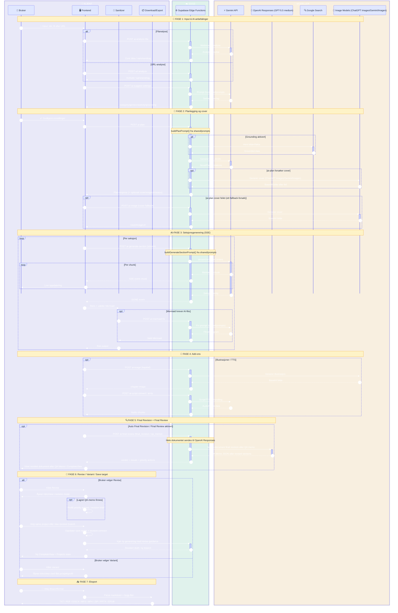

# Story Engine
### AI-drevet publiseringsplattform.


> **Story Engine effektiviserer produksjonen av innhold og sikrer fakta ved hjelp av avanserte AI-agenter. Fra én idé til ferdig dokument, lydbok og video – kvalitetssikret.**

---

## 🚀 Nøkkelfunksjoner

*   ✍️ **Smart Prompt-utvidelse**: Usikker på hvordan du skal formulere deg? Ett klikk forvandler enkle stikkord til en rik, detaljert prosjektbeskrivelse optimalisert for at AI-en skal gi best mulig resultat.

*   ✨ **AI-anbefalte innstillinger**: Få forslag til kategori, sjanger/format (158 kombinasjoner), søk, kreativitet og diagram-frekvens - automatisk tilpasset din idé.

*   🧭 **Simple / Custom startmodus**: Nye prosjekter starter i en ryddig `Simple`-modus der avanserte valg skjules, Final Revision er aktivert, og `Suggest Settings` kjøres automatisk når prosjektet opprettes. `Custom` beholder hele kontrollflaten for brukere som vil styre kategori, format, kreativitet, diagrammer, språk, research og add-ons selv.

*   📄 **Native Dokumentgenerering**: Skaper ekte PDF, DOCX og MP3-filer direkte i nettleseren uten eksterne konverteringstjenester.

*   🌐 **Interaktiv Nettside**: Eksporter prosjektet ditt som en komplett, responsiv nettside (.zip) med oppgradert design, mørkt tema som standard, lys/mørk toggle, innholdsfortegnelse, integrert lyd/bilde-avspilling og egne nedlastingskort. Åpnes enkelt direkte i nettleseren.

*   🎬 **Smart Video-produksjon**: Genererer videoer per kapittel med synkronisert lyd og tekst. Eksporterer som **MP4** (H.264/AAC) i **16:9** eller **9:16** (vertikal) format. Bruker "Smart Split"-teknologi for å sikre perfekt typografi.

*   📊 **PowerPoint-eksport (Non-Fiction)**: AI-genererte presentasjoner med oppsummerte bullet points, kapittelillustrasjoner og Mermaid-diagrammer på dedikerte slides.

*   📚 **EPUB E-bok**: Eksporter som universell e-bok med cover, kapittelnavigasjon og bilder – klar for Apple Books, Kobo, Kindle og andre e-lesere.

*   📂 **Analyser hva som helst**: Start prosjektet ditt med en lydfil, video, bilde, dokument, kodefil eller et helt .zip-arkiv. Core Idea kan i tillegg ha opptil 7 vedlegg, inkludert dokumenter og visuelle referanser, som analyseres før planlegging.

*   🖼️ **Objektagnostiske visuelle referanser**: Opplastede Core Idea-bilder og kildehøstede produktbilder brukes som evidens og visuelle ankre, ikke som collage eller direkte kopi. Cover kan bruke hele referansepoolen, mens seksjonsbilder velger et begrenset, prioritert utvalg og markerer et primary identity anchor når et helmotiv finnes.

*   🔒 **Strukturert fact-lock**: Brukeroppgitte Core Idea-URL-er, opplastede filer, Google Search-kilder og produkt-/konfiguratorlenker normaliseres til én intern kildepool. Fact-lock bygger strukturerte faktakandidater med kildeprioritet, konfliktløsing og autoriserte primary facts før tekst og bildeprompt får bruke tekniske hovedverdier.

*   🛠️ **AI-verktøykasse for spesialoppgaver**: Utfør avanserte oppgaver med ett klikk – konverter lydfiler til undertekster (.srt), generer en komplett README.md fra et .zip-arkiv, eller trekk ut et profesjonelt sammendrag fra et langt dokument.

*   🌍 **Full språk-kontroll**: Velg mellom auto-deteksjon eller spesifiser nøyaktig hvilket språk prosjektet skal skrives på. Eksisterende prosjekter kan nå oversettes via egne plan- og markdown-oversettere.

*   📊 **Dynamisk Diagram-frekvens**: Kontroller den visuelle tettheten med presisjon - velg hvor ofte AI-en skal generere flytskjemaer, tidslinjer og grafer.

*   📝 **Regenerer fra fil**: Last opp en tidligere generert Story Engine-fil (.txt) for å regenerere outputs fra låst dokumentprofil, lage nye medievarianter eller opprette et nytt språkprosjekt.

*   🔁 **Samlet Revise-flyt**: `Revise` bruker lagret QA-memo når det finnes, prefiller revisjonsmål inn i arbeidsflaten, og lar deg enten oppdatere samme prosjekt eller lagre en ny revisjonsgren fra samme arbeidsflate.

*   🎛️ **Variant / Regenerate Outputs**: `Variant` gjenbruker samme prosjektprofil for illustrasjoner, audio og språkbytte. Medie-only-varianter kan oppdatere samme prosjekt og bevare eksisterende bilder når bare audio regenereres, mens språkbytte opprettes som nytt prosjekt.

*   ⚙️ **Automatisk struktur**: La AI-en bestemme det optimale antallet seksjoner for historien din basert på kompleksitet og tema, eller velg antall seksjoner selv.

*   🎙️ **Velg din stemmekvalitet**: Bytt mellom flere Text-to-Speech modeller for lydbøker – Gemini 2.5 Flash (rask og effektiv), Gemini 2.5 Pro (maksimal kvalitet) eller Gemini 3.1 Flash TTS Preview. I testfasen er Gemini 3.1 Flash TTS Preview satt som standardvalg for nye lydgenereringer.

*   🤖 **Multi-Agent System**: Orkestrerer planlegging, skriving og faktasjekk gjennom spesialiserte AI-agenter som samarbeider.

*   🧼 **Vaskemaskinen (Sanitizer)**: Automatisk rensing og validering av kode, Markdown og Mermaid-diagrammer før visning. "Self-healing" Mermaid-diagrammer som fikser syntaksfeil automatisk.

*   🔍 **Final Revision + Final Review**: Etter førstegenerering kan Story Engine kjøre en whole-document Final Revision med GPT-5.5 medium før dokumentet lagres. Final Review er QA-memoet som leser ferdig dokument og returnerer verdict (`strong` / `needs_revision` / `high_risk`), prioriterte forbedringsforslag og seksjonsspesifikke issues uten å endre dokumentet.

*   🧭 **Intelligent Model Routing**: Automatisk valg av optimal AI-modell basert på prosjektets `category`, `genre`, `creativity`-nivå, og om det er fiction eller non-fiction. Routing-logikken lever i `shared/routing/` og brukes av alle Edge Functions.

*   📊 **Quota Health Monitoring**: Sanntids-dashboard for Google Cloud API-kvoter (Gemini, Imagen, Vertex AI) med automatisk synkronisering, helseberegning, og trendvisning. Eget admin-view (`QuotaHealthView`).

*   💳 **Billing & Tier-system**: Komplett abonnement- og kredittløsning med Stripe-integrasjon. Aktive tier-nivåer er `pilot`, `pro` og `elite` med ulike månedlige inkluderte kreditter, generasjonsgrenser og feature-flagg. Eldre `enterprise`-verdier normaliseres til `elite`. Konfigurert i `shared/billing/`.

*   📈 **Production Report og runtime ledger**: Eksportert Story Engine-fil viser både klientbasert provider-estimat og faktisk server-side kredittbruk når ledger-data er fanget, inkludert GPT-5.5, bildeoperasjoner, referanse-surcharge og Final Revision/Review.

*   👥 **Admin Users med prosjektinnsikt**: Admin-flaten viser nå ikke bare tier, kreditter og aktivitet, men også en egen `Projects`-fane per bruker med prosjektantall, review health, revision branches og siste prosjektaktivitet.

---

## 🚀 Se Story Engine i aksjon

### 🧪 Prøv Appen (Beta)
Story Engine kan nå testes på midlertidig server her:
👉 **[https://story.neoweb.no](https://story.neoweb.no)** 

### 🌐 Live demoer
- **Mesterhus Form 1.0 demo (landing/index.html):**
  [https://neoweb.no/mesterhus/index.html](https://neoweb.no/mesterhus/index.html)
  Viser den oppgraderte nedlastbare nettsidepakken med video, lyd, eksportkort og lenke til interaktiv mikroside.

- **Interaktiv Mesterhus-nettside (website/index.html):**
  [https://neoweb.no/mesterhus/website/index.html](https://neoweb.no/mesterhus/website/index.html)
  Ferdig eksportert mikroside generert fra et kildebasert Story Engine-prosjekt.

- **Story Engine walkthrough (produktdemo):**
  [https://neoweb.no/se-walkthrough/index.html](https://neoweb.no/se-walkthrough/index.html)
  Eldre showcase som fortsatt viser leveranseuniverset og fireseksjons walkthrough.

<p>
  <a href="https://neoweb.no/mesterhus/website/index.html">
    
  </a>
  <br/>
  <a href="https://neoweb.no/mesterhus/index.html"><strong>Åpne Mesterhus-demo ➔</strong></a>
  &nbsp;|&nbsp;
  <a href="https://neoweb.no/mesterhus/website/index.html"><strong>Åpne Nettside-eksport ➔</strong></a>
</p>

---

### 🗺️ Videogjennomgang
> 💡 **Klikk på bildene for å se videoene direkte fra vår server**

<table>
  <tr>
    <td>
      <strong>Seksjon 1: Hva Story Engine er i dagens versjon</strong><br/>
      <a href="https://neoweb.no/se-walkthrough/section-1.mp4">
        
      </a><br/>
      Plattformens kjerne, mål og hvorfor pipeline-basert produksjon gir bedre leveringssikkerhet.
    </td>
    <td>
      <strong>Seksjon 2: Arbeidsflyt i praksis (input, styring og regenerering)</strong><br/>
      <a href="https://neoweb.no/se-walkthrough/section-2.mp4">
        
      </a><br/>
      Startmodi, Suggest-flyter, Story Engine-fil import og hvilke innstillinger som bevisst forblir justerbare.
    </td>
  </tr>
  <tr>
    <td>
      <strong>Seksjon 3: Leveranser, add-ons og formatstrategi</strong><br/>
      <a href="https://neoweb.no/se-walkthrough/section-3.mp4">
        
      </a><br/>
      Hvordan ett prosjektgrunnlag gjenbrukes til dokument, presentasjon, web, video, lyd og e-bok.
    </td>
    <td>
      <strong>Seksjon 4: Teknologi, sikkerhet, kostkontroll og administrasjon</strong><br/>
      <a href="https://neoweb.no/se-walkthrough/section-4.mp4">
        
      </a><br/>
      Edge-first arkitektur, server-side kredittlogikk, prompt-SSOT og adminverktøy for brukerstyring.
    </td>
  </tr>
</table>

### 🖥️ Visuell Omvisning App
Møtet med brukeren – rent, moderne og inviterende.


<details>
<summary><strong>Klikk for å se Workspace: app og startside</strong></summary>

### Startside app
Etter landingssiden møter brukeren hovedarbeidsflaten i Story Engine. Den åpner nå i Simple-modus, der nye prosjekter kan startes med færre valg: brukeren skriver inn idé, tema eller bestilling, velger eventuelt bilder og lydopplesning, og kan deretter starte genereringen direkte.

For brukere som ønsker mer kontroll, finnes alle avanserte produksjonsvalg fortsatt i Custom-modus. Der kan man justere språk, kategori, sjanger, kreativitet, researchnivå, add-ons og andre innstillinger før prosjektet kjøres.

Målet med startsiden er å gjøre veien fra første tanke til ferdig prosjekt så kort som mulig, samtidig som mer erfarne brukere fortsatt kan styre hvordan innholdet skal produseres.

### Simple-modus


### Custom-modus


</details>

<details>
<summary><strong>Klikk for å se Workspace: genereringen i sanntid</strong></summary>

### Generation Progress
Noen trinn før genereringen, her foregår researchingen.


Hvor magien skjer. Her ser brukeren innholdet bli skapt i sanntid, med levende oppdateringer.


Her kan man følge skrivingen seksjon for seksjon etter hvert som den skrives.


Når førsteutkastet er skrevet ferdig, går flyten videre til behandling av revisjon og sluttkontroll. Her ser brukeren at systemet ikke bare produserer tekst, men også jobber videre med kvalitetssikring før prosjektet avsluttes.


Til slutt havner prosjektet i ferdigvisningen. Her er genereringen fullført, og brukeren kan gå videre til eksport, åpning av prosjektet, nye varianter eller senere revisjon.


</details>

<details>
<summary><strong>Klikk for å se Workspace: eksport og leveranseformater</strong></summary>

### Eksport og leveranseformater
Story Engine gjør ett prosjektgrunnlag om til flere ferdige leveranser, blant annet dokumentformater, nettside, presentasjon, lyd og video. I denne visningen ser brukeren også at samme tekst kan eksporteres både som klassisk fortelleropplesning eller radio play, og som vanlig bredformatvideo eller vertikal mobilvideo. Poenget er at ett prosjekt ikke bare skrives ferdig, men kan pakkes ut i flere praktiske sluttformater.


</details>

<details>
<summary><strong>Klikk for å se Projects: oversikt</strong></summary>

### Projects Overview
Prosjektoversikten samler alle lagrede prosjekter på ett sted. Her ser brukeren hvilke utkast som er importert, hvilke som mangler første review, hvilke som allerede har baseline eller QA-status, og hva som er neste naturlige handling for hvert prosjekt.


</details>

<details>
<summary><strong>Klikk for å se Projects: åpne et prosjekt</strong></summary>

### Projects / Open
Når et prosjekt åpnes, får brukeren tilgang til cover, struktur, review-status, sist lagrede revisjon og kildeprompt uten å måtte inn i selve arbeidsflaten først. Dette gjør `Projects` til et reelt operasjonspanel, ikke bare en lagringsliste.


</details>

<details>
<summary><strong>Klikk for å se Projects: Revise og revisjonsgren</strong></summary>

### Projects / Revise
`Revise` bygger videre på lagret QA-memo og gjør det tydelig om brukeren bør oppdatere samme prosjekt eller lagre en ny revisjonsgren. `Save Target` styrer nettopp dette valget: enten en direkte oppdatering av eksisterende prosjekt, eller lagring som en separat revision branch for trygg sammenligning og historikk. `Rewrite strength` gir samtidig kontroll over hvor forsiktig eller aggressivt teksten skal omskrives, slik at brukeren kan velge mellom små presiseringer og en mer omfattende redaksjonell omarbeiding. Dette gjør revisjonsarbeidet mer kontrollert, særlig når flere versjoner av samme prosjekt skal sammenlignes senere.


</details>

<details>
<summary><strong>Klikk for å se Projects: Variant og regenererte outputs</strong></summary>

### Projects / Variant
`Variant` lar brukeren gjenbruke samme prosjektprofil for nye illustrasjoner, audio-output eller språkvarianter. Medievarianter kan oppdatere samme prosjekt videre, mens språkvarianter opprettes som et nytt prosjekt med samme grunnprofil, slik skjermbildet viser. Det gjør det mulig å videreføre samme grunnprosjekt til nye leveranser uten å miste historikk eller prosjektkontekst, samtidig som språkversjoner holdes adskilt som egne prosjekter.


</details>

<details>
<summary><strong>Klikk for å se Dashboard</strong></summary>

### Dashboard
Dashboardet gir et raskt overblikk over konto, aktivitet og status. Det er her brukeren ser hva som nylig er generert, hvilke funksjoner som er brukt, og hvordan prosjektarbeidet utvikler seg over tid.


</details>

<details>
<summary><strong>Klikk for å se Billing</strong></summary>

### Billing
Billing-siden samler abonnement, kredittsaldo, top-ups og betalingsstatus i ett tydelig grensesnitt. Målet er at brukeren alltid skal forstå hva som er inkludert, hva som er kjøpt, og hva som er neste steg.


</details>

<details>
<summary><strong>Klikk for å se Monitoring</strong></summary>

### Quota Health
Monitoring viser levende status for AI-kvoter, forbruk og operasjonell helse. Dette er admin-flaten som gjør det mulig å oppdage kapasitetsproblemer, lese runtime-flagg og vurdere neste rollout-steg før noe faktisk går galt.


### Runtime & Config
Her vises hvilke runtime-flagg og fallback-mekanismer som faktisk er aktive. Det gjør overvåkningen konkret, og kobler konfigurasjon direkte til hvordan systemet oppfører seg i produksjon.


### Phase 2 Readiness
Readiness-visningen samler signalene som trengs før neste Vertex-bølge kan vurderes. Den gjør canary-beslutninger mer synlige og mindre avhengige av manuell tolkning på tvers av flere paneler.


### Operational Risks
Dette panelet løfter frem de viktigste operative risikopunktene i et format som er lett å bruke i hverdagen. Målet er å gjøre oppfølging konkret, ikke bare informativ.


</details>

<details>
<summary><strong>Klikk for å se Users</strong></summary>

### Users
Admin-brukerlisten gir full oversikt over brukere, tier, kreditter og abonnementsstatus. I tillegg har hver bruker nå egne faner for `Overview`, `Projects`, `Credits` og `Activity`, slik at support og drift også kan se faktisk prosjektbruk, review health, revision branches og siste prosjektaktivitet uten å forlate adminflaten.


</details>

---

## 🏗️ Teknisk Arkitektur

### Dataflyt (Input → Eksport)

Dataflyten er delt i to separate diagrammer for bedre lesbarhet.

<details>
<summary><strong>Klikk for å se Dataflyt Del 1 (Input → Generering)</strong></summary>

### Dataflyt Del 1: Input → Generering

Dette diagrammet dekker input, analyse, planlegging og innholdsgenerering fram til ferdig generert payload.

```mermaid
graph TD
    Entry((("🚀 App Start")))
    Entry --> LandingPage["🏠 Landing Page<br/><i>LandingPage.tsx</i>"]
    LandingPage --> UserStart((("👤 Bruker")))

    subgraph InputSources ["📥 INPUT KILDER"]
        direction TB
        IdeaInput["📝 Core Idea"]
        FileInput["📁 Fil Upload"]
        URLInput["🌐 URL Analyse"]
        PlanFile["📄 .txt Plan"]
    end
    UserStart -->|"Velger kilde"| InputSources

    subgraph Analysis ["🔍 ANALYSE & ANBEFALINGER"]
        direction TB
        CoreIdea["💡 Core Idea"]
        UI["🎨 IntroView"]
        AIRecommend["🤖 getRecommendedSettingsHybrid()"]
        SuggestPrompt["✨ enhanceUserIdeaHybrid()"]
        FileAnalyzer["⚙️ fileExtract.ts"]
        URLAnalyzer["🔗 api.ts"]
        FileParser["📑 fileParser.ts"]
        SharedPromptSuggest["🧩 shared/prompts<br/><i>suggest builders</i>"]
        EdgeSuggestPrompt["⚙️ ai-suggest-prompt"]
        EdgeSuggestSettings["⚙️ ai-suggest-settings"]
        EdgeAnalyzeFile["⚙️ ai-analyze-file"]
        EdgeUrlAnalyze["⚙️ url-analyze"]
        ReferenceEvidence["🖼️ Reference evidence<br/><i>opptil 7 Core Idea refs</i>"]
        GeminiAnalyze["🤖 Gemini API<br/><i>3 Flash / 3.1 Pro</i>"]
    end

    IdeaInput --> AIRecommend
    IdeaInput --> SuggestPrompt
    SuggestPrompt --> EdgeSuggestPrompt
    EdgeSuggestPrompt --> SharedPromptSuggest
    EdgeSuggestPrompt --> GeminiAnalyze
    CoreIdea --> AIRecommend
    AIRecommend --> EdgeSuggestSettings
    EdgeSuggestSettings --> SharedPromptSuggest
    EdgeSuggestSettings --> GeminiAnalyze
    GeminiAnalyze --> CoreIdea
    EdgeSuggestSettings --> UI

    FileInput --> FileAnalyzer
    FileAnalyzer --> EdgeAnalyzeFile
    EdgeAnalyzeFile --> GeminiAnalyze
    EdgeAnalyzeFile --> ReferenceEvidence
    ReferenceEvidence --> CoreIdea
    URLInput --> URLAnalyzer
    URLAnalyzer --> EdgeUrlAnalyze
    EdgeUrlAnalyze --> GeminiAnalyze
    PlanFile --> FileParser --> PlanReady["📋 NovelPlan<br/><i>fra fil</i>"]

    subgraph Planning ["📐 PLANLEGGING"]
        direction TB
        PlanningLogic{"🤔 Har vi plan?"}
        PlanGenerator["📝 generateNovelPlanHybrid()"]
        SharedPromptPlan["🧩 shared/prompts<br/><i>planPrompt.ts</i>"]
        EdgePlan["⚙️ ai-plan"]
        ModelRouter["🧭 shared/routing<br/><i>decision.ts</i>"]
        GeminiPlan["🤖 Gemini API<br/><i>3 Flash / 3.1 Pro (via Vertex/Dev)</i>"]
        SearchDecision{"🔎 Google Search?"}
        SearchAPI["🌍 Grounding + Citations"]
        PlanCoverAttempt["🖼️ ai-plan cover attempt<br/><i>ChatGPT Images / Gemini / Imagen</i>"]
    end

    UI --> PlanningLogic
    PlanningLogic -->|"Ja"| PlanReady
    PlanningLogic -->|"Nei"| PlanGenerator
    PlanGenerator --> SharedPromptPlan
    SharedPromptPlan --> EdgePlan
    ReferenceEvidence -.-> EdgePlan
    EdgePlan --> ModelRouter
    ModelRouter --> GeminiPlan
    EdgePlan --> SearchDecision
    SearchDecision -->|"Ja"| SearchAPI --> EdgePlan
    SearchDecision -->|"Nei"| EdgePlan
    EdgePlan --> PlanCoverAttempt --> EdgePlan
    EdgePlan --> PlanReady

    subgraph ContentFlow ["✍️ GENERERING + SANITIZE + ADD-ONS"]
        direction TB
        CoverDecision{"🖼️ Cover fra ai-plan?"}
        EdgeImageCover["⚙️ ai-image (cover fallback)"]
        ImageGen["🎨 Image models<br/><i>ChatGPT Images / Gemini / Imagen</i>"]
        PlanWithCover["📖 Plan + coverImageUrl"]
        ChapterGen["📚 generateChapterBatch()"]
        PromptService3["📋 Request assembly<br/><i>chapters.ts</i>"]
        SharedPromptSection["🧩 shared/prompts<br/><i>sectionPrompt.ts</i>"]
        EdgeSection["⚙️ ai-generate-section<br/><i>SSE</i>"]
        RoutingSection["🧭 shared/routing"]
        GeminiSection["🤖 Gemini Streaming<br/><i>Vertex AI / Dev API</i>"]
        StreamHandler["📡 chapters.ts"]
        RawMD["📄 Rå MD"]
        Fix1["🔧 ContentSanitizer"]
        Fix2["✅ mermaidFixer"]
        MermaidDecision{"📊 Mermaid OK?"}
        EdgeMermaidFix["⚙️ ai-mermaid-fix"]
        SharedPromptFix["🧩 mermaidFixPrompt.ts"]
        GeminiFix["🤖 Mermaid fix"]
        CleanMD["✨ Ren MD"]
        AddOnProcessor["⚡ processChapterAddOns()"]
        EdgeImageChapter["⚙️ ai-image (chapter)"]
        EdgeScript["⚙️ ai-script-convert"]
        EdgeTTS["⚙️ ai-tts"]
        FinalChapter["📖 GeneratedChapter"]
        GenerationPayload["💾 Payload til Del 2"]
    end

    PlanReady --> CoverDecision
    ReferenceEvidence -.-> PlanCoverAttempt
    ReferenceEvidence -.-> EdgeImageChapter
    CoverDecision -->|"Ja"| PlanWithCover
    CoverDecision -->|"Nei"| EdgeImageCover
    EdgeImageCover --> ImageGen
    ImageGen --> EdgeImageCover
    EdgeImageCover --> PlanWithCover
    PlanWithCover --> ChapterGen
    ChapterGen --> PromptService3
    PromptService3 --> SharedPromptSection
    SharedPromptSection --> EdgeSection
    EdgeSection --> RoutingSection
    RoutingSection --> GeminiSection
    GeminiSection --> EdgeSection
    EdgeSection --> StreamHandler
    StreamHandler --> RawMD
    RawMD --> Fix1
    Fix1 --> Fix2
    Fix2 --> MermaidDecision
    MermaidDecision -->|"Ja"| CleanMD
    MermaidDecision -->|"Nei"| EdgeMermaidFix
    EdgeMermaidFix --> SharedPromptFix
    SharedPromptFix --> GeminiFix
    GeminiFix --> EdgeMermaidFix
    EdgeMermaidFix --> Fix2
    CleanMD --> AddOnProcessor
    AddOnProcessor --> EdgeImageChapter
    AddOnProcessor --> EdgeScript
    EdgeScript --> EdgeTTS
    AddOnProcessor --> FinalChapter
    EdgeImageChapter --> FinalChapter
    EdgeTTS --> FinalChapter
    FinalChapter --> GenerationPayload
    PlanWithCover --> GenerationPayload

    classDef userNode fill:#fef3c7,stroke:#d97706,stroke-width:3px,color:#92400e
    classDef landingNode fill:#fce7f3,stroke:#be185d,stroke-width:2px,color:#9d174d
    classDef apiNode fill:#dbeafe,stroke:#2563eb,stroke-width:2px,color:#1e40af
    classDef processNode fill:#f3e8ff,stroke:#7c3aed,stroke-width:2px,color:#5b21b6
    classDef serviceNode fill:#e0e7ff,stroke:#4f46e5,stroke-width:2px,color:#3730a3
    classDef stateNode fill:#dcfce7,stroke:#16a34a,stroke-width:3px,color:#166534
    classDef decisionNode fill:#fff7ed,stroke:#ea580c,stroke-width:2px,color:#c2410c
    classDef sanitizerNode fill:#e0f2fe,stroke:#0284c7,stroke-width:2px,color:#075985

    class Entry,UserStart userNode
    class LandingPage landingNode
    class GeminiAnalyze,GeminiPlan,SearchAPI,ImageGen,GeminiSection,GeminiFix apiNode
    class SuggestPrompt,AIRecommend,PlanGenerator,ChapterGen,StreamHandler,AddOnProcessor processNode
    class PromptService3,FileAnalyzer,URLAnalyzer,FileParser,EdgeSuggestPrompt,EdgeSuggestSettings,EdgeAnalyzeFile,EdgeUrlAnalyze,EdgePlan,SharedPromptSuggest,SharedPromptPlan,SharedPromptSection,EdgeSection,EdgeImageCover,EdgeImageChapter,EdgeMermaidFix,SharedPromptFix,EdgeScript,EdgeTTS,ModelRouter,RoutingSection serviceNode
    class CoreIdea,ReferenceEvidence,PlanReady,PlanWithCover,FinalChapter,GenerationPayload,UI stateNode
    class PlanningLogic,SearchDecision,CoverDecision,MermaidDecision decisionNode
    class RawMD,Fix1,Fix2,CleanMD sanitizerNode
```
</details>

<details>
<summary><strong>Klikk for å se Dataflyt Del 2 (State → Eksport)</strong></summary>

### Dataflyt Del 2: State → Review / Revise / Eksport

Dette diagrammet dekker state/sporing, prosjektvisning, QA/revise-flyt og alle eksportformatene.

```mermaid
graph TD
    %% ═══════════════════════════════════════════
    %% 📱 STORY ENGINE - DEL 2 (STATE → REVIEW / REVISE / EKSPORT)
    %% Oppdatert: April 2026
    %% ═══════════════════════════════════════════

    GenerationPayload["📥 Fra Del 1<br/><i>Plan + Chapters + Audio + Images</i>"]
    QuotaUsage["💳 Credits/Kvoter<br/><i>Edge _shared/utils.ts</i>"]

    subgraph StateTracking ["💾 STATE & SPORING"]
        direction LR
        AppState[("App State<br/><i>React</i>")]
        UsageMetrics["📊 UsageMetrics<br/><i>Tokens/Images/Audio</i>"]
    end

    GenerationPayload --> AppState
    GenerationPayload -.-> QuotaUsage
    QuotaUsage --> UsageMetrics
    AppState --> UsageMetrics

    Viewer["🖥️ ContentRenderer<br/><i>react-markdown + Mermaid</i>"]
    Screen["📺 GenerationView / CompleteView"]
    ProjectsUI["📚 ProjectsViewSimple / ProjectsView"]
    IntroUI["📝 IntroView<br/><i>Revise / Variant workspace</i>"]
    UserEnd((("👤 Bruker")))
    DownloadBtn["⬇️ DownloadModal<br/><i>Format + Progress</i>"]
    FormatChoice{"📁 Format?"}
    SaveState["☁️ cloudSave.ts<br/><i>projects + stats + lineage</i>"]

    AppState --> Viewer --> Screen
    AppState --> SaveState
    SaveState --> ProjectsUI
    UserEnd -.->|"Ser dokument"| Screen
    UserEnd -.->|"Ser lagrede prosjekter"| ProjectsUI
    UserEnd -->|"Last Ned"| DownloadBtn --> FormatChoice

    subgraph FinalReviewFlow ["🔍 FINAL REVISION / REVIEW"]
        direction TB
        ReviewDecision{"🔍 Kjør Final Revision / Review?"}
        EdgeFinalReview["⚙️ ai-final-review"]
        ReviewModel["🧠 OpenAI Responses<br/><i>GPT-5.5 medium</i>"]
        QAMemo["📋 Revised document / QA Memo<br/><i>final text eller verdict + issues</i>"]
    end

    AppState -->|"Ferdig dokument"| ReviewDecision
    ReviewDecision -->|"Ja"| EdgeFinalReview
    EdgeFinalReview --> ReviewModel
    ReviewModel --> EdgeFinalReview
    EdgeFinalReview --> QAMemo
    QAMemo --> Screen
    ReviewDecision -->|"Nei / Ikke tilgjengelig"| DownloadBtn

    subgraph RevisionFlow ["🔁 REVISE / VARIANT / SAVE TARGET"]
        direction TB
        ReviseDecision{"🔁 Revise fra Complete/Projects?"}
        VariantDecision{"🎛️ Variant?"}
        SaveTarget{"💾 Same project<br/>eller new revision branch?"}
        RevisionMemo["📋 Saved QA memo<br/><i>priority actions / guidance</i>"]
    end

    Screen --> ReviseDecision
    ProjectsUI --> ReviseDecision
    ProjectsUI --> VariantDecision
    QAMemo --> RevisionMemo
    ReviseDecision -->|"Ja"| IntroUI
    VariantDecision -->|"Ja"| IntroUI
    RevisionMemo --> IntroUI
    IntroUI --> SaveTarget
    SaveTarget --> SaveState
    IntroUI -->|"Ny generering / språkvariant"| AppState

    subgraph ExportService ["📤 EKSPORT SERVICE"]
        direction TB
        DLService["🔧 downloadService"]
        ContentParse["📑 ContentParser<br/><i>MD → Blokker</i>"]
        ExportModules["📦 Export Modules<br/><i>docx/pdf/video/website</i>"]
        FullMD["📄 Full Markdown<br/><i>YAML + Innhold</i>"]
        DLService --> ContentParse
        DLService --> ExportModules
        DLService --> FullMD
    end

    AppState -->|"NovelPlan + Chapters"| DLService
    UsageMetrics -->|"Produksjonsrapport"| DLService

    subgraph ExportFormats ["💾 EKSPORT FORMATER"]
        direction TB
        ExportTXT["📄 .txt<br/><i>YAML + Markdown</i>"]
        GeneratePDF["📕 PDF Generator<br/><i>jsPDF + Bold/Italic</i>"]
        ExportPDF["📕 .pdf<br/><i>A4 + Mermaid PNG</i>"]
        GenerateDOCX["📘 DOCX Generator<br/><i>docx + Numbered lists</i>"]
        ExportDOCX["📘 .docx<br/><i>Native Word</i>"]
        GenerateMP3["🎵 Audio Processor<br/><i>MP3/WAV valg</i>"]
        ExportMP3["🎵 .zip<br/><i>MP3 (64kbps) eller WAV</i>"]
        GenerateWebM["🎬 Video Processor<br/><i>MP4 H.264/AAC</i>"]
        ExportWebM["🎬 .zip<br/><i>MP4 (16:9 / 9:16)</i>"]
        GenerateWebsite["🌐 Web Generator<br/><i>HTML/CSS/JS Bundle</i>"]
        ExportWebsite["🌐 .zip<br/><i>Interaktiv side</i>"]
        GeneratePPTX["📊 PPTX Generator<br/><i>AI Summarize + PptxGenJS</i>"]
        ExportPPTX["📊 .pptx<br/><i>Non-Fiction presentasjon</i>"]
        GenerateEPUB["📚 EPUB Generator<br/><i>XHTML + Cover</i>"]
        ExportEPUB["📚 .epub<br/><i>Universell e-bok</i>"]
    end

    FormatChoice -->|"TXT"| ExportTXT
    FullMD --> ExportTXT

    FormatChoice -->|"PDF"| GeneratePDF
    ContentParse --> GeneratePDF
    GeneratePDF --> ExportPDF

    FormatChoice -->|"DOCX"| GenerateDOCX
    ContentParse --> GenerateDOCX
    GenerateDOCX --> ExportDOCX

    FormatChoice -->|"MP3"| GenerateMP3
    AppState -->|"audioContent"| GenerateMP3
    GenerateMP3 --> ExportMP3

    FormatChoice -->|"MP4 Video"| GenerateWebM
    AppState -->|"audio + image"| GenerateWebM
    GenerateWebM --> ExportWebM

    FormatChoice -->|"Nettside"| GenerateWebsite
    AppState -->|"Plan + Chapters"| GenerateWebsite
    GenerateWebsite --> ExportWebsite

    FormatChoice -->|"PPTX"| GeneratePPTX
    AppState -->|"Plan + AI Summary"| GeneratePPTX
    GeneratePPTX --> ExportPPTX

    FormatChoice -->|"EPUB"| GenerateEPUB
    ContentParse --> GenerateEPUB
    GenerateEPUB --> ExportEPUB

    classDef userNode fill:#fef3c7,stroke:#d97706,stroke-width:3px,color:#92400e
    classDef apiNode fill:#dbeafe,stroke:#2563eb,stroke-width:2px,color:#1e40af
    classDef processNode fill:#f3e8ff,stroke:#7c3aed,stroke-width:2px,color:#5b21b6
    classDef serviceNode fill:#e0e7ff,stroke:#4f46e5,stroke-width:2px,color:#3730a3
    classDef stateNode fill:#dcfce7,stroke:#16a34a,stroke-width:3px,color:#166534
    classDef exportNode fill:#fce7f3,stroke:#db2777,stroke-width:2px,color:#9d174d
    classDef decisionNode fill:#fff7ed,stroke:#ea580c,stroke-width:2px,color:#c2410c
    classDef viewNode fill:#f5f3ff,stroke:#7c3aed,stroke-width:2px,color:#5b21b6
    classDef metricsNode fill:#fef9c3,stroke:#ca8a04,stroke-width:2px,color:#854d0e

    class UserEnd userNode
    class Viewer,Screen,ProjectsUI,IntroUI viewNode
    class DLService,ContentParse,ExportModules,SaveState serviceNode
    class AppState,GenerationPayload,RevisionMemo stateNode
    class QuotaUsage,UsageMetrics metricsNode
    class FormatChoice,ReviseDecision,VariantDecision,SaveTarget decisionNode
    class ExportTXT,ExportPDF,ExportDOCX,ExportMP3,ExportWebM,ExportWebsite,ExportPPTX,ExportEPUB,GeneratePDF,GenerateDOCX,GenerateMP3,GenerateWebM,GenerateWebsite,GeneratePPTX,GenerateEPUB,FullMD,DownloadBtn exportNode
    classDef reviewNode fill:#ecfdf5,stroke:#059669,stroke-width:2px,color:#065f46
    class EdgeFinalReview,ReviewModel,QAMemo reviewNode
    class ReviewDecision decisionNode
```
</details>

<details>
<summary><strong>Klikk for å se Sekvensdiagram (Interaksjon)</strong></summary>

### Sekvensdiagram (Interaksjon)

Hvordan frontend kommuniserer med AI-modellene og håndterer asynkrone strømmer.


```mermaid
%%{init: {
  'theme': 'base',
  'themeVariables': {
    'primaryColor': '#6366f1',
    'primaryTextColor': '#ffffff',
    'primaryBorderColor': '#4f46e5',
    'secondaryColor': '#10b981',
    'tertiaryColor': '#f0f9ff',
    'lineColor': '#6366f1',
    'noteTextColor': '#1e293b',
    'noteBkgColor': '#fef3c7',
    'noteBorderColor': '#f59e0b',
    'actorTextColor': '#1e293b',
    'actorBkg': '#e0e7ff',
    'actorBorder': '#6366f1',
    'activationBkgColor': '#c7d2fe',
    'activationBorderColor': '#4f46e5',
    'sequenceNumberColor': '#ffffff'
  },
  'sequence': {
    'mirrorActors': false,
    'messageAlign': 'center',
    'width': 180,
    'useMaxWidth': true
  }
}}%%

sequenceDiagram
    autonumber
    
    box rgba(99, 102, 241, 0.1) 🎯 KLIENT
        participant User as 👤 Bruker
        participant FE as 🖥️ Frontend
        participant San as 🧼 Sanitizer
        participant DL as 📦 Download/Export
    end
    
    box rgba(16, 185, 129, 0.1) ☁️ EDGE
        participant Edge as ⚙️ Supabase Edge Functions
    end
    
    box rgba(245, 158, 11, 0.1) 🧠 MODELLER
        participant Gemini as ⚡ Gemini API
        participant OpenAI as 🧠 OpenAI Responses (GPT-5.5 medium)
        participant Search as 🔍 Google Search
        participant Imagen as 🎨 Image Models (ChatGPT Images/Gemini/Imagen)
    end

    Note over User,Imagen: 🎯 FASE 1: Input & AI-anbefalinger
    
    User->>+FE: 📝 Input: idé, fil eller URL
    alt Filanalyse
        FE->>+Edge: POST ai-analyze-file
        Edge->>+Gemini: Multimodal analyse
        Gemini-->>-Edge: Analyse-resultat
        Edge-->>-FE: Core Idea / sammendrag
    else URL-analyse
        FE->>+Edge: POST url-analyze
        Edge-->>-FE: Innhold / sammendrag
    end
    FE->>+Edge: POST ai-suggest-settings
    Edge->>Gemini: Prompt fra shared/prompts
    Gemini-->>Edge: Settings-forslag
    Edge-->>-FE: category/genre/creativity/grounding

    Note over User,Imagen: 📐 FASE 2: Planlegging og cover
    
    User->>FE: ✅ Godkjenn innstillinger
    FE->>+Edge: POST ai-plan
    Note over Edge: buildPlanPrompt() fra shared/prompts
    
    alt Grounding aktivert
        Edge->>+Search: Hent kilder/fakta
        Search-->>-Edge: Grounded data
    end
    
    Edge->>+Gemini: Generer plan JSON
    Gemini-->>-Edge: NovelPlan + citations
    opt ai-plan forsøker cover
        Edge->>Imagen: Generer cover (ChatGPT Images/Gemini/Imagen)
        Imagen-->>Edge: Base64 bilde eller feil
    end
    Edge-->>-FE: Plan-respons (+ optional coverImageUrl/status)
    opt ai-plan cover feilet (ett fallback-forsøk)
        FE->>+Edge: POST ai-image (cover fallback)
        Edge->>+Imagen: Generer cover
        Imagen-->>-Edge: Base64 bilde
        Edge-->>-FE: coverImageUrl
    end

    Note over User,Imagen: ✍️ FASE 3: Seksjonsgenerering (SSE)
    
    loop Per seksjon
        FE->>+Edge: POST ai-generate-section (stream)
        Note over Edge: buildGenerateSectionPrompt() fra shared/prompts
        Edge->>+Gemini: streamGenerateContent
        loop Per chunk
            Gemini-->>Edge: Markdown chunk
            Edge-->>FE: SSE event chunk
            FE-->>User: Live oppdatering
        end
        Gemini-->>-Edge: Seksjon ferdig
        Edge-->>-FE: DONE event
        FE->>San: Rens + valider Mermaid
        opt Mermaid krever AI-fiks
            San->>+Edge: POST ai-mermaid-fix
            Edge->>Gemini: Fix-prompt (shared/prompts)
            Gemini-->>Edge: Fikset diagram
            Edge-->>-San: Valid Mermaid
        end
        San-->>FE: Ren output
    end
    
    Note over User,Imagen: 🎁 FASE 4: Add-ons
    opt Illustrasjoner / TTS
        FE->>+Edge: POST ai-image (kapittel)
        Edge->>Imagen: Generer illustrasjon
        Imagen-->>Edge: Base64 bilde
        Edge-->>-FE: chapter image
        FE->>+Edge: POST ai-script-convert / ai-tts
        Edge->>Gemini: Script/TTS behandling
        Gemini-->>Edge: Audio/script-data
        Edge-->>-FE: Audio chunks
    end

    Note over User,OpenAI: 🔍 FASE 5: Final Revision + Final Review
    opt Auto Final Revision / Final Review aktivert
        FE->>+Edge: POST ai-final-review (final_revision / qa_memo)
        Note over Edge: Hele dokumentet sendes til OpenAI Responses
        Edge->>+OpenAI: Whole-document final revision eller QA memo
        OpenAI-->>-Edge: QA Memo JSON eller revised sections
        Edge-->>-FE: verdict + issues + priority actions
        FE-->>User: Viser revidert dokument eller QA Memo i CompleteView
    end

    Note over User,DL: 🔁 FASE 6: Revise / Variant / Save target

    alt Bruker velger Revise
        User->>FE: Klikk Revise
        FE-->>User: Åpner IntroView i revision mode
        opt Lagret QA-memo finnes
            FE->>FE: Prefill priority actions / revision brief
        end
        User->>FE: Velg same project eller new revision branch
        FE->>FE: Oppdater save target + revision contract
        FE->>+Edge: Kjør ny generering med revise-guidance
        Edge-->>-FE: Revidert draft / ny branch
        FE-->>User: Ny CompleteView + Projects state
    else Bruker velger Variant
        User->>FE: Klikk Variant
        FE-->>User: Åpner IntroView med låst prosjektprofil
    end

    Note over User,DL: 📥 FASE 7: Eksport

    User->>FE: 📁 Velg eksportformat
    FE->>DL: Parse markdown + bygg filer
    
    DL-->>User: TXT / PDF / DOCX / MP3 / MP4 / ZIP / PPTX / EPUB
```
</details>

---

## 📂 Filstruktur & Modul-analyse

<details>
<summary><strong>Klikk for filstruktur</strong></summary>

Prosjektet har gjennomgått en omfattende refaktorering for å øke vedlikeholdbarhet og skalerbarhet. Vi bruker nå en tydelig domenestruktur under `services`, samt et delt prompt-lag i `shared/prompts` for å hindre prompt-drift mellom frontend og Edge Functions.

```text
.
├── App.tsx                                   # Global state, view-ruting og kostnadssporing
├── README.md                                 # Dokumentasjon
├── CHANGELOG.md                              # Endringslogg
├── ROADMAP.md                                # Veikart og fremtidsplaner
├── package.json                              # Scripts, avhengigheter og app-metadata
├── vite.config.ts                            # Vite bygg/dev-konfigurasjon
├── tailwind.config.js                        # Tailwind tema og scanning
├── postcss.config.js                         # PostCSS pipeline
├── constants.ts                              # Globale konstanter (stemmer, stiler)
├── types.ts                                  # TypeScript definisjoner for hele applikasjonen
├── genres.ts                                 # Definisjoner av hovedsjangre og kategorier
├── genreOptions.ts                           # Kontekstuelle sub-options (faktasjekk, lengde, etc.)
├── genreUtils.ts                             # Delte sjanger-hjelpere (fiction/non-fiction checks)
├── languages.ts                              # Støttede språk for I/O
├── metadata.json                             # Statisk app-/modellmetadata
├── docs/                                     # Planer, eval-notater og operasjonell dokumentasjon
├── public/                                   # Bilder, screenshots og statiske assets
├── landing/                                  # Egen statisk showcase/landing
├── src/                                      # Global CSS + Vite typer
├── components/
│   ├── Icons.tsx                             # Ikoner (SVG)
│   ├── MermaidDebugPage.tsx                  # Debug side for Mermaid
│   ├── OnboardingModal.tsx                   # Førstegangs onboarding
│   ├── ParserTest.tsx                        # Test-komponent for parser
│   ├── auth/                                 # Login/QR-auth UI
│   │   └── QrLogin.tsx                       # QR-login flyt for mobil autorisering
│   ├── landing/                              # Landingsside komponenter
│   │   └── LandingPage.tsx                   # Hovedinngang / Hero-seksjon
│   ├── ui/                                   # Gjenbrukbare UI-komponenter
│   │   ├── ContentRenderer.tsx               # Markdown/Mermaid renderer (ReactMarkdown)
│   │   ├── DownloadModal.tsx                 # Modal for valg av eksportformat
│   │   ├── ErrorBoundary.tsx                 # Feilhåndtering
│   │   ├── LoadingView.tsx                   # Animerte laste-steg (Analyzing -> Finalizing)
│   │   ├── LogViewer.tsx                     # Debug-konsoll i UI
│   │   ├── Mermaid.tsx                       # Wrapper for Mermaid-diagrammer
│   │   ├── PlanningStepper.tsx               # Visuell fremdriftsindikator
│   │   ├── ResearchSourcesBox.tsx            # Visning av Google Search-kilder
│   │   └── SettingsModal.tsx                 # Avanserte innstillinger (Logger, Terskelverdier)
│   └── views/                                # Hovedvisninger (States)
│       ├── AdminUsersView.tsx                # Egen admin-visning for brukerstyring + projects/credits/activity tabs
│       ├── BillingView.tsx                   # Abonnement, kreditter og Stripe-portal
│       ├── DashboardView.tsx                 # Brukerdashboard og prosjektoversikt
│       ├── ProjectsView.tsx                  # Avansert prosjektfamilievisning / lineage / QA-detaljer
│       ├── ProjectsViewSimple.tsx            # Standard prosjektliste med Open / Variant / Revise
│       ├── QuotaHealthView.tsx               # Google Cloud kvote-monitoring dashboard
│       ├── quotaHealthPlanData.ts            # Plan-data for fase 2 quota readiness
│       ├── pageShell.ts                      # Delt shell-layout for admin-sider
│       ├── LoginView.tsx                     # Innlogging og autentisering
│       ├── QrAuthorizeView.tsx               # Mobil autorisering for QR-login
│       ├── WaitlistView.tsx                  # Venteliste og early access
│       ├── IntroView.tsx                     # Input, filanalyse, Revise/Variant/import-workflows
│       ├── CastingView.tsx                   # Karakteroversikt og stemmevalg
│       ├── GenerationView.tsx                # Live streaming av innhold
│       └── CompleteView.tsx                  # Ferdig resultat, Final Review Memo, Revise/Variant-entrypoints
├── scripts/                                  # Verktøy og test-skript
│   ├── audit-routing-coverage.ts             # Dekningssjekk for routing-regler mot katalogen
│   ├── check-prompt-drift.mjs                # CI-guard mot inline core-prompts i Edge Functions
│   ├── check-suggest-settings-plan.ts        # Parser-/integritetssjekk for suggest-settings testplan
│   ├── compare-suggest-settings-eval.ts      # Sammenligner to suggest-settings eval-rapporter
│   ├── eval-human-nuance-ab.ts               # A/B-evaluering av prompt-kvalitet
│   ├── eval-suggest-settings.ts              # Live/dry-run eval mot suggest-settings-matrisen
│   ├── smoke-human-nuance-default-matrix.ts  # Default-matrise for human-nuance
│   ├── smoke-human-nuance-modes.ts           # Test av human-nuance prompt-modi
│   ├── smoke-mermaid-fixes.ts                # Smoke-test av mermaid sanitizer/fixer
│   ├── smoke-prompt-builders.ts              # Smoke-test av shared prompt-builders
│   ├── smoke-routing-decision.ts             # Smoke-test av model routing-logikk
│   ├── smoke-suggest-settings-heuristics.ts  # Test av suggest-settings heuristikker
│   ├── summarize-suggest-settings-eval.ts    # Oppsummerer suggest-settings eval-rapporter
│   ├── lib/                                  # Hjelpere for eval/testskript
│   │   └── suggest-settings-plan.ts          # Parser for suggest-settings rebalanseringsplanen
│   └── archive/                              # Arkiverte/utdaterte skript
├── services/                                 # FORRETNINGSLOGIKK (MODULÆR)
│   ├── ContentParser.ts                      # AST-parser som konverterer MD til blokker
│   ├── ContentSanitizer.ts                   # "Vaskemaskinen" (Regex-rensing, header-fiks)
│   ├── cloudSave.ts                          # Prosjektpersistens, load/save/delete og lineage
│   ├── coreIdeaAttachmentRecords.ts          # Normaliserer Core Idea vedlegg for prosjektlagring/eksport
│   ├── coreIdeaAttachments.ts                # Klientflyt for Core Idea fil- og bildereferanser
│   ├── documentStyles.ts                     # Fasade for styles/index.ts
│   ├── downloadService.ts                    # Fasade for export/index.ts
│   ├── api.ts                                # URL-analyse og ekstern API-kommunikasjon
│   ├── auth.ts                               # Autentiseringslogikk
│   ├── formatConstants.ts                    # Konstanter for overskriftsformater
│   ├── geminiService.ts                      # Fasade for ai/index.ts
│   ├── localStorageService.ts                # Klientlagring for drafts, settings og snapshots
│   ├── modelPricing.ts                       # Lokale provider-estimater for Gemini, OpenAI, image og TTS
│   ├── prompts.ts                            # Stabil offentlig entrypoint (barrel re-export)
│   ├── referenceEvidence.ts                  # Bygger evidenspakke for visuelle Core Idea-referanser
│   ├── supabaseApi.ts                        # Klient for Supabase Edge Functions
│   ├── supabaseClient.ts                     # Supabase autentisering og oppsett
│   ├── usageMetrics.ts                       # Runtime usage ledger og Production Report-grunnlag
│   ├── ai/                                   # AI-orkestrering via Supabase, Google, OpenAI og image providers
│   │   ├── audioHelpers.ts                   # PCM/Base64 hjelpere
│   │   ├── chapters.ts                       # Generering av kapitler (tekst + add-ons)
│   │   ├── config.ts                         # Konfigurasjon (tokens, sikkerhet)
│   │   ├── fileExtract.ts                    # Filanalyse (DOCX, PDF, Code, Images)
│   │   ├── imageGenerator.ts                 # Bildegenerering via Supabase/API-lag
│   │   ├── imagen.ts                         # Bildegenerering (Gemini/Imagen-kompatibilitet)
│   │   ├── index.ts                          # Eksportør
│   │   ├── retry.ts                          # Feilhåndtering og retry-logikk
│   │   ├── schemas.ts                        # JSON schemas for AI output
│   │   ├── summarize.ts                      # AI-oppsummering for PPTX bullet points
│   │   ├── tts.ts                            # Tekst-til-tale logikk (Gemini)
│   │   └── utils.ts                          # Delte AI-hjelpere
│   ├── aiHybrid.ts                           # Edge-first orkestrering (lokal fallback fjernet)
│   ├── finalReview/                          # Whole-document review, revision guidance og rewrite-styrke
│   │   ├── documentHash.ts                   # Fingerprinting av dokumentutkast for review-sammenligning
│   │   ├── finalRevision.ts                  # Whole-document final revision
│   │   ├── guidedPatch.ts                    # QA-ledet brief-seeding og patch-kandidater
│   │   ├── initialRevisionGuidance.ts        # Førstepass-guidance for finale revisjoner
│   │   ├── reviewCanon.ts                    # Normalisering av lagret review-state
│   │   ├── reviewProgress.ts                 # Review-delta / stagnasjon / anbefalt neste steg
│   │   └── rewriteStrength.ts                # Light / Medium / Heavy defaults per workflow
│   ├── export/                               # Eksport-moduler
│   │   ├── docx.ts                           # DOCX-generering
│   │   ├── epub.ts                           # EPUB 3 e-bok generering (XHTML + Cover)
│   │   ├── index.ts                          # Eksportør
│   │   ├── markdown.ts                       # Markdown-generering
│   │   ├── mp3.ts                            # Lyd-sammenstilling (MP3 64kbps / WAV)
│   │   ├── pdf.ts                            # PDF-generering med avansert formatering
│   │   ├── pptx.ts                           # PowerPoint-generering (Non-Fiction)
│   │   ├── utils.ts                          # Delte eksport-hjelpere (Mermaid render)
│   │   ├── video.ts                          # Videorendring (MP4 H.264/AAC, 16:9 / 9:16) med "Smart Split"
│   │   └── website.ts                        # Interaktiv nettside-pakking (ZIP)
│   ├── format/                               # Tekstformatering
│   │   └── sectionHeaders.ts                 # Håndtering av kapitteloverskrifter og språk
│   ├── i18n/                                 # Internasjonalisering
│   │   └── translations.ts                   # Oversettelser (14 språk) for UI og eksport
│   ├── prompts/                              # Lokale prompt-moduler (split refaktor)
│   │   ├── README.md                         # Modulgrense + safe refactor-regler
│   │   ├── core.ts                           # Delte lokale prompt-konstanter/hjelpere
│   │   ├── referencePrompts.ts               # Fil-/media-analyse prompts
│   │   ├── settingsPrompts.ts                # Settings + enhance-idea prompts
│   │   ├── chapterPrompts.ts                 # Chapter/section + export/QA/TTS prompts
│   │   └── fragments/                        # Re-export av shared fragments
│   │       ├── markdownRules.ts              # MD-regler (fra shared/prompts)
│   │       ├── mermaidRules.ts               # Mermaid-regler (fra shared/prompts)
│   │       ├── mermaidSyntaxV11.ts           # Mermaid v11 syntaks (shared)
│   │       └── professionalVisualization.ts  # Visualiseringsstrategi (shared)
│   ├── sanitize/                             # Rens og validering
│   │   └── mermaidFixer.ts                   # Self-healing Mermaid logikk
│   └── styles/                               # Stildefinisjoner
│       ├── config.ts                         # Globale stilvariabler
│       ├── docx.ts                           # DOCX-spesifikke stiler
│       ├── helpers.ts                        # Hjelpefunksjoner for farger/størrelser
│       ├── index.ts                          # Eksportør
│       ├── pdf.ts                            # PDF-spesifikke stiler
│       ├── types.ts                          # Type-definisjoner for stiler
│       └── units.ts                          # Enhetskonvertering (mm, px, pt)
├── shared/                                   # Delt kode mellom frontend og Edge Functions
│   ├── billing/                              # Abonnement- og tier-konfigurasjon
│   │   ├── presentation.ts                   # UI-presentasjonstekster, feature-kort og notices
│   │   ├── productPolicy.ts                  # Produktpolicy (kreditt-utløp, top-up regler)
│   │   └── tierPresets.ts                    # Tier-definisjoner (pilot/pro/elite)
│   ├── fiction/                              # Fiction-spesifikk logikk
│   │   └── premiseAnchor.ts                  # Premissforankring / continuity-hjelper for fiction
│   ├── routing/                              # Intelligent model routing
│   │   ├── decision.ts                       # Routing-beslutningsmotor
│   │   ├── mapping.ts                        # Modell-til-oppgave mapping
│   │   ├── types.ts                          # Routing-types
│   │   └── index.ts                          # Eksportør
│   ├── suggestSettings/                      # Delt suggest-settings logikk
│   │   ├── heuristics.ts                     # Regex/guard heuristikker og fast-path regler
│   │   └── normalization.ts                  # Normalisering av suggest-resultater og defaults
│   └── prompts/                              # Prompt source-of-truth (core generation flows)
│       ├── builders/                         # Prompt-builders for Edge flows
│       │   ├── coverImagePrompt.ts           # ai-image / cover-art prompt-bygging
│       │   ├── sectionPrompt.ts              # ai-generate-section
│       │   ├── planPrompt.ts                 # ai-plan
│       │   ├── suggestPrompt.ts              # ai-suggest-prompt
│       │   ├── suggestSettingsPrompt.ts      # ai-suggest-settings
│       │   ├── translateMarkdownPrompt.ts    # ai-translate-markdown
│       │   ├── translatePlanPrompt.ts        # ai-translate-plan
│       │   └── mermaidFixPrompt.ts           # ai-mermaid-fix
│       ├── fragments/                        # Delte prompt-fragmenter
│       │   ├── humanNuance.ts                # Human-nuance stilmodi og skrivestyring
│       │   ├── markdownRules.ts              # Markdown-regler
│       │   ├── mermaidRules.ts               # Mermaid-regler
│       │   ├── mermaidSyntaxV11.ts           # Mermaid v11 syntaks
│       │   └── professionalVisualization.ts  # Visualisering
│       └── index.ts                          # Stabil eksportflate
├── supabase/                                 # SUPABASE BACKEND (Edge Functions + DB)
│   ├── config.toml                           # Supabase lokal konfigurasjon
│   ├── deno.json                             # Deno konfigurasjon for Edge Functions
│   ├── functions/
│   │   ├── _shared/                          # Delt logikk for alle Edge Functions
│   │   │   ├── utils.ts                      # Auth, allowlist, kvote/credit-håndtering
│   │   │   ├── imageReferences.ts            # Validering og klargjøring av opplastede referansebilder
│   │   │   ├── openai.ts                     # OpenAI Responses API helper (server-side)
│   │   │   ├── pricing.ts                    # Pris- og kredittkonvertering (server-side)
│   │   │   ├── rateLimit.ts                  # Upstash Redis rate limiting
│   │   │   ├── genres.ts                     # Delt sjangerdata
│   │   │   ├── genreOptions.ts               # Delt sub-option data
│   │   │   ├── types.ts                      # Delte Edge Function-typer
│   │   │   ├── vertexAuth.ts                 # Vertex AI autentisering (service account JWT)
│   │   │   └── vertexGemini.ts               # Vertex AI Gemini API-klient
│   │   ├── ai-admin-adjust-credits/          # Admin: kredittjustering (+/-)
│   │   ├── ai-admin-delete-user/             # Admin: slett bruker, entitlements og historikk
│   │   ├── ai-admin-list-users/              # Admin: brukerliste/status/tier/limits
│   │   ├── ai-admin-manage-flags/            # Admin: legg til/løs opp brukerflagg
│   │   ├── ai-admin-update-user/             # Admin: allowlist + tier-endring
│   │   ├── ai-admin-user-activity/           # Admin: aktivitet/ledger for valgt bruker
│   │   ├── ai-admin-user-projects/           # Admin: prosjektoversikt, review health og project rows per bruker
│   │   ├── ai-analyze-file/                  # Analyse av opplastede filer (multimodal)
│   │   ├── ai-final-review/                  # Final Revision + QA Memo (whole-document)
│   │   ├── ai-generate-section/              # Server-side generering (SSE Streaming)
│   │   ├── ai-image/                         # Bildegenerering (ChatGPT Images / Gemini / Imagen)
│   │   ├── ai-mermaid-fix/                   # Mermaid-fiksing med AI
│   │   ├── ai-plan/                          # Planleggings-agent (Google Search)
│   │   ├── ai-quota-sync/                    # Google Cloud kvote-synkronisering
│   │   ├── ai-script-convert/                # Konvertering til filmmanus
│   │   ├── ai-stripe-checkout/               # Oppretter Stripe Checkout for kredittkjøp
│   │   ├── ai-stripe-portal/                 # Stripe Customer Portal (abonnement)
│   │   ├── ai-stripe-subscription-checkout/  # Oppretter Stripe Checkout for abonnement
│   │   ├── ai-stripe-webhook/                # Verifiserer betaling og fyller kreditter
│   │   ├── ai-suggest-prompt/                # Prompt-forbedring
│   │   ├── ai-suggest-settings/              # Innstillings-anbefalinger
│   │   ├── ai-summarize/                     # Oppsummerings-agent
│   │   ├── ai-translate-markdown/            # Oversettelse av ferdig markdown-dokument
│   │   ├── ai-translate-plan/                # Oversettelse av plan / scaffold før regenerering
│   │   ├── ai-tts/                           # Tekst-til-tale (Gemini TTS)
│   │   ├── ai-user-profile/                  # Brukerprofil, entitlements og feature-flagg
│   │   ├── cleanup-project-visual-references/ # Rydder midlertidige visuelle referanser for prosjekt
│   │   ├── qr-login/                         # QR login (create/authorize/exchange)
│   │   ├── url-analyze/                      # Analyse av nettsider (Scraping)
│   │   └── deno.d.ts                         # Supplerende module declarations
│   └── migrations/                           # Database-migrasjoner
│       ├── 20260120000000_quota_system.sql                    # Kvote-system tabeller og RPC
│       ├── 20260129000000_add_credits_columns.sql             # Credits-kolonner og flyt
│       ├── 20260216160000_fix_credit_idempotency_by_type.sql  # Idempotens-fiks for kreditt-trekk
│       ├── 20260216173000_create_admin_users_table.sql        # Admin-brukere tabell
│       └── ...                               # Videre fixes/cleanup migrasjoner
└── utils/                                    # Generelle hjelpefunksjoner
    ├── audio.ts                              # PCM/WAV-hjelpere (lavnivå)
    ├── dom.ts                                # DOM-manipulasjon
    └── fileParser.ts                         # Parsing av opplastede filer (.txt gjenoppretting)
```
### Nøkkelkomponenter forklart

* `services/ai/chapters.ts`: Kjernen i innholdsgenereringen. Bruker "Smart Chunking" for TTS/video, bygger autoriserte bildepremisser fra fact-lock, velger relevante seksjonsbildereferanser og bevarer eksisterende bilder når medie-only-varianter bare regenererer lyd.
* `services/coreIdeaAttachments.ts` og `services/referenceEvidence.ts`: Klientlaget for Core Idea-vedlegg, visuell evidens og objektagnostiske referansepakker. Faktakilder og visuelle referanser holdes adskilt, men sendes videre som en felles prosjektkontekst til planlegging, tekst og bildegenerering.
* `services/export/video.ts`: Videomotor som bruker Canvas API og WebCodecs. Har innebygd logikk for å splitte lange overskrifter fra brødtekst visuelt.
* `services/export/website.ts`: Genererer en komplett HTML/CSS/JS-pakke som lar brukeren navigere i historien interaktivt, med oppgradert template, tema-toggle, media, kilder og nedlastingsflater.
* `services/sanitize/mermaidFixer.ts`: Intelligent "selvhelbredende" modul som oppdager syntaksfeil i Mermaid-diagrammer og fikser dem automatisk.
* `components/views/AdminUsersView.tsx`: Separat admin-view for brukerliste, allowlist-status, tier-endringer, kredittjustering, brukerflagg og en egen `Projects`-fane med per-bruker prosjektinnsikt.
* `components/views/QuotaHealthView.tsx`: Dedikert dashboard for overvåking av Google Cloud API-kvoter med automatisk synkronisering og helseberegning.
* `components/views/ProjectsViewSimple.tsx`: Standard prosjektoversikt med fargekodet status, komprimerte neste-steg-kort og handlingene `Open`, `Variant` og `Revise`.
* `components/views/IntroView.tsx`: Samlet workspace for idéstart, importert Story Engine-fil, `Variant` og `Revise` med dynamiske save-targets.
* `components/views/CompleteView.tsx`: Ferdig-visning med nedlasting, Final Review Memo, og inngang til `Variant` / `Revise`.
* `shared/prompts/*`: Felles prompt source-of-truth for kjerneflytene (`ai-generate-section`, `ai-plan`, `ai-suggest-*`, `ai-mermaid-fix`) slik at frontend og Edge Functions bruker samme instruksjonsgrunnlag. Inneholder også fact-lock- og image-fact-lock-byggere som styrer hvilke fakta tekst og bilder får bruke.
* `services/finalReview/*`: Logikken for whole-document Final Revision, review-progresjon, rewrite-styrke og QA-seedede revision briefs.
* `shared/suggestSettings/*`: Felles heuristikker og normalisering for `Suggest Settings`, slik at frontend og edge holder samme tolkningsregler.
* `shared/routing/*`: Intelligent model routing-motor som velger optimal AI-modell basert på oppgavetype, kategori, kreativitet og genre.
* `shared/billing/*`: Produktpolicy og tier-presets (`productPolicy.ts`, `tierPresets.ts`) som definerer kredittregler, utløpspolicyer og tier-grenser.
* `services/modelPricing.ts`: Lokal prisestimatkonfigurasjon for Production Report, inkludert GPT-5.5 og long-context terskler der provider-prisingen skiller mellom normal og lang kontekst.
* `scripts/check-prompt-drift.mjs`: Drift-guard som stopper innføring av nye inline core-prompts i Edge Functions.
* `supabase/functions/_shared/utils.ts`: Delt logikk for Edge Functions inkludert auth, allowlist, admin checks, kvote-reservering og brukslogging.
* `supabase/functions/_shared/imageReferences.ts`: Delt validering og normalisering av referansebilder. Core Idea kan analysere opptil 7 visuelle referanser, mens seksjonsbilder fortsatt får et begrenset utvalg.
* `supabase/functions/_shared/vertexAuth.ts`: Vertex AI autentisering via service account JWT for direkte Google Cloud API-tilgang.
* `supabase/functions/_shared/pricing.ts`: Server-side prismapping (`USD -> credits`) for konsistent kredittbelastning.
* `supabase/functions/ai-plan/`: Planleggingsagenten som normaliserer brukeroppgitte kilder, opplastede dokumenter, Google Search-kilder og kildehøstede visuelle referanser til plan-, fact-lock- og bildegrunnlag.
* `supabase/functions/ai-final-review/`: OpenAI Responses-basert kvalitetstrinn for både automatisk Final Revision og manuelt Final Review QA Memo. Standard runtime er GPT-5.5 med medium reasoning.
* `supabase/functions/ai-admin-user-projects/`: Admin-endepunkt som leser lagrede prosjekter via service-role, normaliserer baseline/review health og returnerer en lettvekts prosjektoversikt for valgt bruker.
* `supabase/functions/ai-translate-plan/` og `ai-translate-markdown/`: Egne edge functions for språkvarianter, slik at plan og ferdig innhold kan oversettes server-side før regenerering.
* `supabase/functions/ai-quota-sync/`: Synkroniserer og returnerer normaliserte Google Cloud kvote-snapshots for Quota Health-dashboardet.
* `supabase/migrations/20260120000000_quota_system.sql`: Database-migrasjon med tabeller for `entitlements`, `usage_counters`, `usage_events` og atomiske RPC-funksjoner.

</details>

---

## 🚀 Tilgang & Installasjon

Kildekoden til Story Engine ligger i et privat repository for å beskytte immaterielle rettigheter (IP). Dette repoet fungerer både som produktkode og løpende teknisk dokumentasjon for inviterte utviklere og testere.

For investorer, partnere eller utviklere som har fått tildelt tilgangsrettigheter, gjelder følgende oppsett:

### 🛠️ Forutsetninger
*   **Node.js**: v22+ anbefalt (dev/smoke-skript bruker moderne Node-runtime)
*   **Deno**: v2.6.8+ (for Edge Functions)
*   **Supabase CLI**: v2.75+ (nyere versjon anbefales ved Edge Function-deploy)

### 🚀 Installasjon

1.  **Klon kildekode-repoet**
   (Krever autorisasjon)
    ```bash
    git clone <private-story-engine-repo-url>
    cd story-engine
    ```

2.  **Installer avhengigheter**
    ```bash
    npm install
    ```

3.  **Sett opp miljøvariabler**
    Lag en `.env.local` fil i rotmappen og legg inn Supabase-oppsett:
    ```env
    VITE_SUPABASE_URL=https://<project-ref>.supabase.co
    VITE_SUPABASE_ANON_KEY=<anon-key>
    ```
    For enkelte lokale Node-/eval-skript kan du i tillegg trenge server-style miljøvariabler i shell/session
    (uten `VITE_`-prefix):
    ```env
    GEMINI_API_KEY=din_nøkkel_her
    GOOGLE_CLOUD_PROJECT_ID=<gcp-project-id>
    GOOGLE_CLOUD_LOCATION=global
    ```

    For server-side AI (Supabase Edge Functions) må hemmelige nøkler settes som Supabase secrets
    (ikke kun i `.env.local`). Gemini/Vertex brukes til planlegging, seksjonsgenerering, analyse,
    Mermaid-fiks, TTS og enkelte verktøyflyter:
    ```bash
    supabase secrets set GEMINI_API_KEY=...
    # optional Vertex AI routing:
    # supabase secrets set USE_VERTEX_PLAN=true
    # supabase secrets set USE_VERTEX_SECTION_GEN=true
    # supabase secrets set USE_VERTEX_SCRIPT_CONVERT=true
    # supabase secrets set USE_VERTEX_SUMMARIZE=true
    # supabase secrets set USE_VERTEX_MERMAID_FIX=true
    # supabase secrets set USE_VERTEX_TRANSLATE_PLAN=true
    # supabase secrets set USE_VERTEX_TTS=true
    # supabase secrets set GOOGLE_CLOUD_PROJECT_ID=<gcp-project-id>
    # supabase secrets set GOOGLE_CLOUD_LOCATION=global
    # supabase secrets set GOOGLE_SERVICE_ACCOUNT_JSON='<service-account-json>'
    ```

    Whole-document Final Revision og Final Review bruker OpenAI Responses API. Hvis `FINAL_REVIEW_MODEL`
    og `FINAL_REVIEW_REASONING_EFFORT` ikke settes som secrets, bruker koden standarden GPT-5.5 med
    medium reasoning:
    ```bash
    supabase secrets set OPENAI_API_KEY=sk-...
    # optional final review tuning:
    # supabase secrets set ENABLE_FINAL_REVIEW=true
    # supabase secrets set FINAL_REVIEW_MODE=qa_memo
    # supabase secrets set FINAL_REVIEW_MODEL=gpt-5.5
    # supabase secrets set FINAL_REVIEW_REASONING_EFFORT=medium
    # hybrid pricing is now the recommended default:
    # supabase secrets set FINAL_REVIEW_PRICING_MODE=hybrid
    # supabase secrets set FINAL_REVIEW_BASE_CREDITS=4
    # supabase secrets set FINAL_REVIEW_EXTRA_BATCH_CREDITS=2
    # supabase secrets set FINAL_REVIEW_MIN_CREDITS=4
    # legacy flat fallback:
    # supabase secrets set FINAL_REVIEW_CREDITS=3
    ```

4.  **Start utviklingsserveren**
    ```bash
    npm run dev
    ```

5.  **Deploy Supabase DB-migrasjoner og Edge Functions**
    Når du har endret `supabase/migrations/`, push migrasjonene først:
    ```bash
    npx supabase db push
    ```

    Når du har endret edge-funksjoner, kan hele standardsuiten deployes med:
    ```bash
    npm run deploy:functions:noverify
    ```
    Scriptet deployer blant annet `ai-final-review`, `ai-image`, `ai-plan`, `cleanup-project-visual-references`, `ai-translate-plan`, `ai-translate-markdown`, `qr-login`, `ai-quota-sync`, admin-/Stripe-funksjonene og de øvrige kjernefunksjonene i `supabase/functions/`.
---

## 📝 Endringslogg

Kortversjon av siste endringer. Full historikk finnes i `CHANGELOG.md` (og i GitHub Releases).

### Siste endringer (April-Mai 2026)
- 🧭 **Simple / Custom startmodus**: Startsiden har nå en enklere `Simple`-modus for førstegenerering, der avanserte kontroller skjules og `Suggest Settings` kjøres automatisk ved `Create Project`. `Custom` beholder full kontrollflate.
- 🎙️ **3.1 Flash TTS som standard**: Standard Text-to-Speech-modell er nå `gemini-3.1-flash-tts-preview`, mens 2.5 Flash og 2.5 Pro fortsatt kan velges manuelt.
- 🔒 **Strukturert fact-lock**: `ai-plan` normaliserer Core Idea-URL-er, opplastede dokumenter, Google Search-kilder og produkt-/konfiguratorlenker til én kildepool, rangerer kilder og løser konflikter før primary facts sendes til tekst og bildeprompt.
- 🧾 **Fact candidates og debug**: Story Engine-filen eksporterer nå kildepool, faktakandidater, primary facts, rejected/conflict facts og source-backed status i frontmatter når fact-lock er aktiv.
- 🖼️ **Kildehøstede visuelle referanser**: Offisielle kildesider kan bidra med `source_visual_references` til cover og seksjonsbilder, med visual-kind, primary identity anchor og mer konservativ bruk av faktalåste labels.
- 🌐 **Oppgradert nettside-eksport**: `websiteTemplate` og `landing/index.html` støtter en mer presentabel mikrosidepakke med mørkt tema som standard, lys/mørk toggle, media, kilder, lyd og nedlastbare formater. Mesterhus Form 1.0-demoen viser den nye varianten.
- 🎧 **Medie-only Variant**: Audio-varianter kan oppdatere samme prosjekt uten å regenerere eller miste eksisterende seksjonsbilder når `Illustrations` ikke er valgt.
- 🔁 **Samlet revisjonsflyt**: `Revise` er nå hovedinngangen for tekstforbedring, med valg mellom å oppdatere samme prosjekt eller lagre en ny revisjonsgren.
- 🧩 **Revise med lagret QA-kontekst**: `Revise` prefiller nå lagret QA-memo og prioriterte tiltak inn i arbeidsflaten når slikt review finnes.
- 🧠 **GPT-5.5 for kvalitetstrinn**: Final Revision og Final Review bruker nå GPT-5.5 medium som standard, og Production Report har lokal GPT-5.5-prising i provider-estimatet.
- 🖼️ **Core Idea referansebilder**: Core Idea støtter opptil 7 opplastede dokumenter/bilder. Seksjonsbilder velger et begrenset, prioritert referanseutvalg, med primary identity anchor når et helmotiv finnes.
- 🎛️ **Variant oppgradert**: `Variant` har egen save-target-logikk, støtte for språkvarianter som nytt prosjekt, og samme låste profil-kontrakt som importert Story Engine-fil.
- 🔍 **Final Revision / Review**: Seksjonsvis post-check er pensjonert. Whole-document Final Revision og QA Memo er samlet rundt `ai-final-review`, `services/finalReview/*` og review-progresjon på tvers av revision branches.
- 🌐 **Oversettelsesflyt**: Nye edge functions `ai-translate-plan` og `ai-translate-markdown` gjør språkvarianter til en egen server-side flyt.
- 🧭 **Projects UX**: Enkel prosjektvisning er komprimert og tydeliggjort med fargekodet status, bedre neste-steg-guidance og admin-skjult advanced mode.
- 👥 **Admin Users Projects-tab**: Admin-brukerflaten viser nå også prosjektvolum, review health, revision branches og siste prosjektaktivitet via `ai-admin-user-projects`.
- 🧠 **Suggest Settings**: Prompt- og heuristikkgrunnlaget er utvidet og dokumentert videre i egne planer under `docs/`.
- 💳 **Deploy/ops**: `deploy:functions:noverify` dekker nå også `ai-final-review`, `ai-image`, `ai-plan`, `cleanup-project-visual-references`, oversettelsesfunksjonene, `qr-login`, `ai-quota-sync` og admin-/Stripe-funksjoner.

> Tips: Bruk GitHub Releases for "release notes", og hold `CHANGELOG.md` som den tekniske kilden.

---

## 🗺️ Veikart

Vi bygger fremtidens publiseringsverktøy. Her er aktuelle oppfølgingsområder og videre planer:

### Aktuelle oppfølgingsområder (Q2 2026)
*   🔁 **Multi-Round Final Review**: QA-historikk, review-delta og stagnasjons-/regresjonssignaler er innført i flere prosjektflater. Videre arbeid handler om å gjøre historikken enda enklere å bruke operasjonelt. Historisk beslutningsgrunnlag: `docs/archived_plans/final-review-multi-round-strategy.md`.
*   🔧 **Guided Patch Mode** (deferred): Fremtidig utvidelse der AI-en foreslår konkrete, seksjonsmålrettede tekstendringer basert på QA-memoet. Se `docs/archived_plans/final-review-guided-patch-decision-packet.md`.
*   🎯 **Suggest Settings Rebalancing**: Dokumentert arbeid for å balansere bias mellom de 158 category/genre-kombinasjonene i prompt, heuristikker og normalisering. Se `docs/archived_plans/suggest-settings-architecture-plan.md` og `docs/archived_plans/suggest-settings-rebalancing-plan.md`.
*   🌐 **Social Media Link Analysis**: Utvidelse av "Analyze Link" til YouTube-transkripter, X/Twitter-poster, Facebook/Instagram (oEmbed) og Gemini-basert videoanalyse. Se `docs/social-media-link-analysis-plan.md`.
*   ☁️ **Vertex AI Phase 2 Migration**: Bølgevis Vertex-migrering og canary-verifisering for planlegging, seksjonsgenerering, TTS og støtteflyter. Gemini Developer API beholdes som fallback der feature-flaggene ikke er aktivert.

### Fremtidige visjoner
*   📰 **Integrasjon mot Retriever/Mediearkivet**: For dypere faktasjekk mot norske kilder.
*   🗣️ **Multi-LLM Konsensus-debatt**: La flere AI-modeller diskutere en sak før konklusjon trekkes.
*   📻 **Advanced Audio (Radio Play)**: Lydeffekter og bakgrunnsmusikk mikset med fortellerstemmen.
*   🗞️ **Pilotprosjekt med lokalavis**: Test av "Breaking News"-agent (f.eks journalist, etter avtale).
*   📱 **PWA-støtte**: Full offline-støtte for journalister i felt (etter avtale).

---

## 🎵 Bonus: The Story Engine Anthem

Fordi en multimodal AI-plattform fortjener sitt eget lydspor. Tekst og melodi er generert for å fange essensen av overgangen fra idé til ferdig produkt.

> *"Story Engine / Turning one small flame to a wildfire..."*

[▶️ **Hør sangen her (Suno)**](https://suno.com/s/bYmMmpVi77OgbCm2)

---

<details>
  <summary>📊</summary>
  
</details>

<div align="center">
  <p>Utviklet med ❤️ i Norge</p>
  <p>© 2025-2026 Story Engine</p>
</div>
