# Story Engine
### Den AI-drevne publiseringsplattformen.


> **Story Engine effektiviserer produksjonen av innhold og sikrer fakta ved hjelp av avanserte AI-agenter. Fra én idé til ferdig dokument, lydbok og video – kvalitetssikret.**

---

## 🚀 Nøkkelfunksjoner

*   ✍️ **Smart Prompt-utvidelse**: Usikker på hvordan du skal formulere deg? Ett klikk forvandler enkle stikkord til en rik, detaljert prosjektbeskrivelse optimalisert for at AI-en skal gi best mulig resultat.

*   ✨ **AI-anbefalte innstillinger**: Få forslag til kategori, sjanger/format (155 kombinasjoner), søk og kreativitet – automatisk tilpasset din idé.

*   📄 **Native Dokumentgenerering**: Skaper ekte PDF, DOCX og MP3-filer direkte i nettleseren uten eksterne konverteringstjenester.

*   🌐 **Interaktiv Nettside**: Eksporter prosjektet ditt som en komplett, responsiv nettside (.zip) med mørkt tema, innholdsfortegnelse, og integrert lyd/bilde-avspilling.

*   🎬 **Smart Video-produksjon**: Genererer videoer (.webm) per kapittel med synkronisert lyd og tekst. Bruker "Smart Split"-teknologi for å sikre perfekt typografi (overskrifter vs. brødtekst).

*   📊 **PowerPoint-eksport (Non-Fiction)**: AI-genererte presentasjoner med oppsummerte bullet points, kapittelillustrasjoner og Mermaid-diagrammer på dedikerte slides.

*   📚 **EPUB E-bok**: Eksporter som universell e-bok med cover, kapittelnavigasjon og bilder – klar for Apple Books, Kobo, Kindle og andre e-lesere.

*   📂 **Analyser hva som helst**: Start prosjektet ditt med en lydfil, video, bilde, dokument, kodefil eller et helt .zip-arkiv. AI-en forstår innholdet og skriver "Core Idea" for deg.

*   🛠️ **AI-verktøykasse for spesialoppgaver**: Utfør avanserte oppgaver med ett klikk – konverter lydfiler til undertekster (.srt), generer en komplett README.md fra et .zip-arkiv, eller trekk ut et profesjonelt sammendrag fra et langt dokument.

*   🌍 **Full språk-kontroll**: Velg mellom auto-deteksjon eller spesifiser nøyaktig hvilket språk historien skal skrives på. Inkluderer nå oversettelse av eksisterende prosjekter.

*   📝 **Regenerer fra fil**: Last opp en tidligere generert Story Engine-fil (.txt) for å lage nye formater som lyd, video eller nettside med den originale teksten eller oversett til et annet språk.

*   ⚙️ **Automatisk struktur**: La AI-en bestemme det optimale antallet seksjoner for historien din basert på kompleksitet og tema, eller velg antall seksjoner selv.

*   🎙️ **Velg din stemmekvalitet**: Bytt mellom to kraftige Text-to-Speech modeller for lydbøker – Gemini 2.5 Flash (rask og effektiv) eller Pro (maksimal kvalitet).

*   🤖 **Multi-Agent System**: Orkestrerer planlegging, skriving og faktasjekk gjennom spesialiserte AI-agenter som samarbeider.

*   🧼 **Vaskemaskinen (Sanitizer)**: Automatisk rensing og validering av kode, Markdown og Mermaid-diagrammer før visning. "Self-healing" Mermaid-diagrammer som fikser syntaksfeil automatisk.

---

## 🚀 Se Story Engine i aksjon

### 🌐 Live Interaktiv Rapport
Opplev en komplett generert leveranse direkte i nettleseren. Klikk på bildet under for å utforske den interaktive nettsiden som Story Engine produserer automatisk:

<p align="center">
  <a href="https://neoweb.no/se-walkthrough/index.html">
    
  </a>
  <br/>
  <a href="https://neoweb.no/se-walkthrough/index.html"><strong>Åpne Interaktiv Demo ➔</strong></a>
</p>

---

### 🗺️ Videogjennomgang
> 💡 **Klikk på bildene for å se videoene direkte fra vår server**

<table>
  <tr>
    <td>
      <strong>Seksjon 1: Velkommen til Story Engine</strong><br/>
      <a href="https://neoweb.no/se-walkthrough/chapter-1.webm">
        
      </a><br/>
      Introduksjon til Story Engine og dets muligheter.
    </td>
    <td>
      <strong>Seksjon 2: Slik fungerer det</strong><br/>
      <a href="https://neoweb.no/se-walkthrough/chapter-2.webm">
        
      </a><br/>
      Steg-for-steg gjennomgang av arbeidsflyten.
    </td>
  </tr>
  <tr>
    <td>
      <strong>Seksjon 3: Nøkkelfunksjoner</strong><br/>
      <a href="https://neoweb.no/se-walkthrough/chapter-3.webm">
        
      </a><br/>
      Deep dive i avanserte funksjoner.
    </td>
    <td>
      <strong>Seksjon 4: Teknologi og Sikkerhet</strong><br/>
      <a href="https://neoweb.no/se-walkthrough/chapter-4.webm">
        
      </a><br/>
      Teknisk arkitektur og sikkerhetsprinsipper.
    </td>
  </tr>
</table>

### 🖥️ Visuell Omvisning App
Møtet med brukeren – rent, moderne og inviterende.


<details>
<summary><strong>Klikk for å se Story Engine app</strong></summary>

### Startside app
Etter landingssiden – moderne og stilrent panel.


### Alternativt smal skjermbredde
Startsiden tilpasses skjermbredden automatisk.

</details>

<details>
<summary><strong>Klikk for å se genereringen i sanntid</strong></summary>

### Generation Progress
Noen trinn før genereringen, her foregår researchingen.


Hvor magien skjer. Her ser brukeren innholdet bli skapt i sanntid, med levende oppdateringer.

</details>

---

## 🏗️ Teknisk Arkitektur

<details>
<summary><strong>Klikk for å se Dataflyt (Input → Eksport)</strong></summary>

### Dataflyt (Input → Eksport)

Dette diagrammet viser hvordan data beveger seg fra brukerens input, gjennom våre prosesseringssteg, og ut som ferdige formater.

```mermaid
graph TD
    %% ═══════════════════════════════════════════
    %% 📱 STORY ENGINE - KOMPLETT DATAFLYT
    %% Oppdatert: Januar 2026
    %% ═══════════════════════════════════════════

    %% ─── FASE -1: LANDING PAGE ───
    Entry((("🚀 App Start")))
    Entry --> LandingPage["🏠 Landing Page<br/><i>LandingPage.tsx</i>"]
    LandingPage -->|"Kom i gang"| UserStart((("👤 Bruker")))

    %% ─── FASE 0: INPUT KILDER ───
    subgraph InputSources ["📥 INPUT KILDER"]
        direction TB
        IdeaInput["📝 Core Idea<br/><i>Tekstfelt</i>"]
        FileInput["📁 Fil Upload<br/><i>Audio/Video/Image/<br/>PDF/DOCX/ZIP/Code</i>"]
        URLInput["🌐 URL Analyse<br/><i>Nettside</i>"]
        PlanFile["📄 .txt Plan<br/><i>Tidligere eksport</i>"]
    end

    UserStart -->|"Velger kilde"| InputSources

    %% ─── FASE 1: ANALYSE & AI-ANBEFALINGER ───
    subgraph Analysis ["🔍 ANALYSE & PARSING"]
        direction TB
        FileAnalyzer["⚙️ Fil Analysering<br/><i>fileExtract.ts</i>"]
        PromptService1["📋 Prompt Service<br/><i>getAnalyze*Prompt()</i>"]
        URLAnalyzer["🔗 URL Scraping<br/><i>api.ts</i>"]
        FileParser["📑 Plan Parser<br/><i>fileParser.ts</i>"]
        AIRecommend["🤖 AI Anbefalinger<br/><i>getRecommendedSettings()</i>"]
    end

    IdeaInput -->|"Direkte tekst"| AIRecommend
    AIRecommend -->|"Foreslår innstillinger"| UI["🎨 IntroView<br/><i>Konfigurasjon</i>"]
    
    FileInput -->|"analyzeReferenceFile()"| FileAnalyzer
    FileAnalyzer -->|"getAnalyze*Prompt()"| PromptService1
    PromptService1 -->|"Prompt basert på filtype"| GeminiAPI1["🤖 Gemini API<br/><i>2.5-flash/pro</i>"]
    
    URLInput -->|"analyzeUrl()"| URLAnalyzer
    URLAnalyzer -->|"Henter innhold"| GeminiAPI1
    
    GeminiAPI1 -->|"Returnerer analyse"| CoreIdea["💡 Core Idea<br/><i>Populert</i>"]
    CoreIdea --> AIRecommend
    
    PlanFile -->|"parseNovelPlanFromFile()"| FileParser
    FileParser -->|"Ferdig plan"| PlanReady["📋 NovelPlan<br/><i>Klar til bruk</i>"]

    %% ─── FASE 2: PLANLEGGING ───
    subgraph Planning ["📐 PLANLEGGING"]
        direction TB
        PlanGenerator["📝 Plan Generator<br/><i>generateNovelPlan()</i>"]
        PromptService2["📋 Prompt Service<br/><i>getNovelPlanPrompt()</i><br/><i>+ Sub-options</i>"]
    end

    UI -->|"handleStartPlanning()"| PlanningLogic{"🤔 Har vi<br/>en plan?"}
    PlanningLogic -->|"Nei"| PlanGenerator
    PlanningLogic -->|"Ja: Fra fil"| PlanReady

    PlanGenerator -->|"getNovelPlanPrompt()"| PromptService2
    PromptService2 -->|"Strukturert prompt"| GeminiAPI2["🤖 Gemini API<br/><i>2.5-pro</i>"]

    GeminiAPI2 --> SearchDecision{"🔎 Google<br/>Search?"}
    SearchDecision -->|"Ja"| SearchAPI["🌍 Google Search<br/><i>Grounding + Citations</i>"]
    SearchAPI -->|"Grounded data"| GeminiAPI2
    SearchDecision -->|"Nei"| NoSearch["📄 Standard<br/>generering"]
    NoSearch --> PlanReady
    GeminiAPI2 -->|"JSON Plan + metadata"| PlanReady

    %% ─── FASE 3: COVER IMAGE ───
    subgraph CoverGen ["🖼️ COVER GENERERING"]
        direction LR
        ImageGen["🎨 Imagen 4.0<br/><i>Ultra/Standard/Fast</i>"]
        ModelPricing["💰 modelPricing<br/><i>Kostnadssporing</i>"]
    end
    
    PlanReady -->|"generateImage()"| ImageGen
    ImageGen -->|"incrementImageCount()"| ModelPricing
    ImageGen -->|"Base64 bilde"| PlanWithCover["📖 NovelPlan<br/><i>+ coverImageUrl</i>"]

    %% ─── FASE 4: INNHOLDSGENERERING ───
    subgraph ContentGen ["✍️ INNHOLDSGENERERING"]
        direction TB
        ChapterGen["📚 Kapittel Generator<br/><i>generateChapterBatch()</i>"]
        PromptService3["📋 Prompt Service<br/><i>getBaseChapterPrompt()</i><br/><i>+ markdownRules</i>"]
        StreamHandler["📡 Stream Handler<br/><i>chapters.ts</i>"]
    end

    PlanWithCover -->|"Batch av kapitler"| ChapterGen
    ChapterGen -->|"getBaseChapterPrompt()"| PromptService3
    PromptService3 -->|"Strukturert prompt"| GeminiAPI3["🤖 Gemini API<br/><i>2.5-pro Streaming</i>"]
    GeminiAPI3 -->|"Streamer Markdown"| StreamHandler

    %% ─── FASE 5: VASKEMASKINEN ───
    subgraph Sanitizer ["🧼 VASKEMASKINEN"]
        direction LR
        RawMD["📄 Rå MD"]
        Fix1["🔧 ContentSanitizer<br/><i>Tags/Headers</i>"]
        Fix2["✅ mermaidFixer<br/><i>Diagram-validering</i>"]
        Fix3["📝 Spacing<br/><i>Tabeller/Lister</i>"]
        CleanMD["✨ Ren MD"]
        RawMD --> Fix1 --> Fix2 --> Fix3 --> CleanMD
    end

    StreamHandler --> RawMD

    %% ─── FASE 6: ADD-ONS ───
    subgraph AddOns ["🎁 ADD-ONS"]
        direction TB
        AddOnProcessor["⚡ processChapterAddOns()<br/><i>chapters.ts</i>"]
        ChapterImageGen["🖼️ Imagen 4.0<br/><i>Illustrasjoner</i>"]
        NarrationGen["🎙️ Gemini TTS<br/><i>tts.ts</i>"]
        SmartChunking["✂️ Smart Chunking<br/><i>Bevarer linjeskift</i>"]
    end

    CleanMD -->|"Kapittel ferdig"| AddOnProcessor

    AddOnProcessor --> IllustrationDecision{"🖼️ Bilder?"}
    IllustrationDecision -->|"Ja"| ChapterImageGen
    ChapterImageGen -->|"Base64 bilde"| ChapterWithImage["📖 Chapter<br/><i>+ imageUrl</i>"]
    IllustrationDecision -->|"Nei"| ChapterWithImage

    ChapterWithImage --> AudioDecision{"🔊 Audio?"}
    AudioDecision -->|"Narrasjon"| SmartChunking
    SmartChunking -->|"Tekstbiter med \\n"| NarrationGen
    AudioDecision -->|"Nei"| FinalChapter["📖 GeneratedChapter<br/><i>Ferdig</i>"]
    NarrationGen -->|"Base64 audio"| FinalChapter

    %% ─── FASE 7: STATE & KOSTNADSSPORING ───
    subgraph StateTracking ["💾 STATE & SPORING"]
        direction LR
        AppState[("App State<br/><i>React</i>")]
        UsageMetrics["📊 UsageMetrics<br/><i>Tokens/Images/Audio</i>"]
    end
    
    FinalChapter -->|"setGeneratedNovel()"| AppState
    ModelPricing --> UsageMetrics
    AppState --> UsageMetrics

    %% ─── FASE 8: RENDERING ───
    AppState -->|"Sender data"| Viewer["🖥️ ContentRenderer<br/><i>react-markdown + Mermaid</i>"]
    Viewer -->|"Rendrer innhold"| Screen["📺 GenerationView<br/><i>Live + Yellow text</i>"]

    %% ─── FASE 9: EKSPORT ───
    UserEnd((("👤 Bruker")))
    UserEnd -.->|"Ser dokument"| Screen
    UserEnd -->|"Last Ned"| DownloadBtn["⬇️ DownloadModal<br/><i>Format + Progress</i>"]

    DownloadBtn --> FormatChoice{"📁 Format?"}

    subgraph ExportService ["📤 EKSPORT SERVICE"]
        direction TB
        DLService["🔧 downloadService"]
        ContentParse["📑 ContentParser<br/><i>MD → Blokker</i>"]
        ExportModules["📦 Export Modules<br/><i>docx/pdf/video/website</i>"]
        FullMD["📄 Full Markdown<br/><i>YAML + Innhold</i>"]
        DLService --> ContentParse
        DLService --> ExportModules
        DLService --> FullMD
    end

    AppState -->|"NovelPlan + Chapters"| DLService
    UsageMetrics -->|"Produksjonsrapport"| DLService

    subgraph ExportFormats ["💾 EKSPORT FORMATER"]
        direction TB
        ExportTXT["📄 .txt<br/><i>YAML + Markdown</i>"]
        GeneratePDF["📕 PDF Generator<br/><i>jsPDF + Bold/Italic</i>"]
        ExportPDF["📕 .pdf<br/><i>A4 + Mermaid PNG</i>"]
        GenerateDOCX["📘 DOCX Generator<br/><i>docx + Numbered lists</i>"]
        ExportDOCX["📘 .docx<br/><i>Native Word</i>"]
        GenerateMP3["🎵 Audio Processor<br/><i>WAV Header</i>"]
        ExportMP3["🎵 .zip<br/><i>MP3 64kbps per kapittel</i>"]
        GenerateWebM["🎬 Video Processor<br/><i>Canvas + Smart Split</i>"]
        ExportWebM["🎬 .zip<br/><i>WebM per kapittel</i>"]
        GenerateWebsite["🌐 Web Generator<br/><i>HTML/CSS/JS Bundle</i>"]
        ExportWebsite["🌐 .zip<br/><i>Interaktiv side</i>"]
        GeneratePPTX["📊 PPTX Generator<br/><i>AI Summarize + PptxGenJS</i>"]
        ExportPPTX["📊 .pptx<br/><i>Non-Fiction presentasjon</i>"]
        GenerateEPUB["📚 EPUB Generator<br/><i>XHTML + Cover</i>"]
        ExportEPUB["📚 .epub<br/><i>Universell e-bok</i>"]
    end

    FormatChoice -->|"TXT"| ExportTXT
    FullMD --> ExportTXT

    FormatChoice -->|"PDF"| GeneratePDF
    ContentParse --> GeneratePDF
    GeneratePDF --> ExportPDF

    FormatChoice -->|"DOCX"| GenerateDOCX
    ContentParse --> GenerateDOCX
    GenerateDOCX --> ExportDOCX

    FormatChoice -->|"MP3"| GenerateMP3
    AppState -->|"audioContent"| GenerateMP3
    GenerateMP3 --> ExportMP3

    FormatChoice -->|"WebM"| GenerateWebM
    AppState -->|"audio + image"| GenerateWebM
    GenerateWebM --> ExportWebM

    FormatChoice -->|"Nettside"| GenerateWebsite
    AppState -->|"Plan + Chapters"| GenerateWebsite
    GenerateWebsite --> ExportWebsite

    FormatChoice -->|"PPTX"| GeneratePPTX
    AppState -->|"Plan + AI Summary"| GeneratePPTX
    GeneratePPTX --> ExportPPTX

    FormatChoice -->|"EPUB"| GenerateEPUB
    ContentParse --> GenerateEPUB
    GenerateEPUB --> ExportEPUB

    %% ═══════════════════════════════════════════
    %% 🎨 STYLING CLASSES (GitHub Compatible)
    %% ═══════════════════════════════════════════
    
    classDef userNode fill:#fef3c7,stroke:#d97706,stroke-width:3px,color:#92400e
    classDef landingNode fill:#fce7f3,stroke:#be185d,stroke-width:2px,color:#9d174d
    classDef apiNode fill:#dbeafe,stroke:#2563eb,stroke-width:2px,color:#1e40af
    classDef processNode fill:#f3e8ff,stroke:#7c3aed,stroke-width:2px,color:#5b21b6
    classDef serviceNode fill:#e0e7ff,stroke:#4f46e5,stroke-width:2px,color:#3730a3
    classDef stateNode fill:#dcfce7,stroke:#16a34a,stroke-width:3px,color:#166534
    classDef exportNode fill:#fce7f3,stroke:#db2777,stroke-width:2px,color:#9d174d
    classDef decisionNode fill:#fff7ed,stroke:#ea580c,stroke-width:2px,color:#c2410c
    classDef sanitizerNode fill:#e0f2fe,stroke:#0284c7,stroke-width:2px,color:#075985
    classDef viewNode fill:#f5f3ff,stroke:#7c3aed,stroke-width:2px,color:#5b21b6
    classDef metricsNode fill:#fef9c3,stroke:#ca8a04,stroke-width:2px,color:#854d0e

    class Entry,UserStart,UserEnd userNode
    class LandingPage landingNode
    class GeminiAPI1,GeminiAPI2,GeminiAPI3,SearchAPI,ImageGen,ChapterImageGen,NarrationGen apiNode
    class UI,ChapterGen,StreamHandler,Viewer,AddOnProcessor,AIRecommend,SmartChunking processNode
    class PromptService1,PromptService2,PromptService3,DLService,FileAnalyzer,URLAnalyzer,FileParser,ContentParse,DocStyles,ExportModules serviceNode
    class AppState,PlanReady,CoreIdea,FinalChapter,PlanWithCover,ChapterWithImage,PlanGenerator,NoSearch stateNode
    class ExportTXT,ExportPDF,ExportDOCX,ExportMP3,ExportWebM,ExportWebsite,GeneratePDF,GenerateDOCX,GenerateMP3,GenerateWebM,GenerateWebsite,FullMD,DownloadBtn exportNode
    class PlanningLogic,SearchDecision,IllustrationDecision,AudioDecision,FormatChoice decisionNode
    class RawMD,Fix1,Fix2,Fix3,CleanMD sanitizerNode
    class Screen viewNode
    class ModelPricing,UsageMetrics metricsNode
```



</details>

<details>
<summary><strong>Klikk for å se Sekvensdiagram (Interaksjon)</strong></summary>

### Sekvensdiagram (Interaksjon)

Hvordan frontend kommuniserer med AI-modellene og håndterer asynkrone strømmer.

```mermaid
%%{init: {
  'theme': 'base',
  'themeVariables': {
    'primaryColor': '#6366f1',
    'primaryTextColor': '#ffffff',
    'primaryBorderColor': '#4f46e5',
    'secondaryColor': '#10b981',
    'tertiaryColor': '#f0f9ff',
    'lineColor': '#6366f1',
    'noteTextColor': '#1e293b',
    'noteBkgColor': '#fef3c7',
    'noteBorderColor': '#f59e0b',
    'actorTextColor': '#1e293b',
    'actorBkg': '#e0e7ff',
    'actorBorder': '#6366f1',
    'activationBkgColor': '#c7d2fe',
    'activationBorderColor': '#4f46e5',
    'sequenceNumberColor': '#ffffff'
  },
  'sequence': {
    'mirrorActors': false,
    'messageAlign': 'center',
    'width': 180,
    'useMaxWidth': true
  }
}}%%

sequenceDiagram
    autonumber
    
    box rgba(99, 102, 241, 0.1) 🎯 BRUKERGRENSESNITT
        participant User as 👤 Bruker
        participant FE as 🖥️ Frontend
    end
    
    box rgba(16, 185, 129, 0.1) 🧠 AI-MOTOR
        participant AI as ⚡ Gemini API
        participant Search as 🔍 Google Search
        participant Imagen as 🎨 Imagen
    end
    
    box rgba(245, 158, 11, 0.1) ⚙️ PROSESSERING
        participant San as 🛡️ Sanitizer
        participant Parse as 📑 Parser
        participant DL as 📦 Download
    end

    Note over User,DL: 🎯 FASE 1: Input & AI-Anbefalinger
    
    User->>+FE: 📝 Input: Idé, fil eller URL
    FE->>+AI: 🤖 Analyser innhold
    AI-->>-FE: 💡 Core Idea + Anbefalinger
    FE-->>User: ✨ Foreslått kategori/sjanger/søk

    Note over User,DL: 📐 FASE 2: Planlegging & Research
    
    User->>FE: ✅ Godkjenn innstillinger
    FE->>+AI: 📋 Generer plan
    
    alt 🔍 Google Search aktivert
        AI->>+Search: Søk etter fakta
        Search-->>-AI: 📰 Grounded data + kilder
    end
    
    AI-->>-FE: 📖 NovelPlan (JSON)
    FE->>+Imagen: 🖼️ Generer cover
    Imagen-->>-FE: 🎨 Base64 bilde

    Note over User,DL: ✍️ FASE 3: Innholdsgenerering
    
    FE->>+AI: 📚 Generer kapitler (batch)
    
    loop 📖 Per kapittel (streaming)
        AI-->>FE: ✨ Markdown chunk
        FE->>San: 🧼 Valider + rens
        San-->>FE: ✅ Ren output
        FE-->>User: 🖼️ Live oppdatering (gul tekst)
    end
    
    AI-->>-FE: ✅ Alle kapitler ferdig
    
    opt 🎁 Add-ons aktivert
        loop 📖 Per kapittel
            opt 🖼️ Illustrasjoner
                FE->>+Imagen: Generer kapittel-bilde
                Imagen-->>-FE: 🎨 Base64 bilde
            end
            opt 🎙️ Audio
                FE->>+AI: TTS narrasjon
                AI-->>-FE: 🔊 Base64 audio
            end
        end
    end
    
    FE-->>User: 📺 Komplett visning (hvit tekst)

    Note over User,DL: 📥 FASE 4: Eksport & Levering
    
    User->>FE: 📁 Velg eksportformat
    FE->>Parse: 📑 MD → Strukturerte blokker
    Parse-->>FE: 📦 Headers, lister, tabeller, mermaid
    
    alt 📄 Dokument (TXT)
        FE->>+DL: YAML + Markdown
        DL-->>-User: ⬇️ .txt fil
    else 📕 Dokument (PDF)
        FE->>+DL: Blokker → jsPDF
        DL->>DL: 🎨 Bold/italic + Mermaid PNG
        DL-->>-User: ⬇️ .pdf fil
    else 📘 Dokument (DOCX)
        FE->>+DL: Blokker → docx
        DL->>DL: 📝 Numbered lists + styling
        DL-->>-User: ⬇️ .docx fil
    else 🎵 Audio (MP3)
        FE->>+DL: Audio chunks → lamejs (64kbps)
        DL-->>-User: ⬇️ .zip (MP3 per kapittel)
    else 🎬 Video (WebM)
        FE->>+DL: Audio + bilder → WebCodecs
        DL-->>-User: ⬇️ .zip (WebM per kapittel)
    else 🌐 Nettside (ZIP)
        FE->>+DL: Samle HTML/CSS/JS + Assets
        DL->>DL: 📚 Render Mermaid PNGs
        DL-->>-User: ⬇️ .zip (Interaktiv side)
    else 📊 PowerPoint (PPTX)
        FE->>+DL: AI oppsummer → PptxGenJS
        DL->>DL: 🎯 Slides + diagrammer
        DL-->>-User: ⬇️ .pptx fil
    else 📚 E-bok (EPUB)
        FE->>+DL: Blokker → XHTML + Cover
        DL->>DL: 📦 EPUB 3 pakking
        DL-->>-User: ⬇️ .epub fil
    end
    
    Note over User,DL: 📊 Kostnadssporing oppdateres kontinuerlig
```


</details>

---

## 📂 Filstruktur & Modul-analyse

<details>
<summary><strong>Klikk for filstruktur</strong></summary>

Prosjektet har gjennomgått en omfattende refaktorering for å øke vedlikeholdbarhet og skalerbarhet. Vi bruker nå en tydelig domenestruktur under services.

```text
.
├── App.tsx                      # Global state, view-ruting og kostnadssporing
├── README.md                    # Dokumentasjon
├── CHANGELOG.md                 # Endringslogg
├── ROADMAP.md                   # Veikart og fremtidsplaner
├── constants.ts                 # Globale konstanter (stemmer, stiler)
├── types.ts                     # TypeScript definisjoner for hele applikasjonen
├── genres.ts                    # Definisjoner av hovedsjangre og kategorier
├── genreOptions.ts              # Kontekstuelle sub-options (faktasjekk, lengde, etc.)
├── languages.ts                 # Støttede språk for I/O
├── components/
│   ├── Icons.tsx                # Ikoner (SVG)
│   ├── ParserTest.tsx           # Test-komponent for parser
│   ├── landing/                 # Landingsside komponenter
│   │   └── LandingPage.tsx      # Hovedinngang / Hero-seksjon
│   ├── ui/                      # Gjenbrukbare UI-komponenter
│   │   ├── ContentRenderer.tsx  # Markdown/Mermaid renderer (ReactMarkdown)
│   │   ├── DownloadModal.tsx    # Modal for valg av eksportformat
│   │   ├── ErrorBoundary.tsx    # Feilhåndtering
│   │   ├── LoadingView.tsx      # Animerte laste-steg (Analyzing -> Finalizing)
│   │   ├── LogViewer.tsx        # Debug-konsoll i UI
│   │   ├── Mermaid.tsx          # Wrapper for Mermaid-diagrammer
│   │   ├── PlanningStepper.tsx  # Visuell fremdriftsindikator
│   │   ├── ResearchSourcesBox.tsx # Visning av Google Search-kilder
│   │   └── SettingsModal.tsx    # Avanserte innstillinger (Logger, Terskelverdier)
│   └── views/                   # Hovedvisninger (States)
│       ├── LoginView.tsx        # Innlogging og autentisering
│       ├── WaitlistView.tsx     # Venteliste og early access
│       ├── IntroView.tsx        # Input, filanalyse, drag-n-drop
│       ├── CastingView.tsx      # Karakteroversikt og stemmevalg
│       ├── GenerationView.tsx   # Live streaming av innhold
│       └── CompleteView.tsx     # Ferdig resultat, avspilling og regenerering
├── services/                    # FORRETNINGSLOGIKK (MODULÆR)
│   ├── ContentParser.ts         # AST-parser som konverterer MD til blokker
│   ├── ContentSanitizer.ts      # "Vaskemaskinen" (Regex-rensing, header-fiks)
│   ├── documentStyles.ts        # Fasade for styles/index.ts
│   ├── downloadService.ts       # Fasade for export/index.ts
│   ├── api.ts                   # URL-analyse og ekstern API-kommunikasjon
│   ├── auth.ts                  # Autentiseringslogikk
│   ├── formatConstants.ts       # Konstanter for overskriftsformater
│   ├── geminiService.ts         # Fasade for ai/index.ts
│   ├── modelPricing.ts          # Prismodeller for Gemini/Imagen
│   ├── prompts.ts               # Fasade for prompts/index.ts
│   ├── supabaseApi.ts           # Klient for Supabase Edge Functions
│   ├── supabaseClient.ts        # Supabase autentisering og oppsett
│   ├── ai/                      # AI-integrasjon (Google GenAI)
│   │   ├── audioHelpers.ts      # PCM/Base64 hjelpere
│   │   ├── chapters.ts          # Generering av kapitler (tekst + add-ons)
│   │   ├── client.ts            # GoogleGenAI klient-init
│   │   ├── config.ts            # Konfigurasjon (tokens, sikkerhet)
│   │   ├── fileExtract.ts       # Filanalyse (DOCX, PDF, Code, Images)
│   │   ├── imagen.ts            # Bildegenerering (Imagen & Gemini)
│   │   ├── index.ts             # Eksportør
│   │   ├── json.ts              # Robust JSON-parsing
│   │   ├── plan.ts              # Planlegging og oversettelse
│   │   ├── retry.ts             # Feilhåndtering og retry-logikk
│   │   ├── schemas.ts           # Zod/JSON schemas for AI output
│   │   ├── summarize.ts         # AI-oppsummering for PPTX bullet points
│   │   └── tts.ts               # Tekst-til-tale logikk (Gemini)
│   ├── aiHybrid.ts              # Hybrid-løsning (Edge Functions + Client)
│   ├── export/                  # Eksport-moduler
│   │   ├── docx.ts              # DOCX-generering
│   │   ├── epub.ts              # EPUB 3 e-bok generering (XHTML + Cover)
│   │   ├── index.ts             # Eksportør
│   │   ├── markdown.ts          # Markdown-generering
│   │   ├── mp3.ts               # Lyd-sammenstilling (64kbps MP3)
│   │   ├── pdf.ts               # PDF-generering med avansert formatering
│   │   ├── pptx.ts              # PowerPoint-generering (Non-Fiction)
│   │   ├── utils.ts             # Delte eksport-hjelpere (Mermaid render)
│   │   ├── video.ts             # Videorendring (WebM) med "Smart Split"
│   │   └── website.ts           # Interaktiv nettside-pakking (ZIP)
│   ├── format/                  # Tekstformatering
│   │   └── sectionHeaders.ts    # Håndtering av kapitteloverskrifter og språk
│   ├── i18n/                    # Internasjonalisering
│   │   └── translations.ts      # Oversettelser (NO/EN) for UI og eksport
│   ├── prompts/                 # AI-instrukser (Prompts)
│   │   └── fragments/           # Gjenbrukbare prompt-deler (Regler)
│   │       ├── markdownRules.ts # Regler for MD-struktur
│   │       ├── mermaidRules.ts  # Regler for Mermaid v11 syntaks
│   │       ├── mermaidSyntaxV11.ts # Detaljerte Mermaid syntaksregler
│   │       └── professionalVisualization.ts # Konsulent-stil guider
│   ├── sanitize/                # Rens og validering
│   │   └── mermaidFixer.ts      # Self-healing Mermaid logikk
│   └── styles/                  # Stildefinisjoner
│       ├── config.ts            # Globale stilvariabler
│       ├── docx.ts              # DOCX-spesifikke stiler
│       ├── helpers.ts           # Hjelpefunksjoner for farger/størrelser
│       ├── index.ts             # Eksportør
│       ├── pdf.ts               # PDF-spesifikke stiler
│       ├── types.ts             # Type-definisjoner for stiler
│       └── units.ts             # Enhetskonvertering (mm, px, pt)
├── supabase/                    # SUPABASE BACKEND (Edge Functions + DB)
│   ├── config.toml              # Supabase lokal konfigurasjon
│   ├── deno.json                # Deno konfigurasjon for Edge Functions
│   ├── functions/
│   │   ├── _shared/             # Delt logikk for alle Edge Functions
│   │   │   ├── utils.ts         # Auth, allowlist, kvote-håndtering
│   │   │   └── rateLimit.ts     # Upstash Redis rate limiting
│   │   ├── ai-analyze-file/     # Analyse av opplastede filer (multimodal)
│   │   ├── ai-generate-section/ # Server-side generering (SSE Streaming)
│   │   ├── ai-image/            # Bildegenerering (Imagen 4.0)
│   │   ├── ai-mermaid-fix/      # Mermaid-fiksing med AI
│   │   ├── ai-plan/             # Planleggings-agent (Google Search)
│   │   ├── ai-script-convert/   # Konvertering til filmmanus
│   │   ├── ai-suggest-prompt/   # Prompt-forbedring
│   │   ├── ai-suggest-settings/ # Innstillings-anbefalinger
│   │   ├── ai-summarize/        # Oppsummerings-agent
│   │   ├── ai-tts/              # Tekst-til-tale (Gemini TTS)
│   │   └── url-analyze/         # Analyse av nettsider (Scraping)
│   └── migrations/              # Database-migrasjoner
│       └── 20260120_quota_system.sql  # Kvote-system tabeller og RPC
├── scripts/                     # Verktøy og test-skript
│   ├── debug_code_spacing.js
│   ├── reproduce_failure.ts
│   ├── test_backticks.js|ts
│   ├── test_header_issue.ts
│   ├── test_mermaid_repro.ts
│   ├── test_nested_backticks.ts
│   └── test_parser.ts
└── utils/                       # Generelle hjelpefunksjoner
    ├── audio.ts                 # PCM/WAV-hjelpere (lavnivå)
    ├── dom.ts                   # DOM-manipulasjon
    └── fileParser.ts            # Parsing av opplastede filer (.txt gjenoppretting)
```
### Nøkkelkomponenter forklart

* `services/ai/chapters.ts`: Kjernen i innholdsgenereringen. Bruker nå "Smart Chunking" for å bevare linjeskift i TTS-tekst, noe som er kritisk for korrekt videorendring og synkronisering.
* `services/export/video.ts`: Videomotor som bruker Canvas API og WebCodecs. Har innebygd logikk for å splitte lange overskrifter fra brødtekst visuelt.
* `services/export/website.ts`: Genererer en komplett HTML/CSS/JS-pakke som lar brukeren navigere i historien interaktivt.
* `services/sanitize/mermaidFixer.ts`: Intelligent "selvhelbredende" modul som oppdager syntaksfeil i Mermaid-diagrammer og fikser dem automatisk.
* `supabase/functions/_shared/utils.ts`: Delt logikk for alle Edge Functions inkludert auth, allowlist, kvote-reservering og brukslogging.
* `supabase/migrations/20260120_quota_system.sql`: Database-migrasjon med tabeller for `entitlements`, `usage_counters`, `usage_events` og atomiske RPC-funksjoner.


</details>

---

## 🚀 Tilgang & Installasjon

Kildekoden til Story Engine er for tiden i et privat repository (novel-planner) for å beskytte immaterielle rettigheter (IP). Dette repoet fungerer som teknisk dokumentasjon.

For investorer, partnere eller utviklere som har fått tildelt tilgangsrettigheter, gjelder følgende oppsett:

1.  **Klon kildekode-repoet**
   (Krever autorisasjon)
    ```bash
    git clone https://github.com/engan/novel-planner.git
    cd novel-planner
    ```

2.  **Installer avhengigheter**
    ```bash
    npm install
    ```

3.  **Sett opp miljøvariabler**
    Lag en `.env.local` fil i rotmappen og legg inn din API-nøkkel:
    ```env
    VITE_GEMINI_API_KEY=din_nøkkel_her
    ```

4.  **Start utviklingsserveren**
    ```bash
    npm run dev
    ```

---

## 📝 Endringslogg

Kortversjon av siste endringer. Full historikk finnes i `CHANGELOG.md` (og i GitHub Releases).

### Siste endringer (arbeidsgren / story-engine-dev)
- 🎬 **Video**: Mermaid-diagrammer viser nå "Diagram er utelatt i video"-melding. Listelementer beholder **bold**/*italic* formatering. Unummererte lister bruker bullet-punkt (•). Inline math ($...$) konverteres til kursiv. Fleksibel tabelldeteksjon.
- 📄 **PDF/DOCX**: Inline math støttes som kursiv tekst. PDF-kodeblokker har emoji-til-tekst konvertering (jsPDF-begrensning). Forbedret word-wrap i kodeblokker.
- 🎙️ **TTS**: Stemmenavn (Charon:, etc.) fjernes kun når de står som speaker-label på linjestarten – bevarer legitim bruk i tekst.
- 🔗 **Lenker**: Konsistent lenkegjengivelse i video (cyan/understrek), PDF (blå/klikkbar), og DOCX (hyperlenker). Filtrerer ut "junk" grounding-lenker.
- 🖥️ **UI**: Fikset tekstoverflyt i Generation Progress-kort.
- 🛠️ **Refaktorering**: `externalApiService.ts` → `api.ts`.

> Tips: Bruk GitHub Releases for "release notes", og hold `CHANGELOG.md` som den tekniske kilden.

---

## 🗺️ Veikart

Vi bygger fremtidens publiseringsverktøy. Her er hva som kommer:

*   📰 **Integrasjon mot Retriever/Mediearkivet**: For dypere faktasjekk mot norske kilder.
*   🗣️ **Multi-LLM Konsensus-debatt**: La flere AI-modeller diskutere en sak før konklusjon trekkes.
*   🗞️ **Pilotprosjekt med lokalavis**: Test av "Breaking News"-agent (f.eks journalist, etter avtale).
*   📱 **PWA-støtte**: Full offline-støtte for journalister i felt (etter avtale).

---

## 🎵 Bonus: The Story Engine Anthem

Fordi en multimodal AI-plattform fortjener sitt eget lydspor. Tekst og melodi er generert for å fange essensen av overgangen fra idé til ferdig produkt.

> *"Story Engine / Turning one small flame to a wildfire..."*

[▶️ **Hør sangen her (Suno)**](https://suno.com/s/bYmMmpVi77OgbCm2)

---

<details>
  <summary>📊</summary>
  
</details>

<div align="center">
  <p>Utviklet med ❤️ i Norge</p>
  <p>© 2025-2026 Story Engine</p>
</div>
